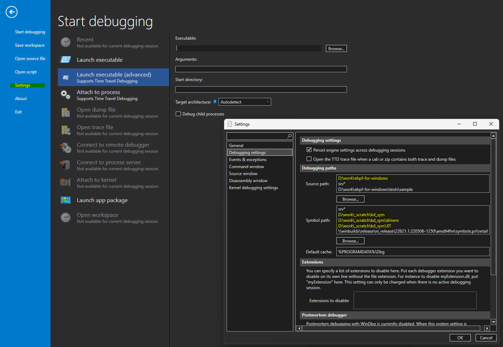
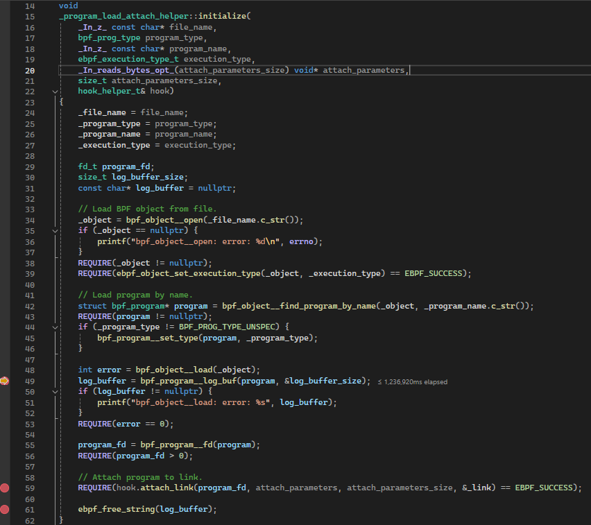
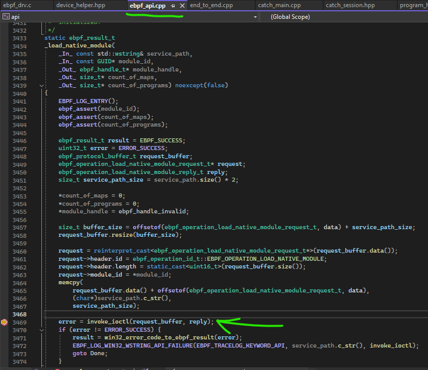
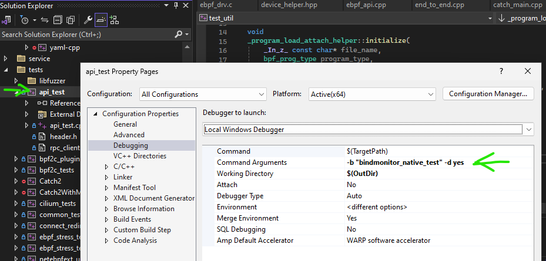
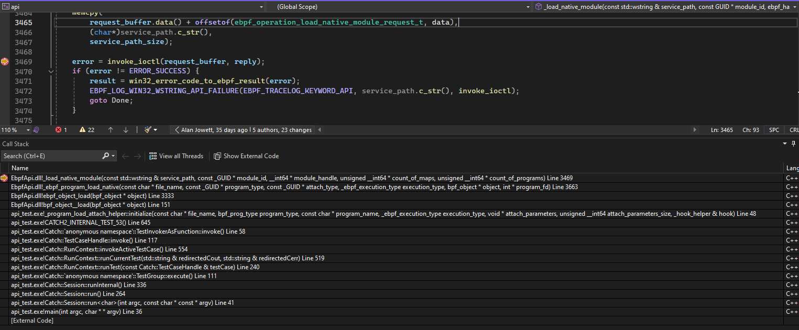
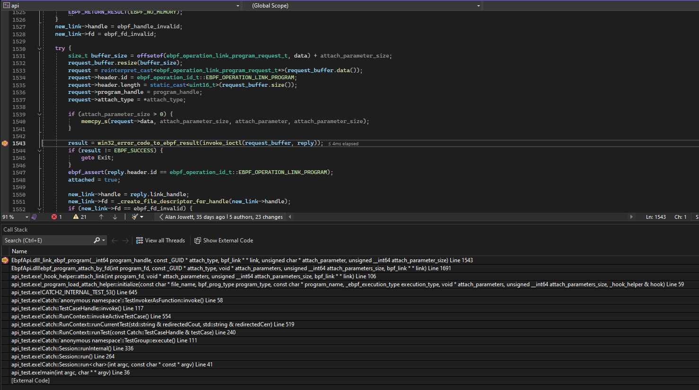
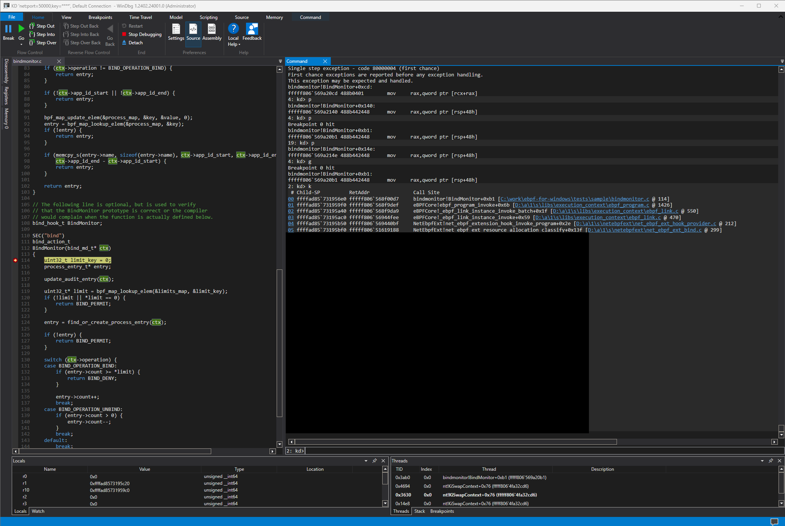

# Quick-start: using WinDbg to debug kernel code on a target machine

This is a quick guide on how to use WinDbg to debug eBPF programs on a target machine.
This guide assumes that the target machine is a Windows VM, and that the host machine is also a Windows machine.
The target machine is running a native eBPF program (which is packaged into a Windows kernel driver),
and the host machine is running WinDbg to debug the target machine.

## Prerequisites

For this guide, the following prerequisites are required:

- **Install WinDbg**: Install WinDbg on the host machine, from the Microsoft Store. See [Debugging Tools for Windows](https://learn.microsoft.com/en-us/windows-hardware/drivers/debugger/debugger-download-tools).

- **Setup up WinDbg for remote debugging**: Configure WinDbg for remote debugging. This is required to connect to the target machine from the host machine. There are different transport options for remote debugging,
 but the most common one is to use the **KDNET tool** on the target machine, and then connect to it from the host machine.

    >Reference links:
    >
    >- [Setting Up KDNET Network Kernel Debugging Automatically - Windows drivers](https://learn.microsoft.com/en-us/windows-hardware/drivers/debugger/setting-up-a-network-debugging-connection-automatically)
    >- [Remote Debugging Using WinDbg](https://learn.microsoft.com/en-us/windows-hardware/drivers/debugger/remote-debugging-using-windbg)

- **Set up WinDbg for kernel debugging a target VM**: Configure WinDbg to connect to the target VM. This is required to debug the eBPF program on the target machine.

    >Reference links:
    >
    >- [Setting Up Network Debugging of a Virtual Machine - KDNET](https://learn.microsoft.com/en-us/windows-hardware/drivers/debugger/setting-up-network-debugging-of-a-virtual-machine-host)

    1. Execute in the target VM:

        ```bash
        cd \debug # Or wherever KDNET is installed
        kdnet 172.0.0.1 50000 # The IP is the one of th *host* machine plus a port of your choice, normally above 50000
        ```

        output will be something like this (i.e., the `key` value will be different):

        ```cmd
        Enabling network debugging on Network debugging is supported by this Microsoft Hypervisor Virtual Machine.

        To debug this vm, run the following command on your debugger host machine.
        windbg -k net:port=50000,key=3adpup5qtxbyx.bw69xisgfdsebjbxwm.bm28voxf4p7s.bekxypxmiyx5

        Then restart this VM by running shutdown -r -t 0 from this command prompt.
        ```

    1. Reboot the target  VM, and execute the above command's output in the HOST machine (note the port and key will be different for each VM, and regenerated upon every *kdnet* command).
    In this example, the command would be:

        ```bash
        windbgx.exe -k net:port=50000,key=3adpup5qtxbyx.bw69xisgfdsebjbxwm.bm28voxf4p7s.bekxypxmiyx5
        ```

        Once rebooted, the WinDbg will connect to the target VM, the output will be something like this:

        ```cmd
        ...
        ...
        Microsoft (R) Windows Debugger Version 10.0.27553.1004 AMD64
        Copyright (c) Microsoft Corporation. All rights reserved.

        Using NET for debugging
        Opened WinSock 2.0
        Waiting to reconnect...
        Connected to target 172.0.0.2 on port 50000 on local IP 172.0.0.1.
        You can get the target MAC address by running .kdtargetmac command.
        ```

- **Provision the target machine**: provision the target machine with the latest release of the eBPF for Windows (using the MSI). For more information, see the following links:

  - [Installing eBPF into a Test VM](https://github.com/gtrevi/ebpf-for-windows/blob/main/docs/InstallEbpf.md) - Use *"Method 1 (Install a release with the MSI installer)"*.

- **Copy the PDB files to the Host machine**: Copy over all the PDB files from the target machine's eBPF installation directory to the host machine (by default, `c:\Program Files\ebpf-for-windows`), into a folder of your choice (e.g.: `c:\debugging\symbols`) which will have to be added to the symbol path of WinDbg (see above). You will also need the `.PDB` symbol files for the `bindmonitor.sys` native eBPF test program, and the `api_test.exe` tests, which are located in the `x64\Debug` folder of your local eBPF for Windows repository workspace. For a full guidance in setting up an eBPF for Windows dev environment, please read through the [Getting Started with eBPF](https://github.com/gtrevi/ebpf-for-windows/blob/main/docs/GettingStarted.md).

## Debugging an eBPF program

In the following sections, we will break into the eBPF program, and debug it at source level using WinDbg. We'll be using the `bindmonitor.sys` program as an example, and leverage the `api_test.exe` test suite to trigger the program.
Copy these binaries, which you can build yourself (or just copy from the released artifacts on GitHub), to the target machine, in a folder of your choice (e.g.: `c:\tests\ebpf-for-windows`).

For a more intuitive experience, it is suggested to use Visual Studio Community Edition on the target machine, so to set breakpoints in the `api_test` source code. You would also need to create a local workspace on the target machine from the same release branch of the MSI installed on the target machine.

### Preparing the target and host machines for debugging

Thanks to the fact that native eBPF programs' source information is embedded within the
[Portable Executable (PE)](https://learn.microsoft.com/en-us/windows/win32/debug/pe-format) image of the kernel driver's `.sys` file
(packaging the eBPF program), eBPF programs can be debugged at source level using WinDbg.
This is a powerful feature (that differentiates eBPF for Windows from its Linux counterpart) that allows developers to debug eBPF programs in
a similar way to user-mode programs, with the added benefit of being able to debug the program in the context of the kernel.

To accomplish this, the following steps are required:

1. **Setting up Symbols & source paths**: Setup WinDbg to point to the correct symbols and source paths.
This is essential for starting the debugging session.
    >Note: the symbols and source paths can also be setup/changed at any time during the debugging session.
This can be done by first breaking into the debugger (click the `||- Break` icon), and then defining them either
 through the UI or through the command line. In the following examples,
 the eBPF MSI was previously installed on the target machine,
 and the entire package (for simplicity) was copied to the host machine (otherwise, just the `*.pdb` files are required).

   - Using the UI:

     

   - Using the command line:

        ```bash
        # List the current symbol paths
        kd> .sympath
        # Set/Add symbol's path (no '+' to replace all paths).
        kd> .sympath+ <path> # e.g.: .sympath+ c:\debugging\symbols
        ```

        ```bash

        # List the current source paths
        kd> .srcpath
        # Set/Add source code path (no '+' to replace all paths).
        kd> .srcpath+ <path> # e.g.: .srcpath+ c:\work\ebpf-for-windows
        ```

        >Note:
        > - Source paths DOES include sub folders.
        > - Symbol paths does NOT include sub folders, so make sure to add any sub folders that contain the `.pdb` files.

        Detailed information on the `sympath` and `srcpath` commands can be found here:

        - [sympath](https://learn.microsoft.com/windows-hardware/drivers/debuggercmds/-sympath--set-symbol-path-)
        - [srcpath](https://learn.microsoft.com/windows-hardware/drivers/debuggercmds/-srcpath---lsrcpath--set-source-path-)

1. **Reload all symbols**: This is required to load the symbols for the eBPF program.

    ```cmd
    kd> .reload
    kd> .reload /user
    ```

1. **Prepare the target machine for debugging**: Before breaking into the eBPF program,
the program must be loaded into the target machine.
This can be done by using the `netsh` command, and pointing to the `.sys` file that contains the eBPF program.

    ```ps
    # Ensure the eBPF drivers are running
    PS C:> sc query ebpfcore
    PS C:> sc query netebpfext

    # Ensure no programs are loaded
    PS C:> netsh ebpf show prog

    ID  Pins  Links  Mode       Type           Name
    ======  ====  =====  =========  =============  ====================
    ```

    > Note: make sure that the source code and symbols of the program are in the symbol path of the debugger on the host machine.

### Loading the eBPF program

Let's leverage the `"bindmonitor_native_test"` test within the `"api_test"` test suite.

Prepare the debugger on the host machine to break on the following break points, that will be hit during the loading of the `bindmonitor.sys` program
(see later for the test reference):

```bash
# This will break into the UM entry point, that will trigger the program load:
bp EbpfApi!_load_native_module
# This will break into the UM entry point, that will trigger the program attach:
bp EbpfApi!_link_ebpf_program

# This will break into the KM entry point, after the EbpfApi will have invoked the IOCTL on the EbpfCore driver:
bp EbpfCore!_ebpf_driver_io_device_control
bp EbpfCore!_ebpf_core_protocol_load_native_module
bp EbpfCore!ebpf_native_load
bp EbpfCore!ebpf_native_load_driver
bp bindmonitor!DriverEntry # This is where the eBPF program will actually be registered as an NMR Client (i.e. NmrRegisterClient)
.reload
```

Now, from within the target machine, it is suggested to start a Visual Studio debug session (assuming its installation on the target machine, with the ebpf-for-windows built from the installed release branch), so that we can set three breakpoints
in the source code, in `tests\libs\util\program_helper.cpp`, function `_program_attach_helper::initialize`:

- one just after the call to `bpf_object__load()`
- one on the call to `hook.attach_link()`, and the other just after, so to isolate only what's done in the attach phase (in the next paragraph).

Just as a visual example, as of writing, this is the point:



and in `\libs\api\ebpf_api.cpp`, function `_load_native_module()`, just on the call to `invoke_ioctl()`.
Just as a visual example, as of writing, this is the point:



Now, in the `api_test` project's properties, go to the "Debugging" tab and set the "Command Arguments" to "-b "bindmonitor_native_test" -d yes",
 for the configuration you'll be running.
Finally, right-click on the `api_test` project, select "Set as startup project" and launch the local debugging session:



When the `bpf_object__load()` line is hit, press F5 again and as soon as breakpoint on `invoke_ioctl()` is hit, this will be the call stack:



Now that we visited the flow of loading the eBPF program in user-mode, hit F5 and the breakpoints previously set up on WinDbg will be hit in this sequence:

```bash
> \ebpfcore\ebpf_drv.c                -> _ebpf_driver_io_device_control()
> \libs\execution_context\ebpf_core.c -> ebpf_core_get_protocol_handler_properties()
> \libs\execution_context\ebpf_core.c -> ebpf_native_load()
> \libs\execution_context\ebpf_core.c -> ebpf_native_load_driver()
```

The last call will finally call the `ZwLoadDriver` System API, which will actually load the driver.
Hitting once again F5 will ultimately jump into our last break point, within the eBPF program's driver wrapper,
inside the `DriverEntry` in `\x64\Debug\bindmonitor_km\bindmonitor_driver.c`.

If we dump the stack on WinDbg at this point, it will look like this:

```cmd
4: kd> k
 # Child-SP          RetAddr               Call Site
00 ffff9589`64177138 fffff807`4aa18020     bindmonitor!DriverEntry [C:\work\ebpf-for-windows\x64\Debug\bindmonitor_km\bindmonitor_driver.c @ 78] 
01 ffff9589`64177140 fffff807`28b5e96c     bindmonitor!GsDriverEntry+0x20 [minkernel\tools\gs_support\kmodefastfail\gs_driverentry.c @ 47] 
02 ffffxxxx`xxxxxxxx fffff807`xxxxxxx      nt!PnpCallDriverEntry+0x?? [xxxxxxxx\xxxxxxxx\xxxxxxxx.c @ xxxx] 
03 ffffxxxx`xxxxxxxx fffff807`xxxxxxx      nt!IopLoadDriver+0x?? [xxxxxxxx\xxxxxxxx\xxxxxxxx.c @ xxxx] 
04 ffffxxxx`xxxxxxxx fffff807`xxxxxxx      nt!IopLoadUnloadDriver+0x?? [xxxxxxxx\xxxxxxxx\xxxxxxxx.c @ xxxx] 
05 ffffxxxx`xxxxxxxx fffff807`xxxxxxx      nt!ExpWorkerThread+0x?? [xxxxxxxx\xxxxxxxx\xxxxxxxx.c @ xxxx] 
06 ffffxxxx`xxxxxxxx fffff807`xxxxxxx      nt!PspSystemThreadStartup+0x?? [xxxxxxxx\xxxxxxxx\xxxxxxxx.c @ xxxx] 
07 ffffxxxx`xxxxxxxx 00000000`00000000     nt!KiStartSystemThread+0x?? [xxxxxxxx\xxxxxxxx\xxxxxxxx.asm @ xx] 

```

The driver code will finally register itself as an NMR client with `NmrRegisterClient`,
and from there the debugging of the program can be done as described earlier.

### Attaching the eBPF program

Continuing to the last step, the attach phase, place a breakpoint in `\libs\api\ebpf_api.cpp`, function `_link_ebpf_program()`,
just on the call to `invoke_ioctl()`, and hit F5.

Just as a visual example, here is what the call stack will look like:



On WinDbg, break the target machine and add the following breakpoints:

```bash
bp EbpfCore!_ebpf_core_protocol_link_program
```

Hit `g` on WinDbg, and then F5 on Visual Studio on the target machine.
WinDbg will again stop on `_ebpf_driver_io_device_control()`, hit go again and it will finally break on `_ebpf_core_protocol_link_program()`,
which is the function that will actually link the program.

If we dump the stack on WinDbg at this point, it will look like this:

```cmd
8: kd> k
 # Child-SP          RetAddr               Call Site
00 ffff9589`68066c78 fffff807`968a49e9     eBPFCore!_ebpf_core_protocol_link_program [D:\a\1\s\libs\execution_context\ebpf_core.c @ 1453] 
01 ffff9589`68066c80 fffff807`9689252f     eBPFCore!ebpf_core_invoke_protocol_handler+0x219 [D:\a\1\s\libs\execution_context\ebpf_core.c @ 2817] 
02 ffff9589`68066d20 fffff807`29e0525b     eBPFCore!_ebpf_driver_io_device_control+0x38f [D:\a\1\s\ebpfcore\ebpf_drv.c @ 340] 
03 (Inline Function) --------`--------     Wdf01000!FxIoQueueIoDeviceControl::Invoke+0x?? [xxxxxxxx\xxxxxxxx\xxxxxxxx.hpp @ xxx] 
04 ffffxxxx`xxxxxxxx fffffxxx`xxxxxxxx     Wdf01000!FxIoQueue::DispatchRequestToDriver+0x?? [xxxxxxxx\xxxxxxxx\xxxxxxxx.cpp @ xxxx] 
05 ffffxxxx`xxxxxxxx fffffxxx`xxxxxxxx     Wdf01000!FxIoQueue::DispatchEvents+0x?? [xxxxxxxx\xxxxxxxx\xxxxxxxx.cpp @ xxxx] 
06 (Inline Function) --------`--------     Wdf01000!FxIoQueue::QueueRequest+0x?? [xxxxxxxx\xxxxxxxx\xxxxxxxx.cpp @ xxxx] 
07 (Inline Function) --------`--------     Wdf01000!FxPkgIo::DispatchStep2+0x?? [xxxxxxxx\xxxxxxxx\xxxxxxxx.cpp @ xxx] 
08 ffffxxxx`xxxxxxxx fffffxxx`xxxxxxxx     Wdf01000!FxPkgIo::DispatchStep1+0x?? [xxxxxxxx\xxxxxxxx\xxxxxxxx.cpp @ xxx] 
09 ffffxxxx`xxxxxxxx fffffxxx`xxxxxxxx     Wdf01000!FxPkgIo::Dispatch+0x?? [xxxxxxxx\xxxxxxxx\xxxxxxxx.cpp @ xxx] 
0a (Inline Function) --------`--------     Wdf01000!DispatchWorker+0x?? [xxxxxxxx\xxxxxxxx\xxxxxxxx.cpp @ xxxx] 
0b (Inline Function) --------`--------     Wdf01000!FxDevice::Dispatch+0x?? [xxxxxxxx\xxxxxxxx\xxxxxxxx.cpp @ xxxx] 
0c ffffxxxx`xxxxxxxx fffffxxx`xxxxxxxx     Wdf01000!FxDevice::DispatchWithLock+0x?? [xxxxxxxx\xxxxxxxx\xxxxxxxx.cpp @ xxxx] 
0d ffffxxxx`xxxxxxxx fffffxxx`xxxxxxxx     nt!IopfCallDriver+0x?? [xxxxxxxx\xxxxxxxx\xxxxxxxx.h @ xxxx] 
0e ffffxxxx`xxxxxxxx fffffxxx`xxxxxxxx     nt!IovCallDriver+0x?? [xxxxxxxx\xxxxxxxx\xxxxxxxx.c @ xxx] 
0f ffffxxxx`xxxxxxxx fffffxxx`xxxxxxxx     nt!IofCallDriver+0x?? [xxxxxxxx\xxxxxxxx\xxxxxxxx.c @ xxxx] 
10 (Inline Function) --------`--------     nt!IoCallDriverWithTracing+0x?? [xxxxxxxx\xxxxxxxx\xxxxxxxx.h @ xxxx] 
11 (Inline Function) --------`--------     nt!IopCallDriverReference+0x?? [xxxxxxxx\xxxxxxxx\xxxxxxxx.h @ xxxx] 
12 ffffxxxx`xxxxxxxx fffffxxx`xxxxxxxx     nt!IopSynchronousServiceTail+0x?? [xxxxxxxx\xxxxxxxx\xxxxxxxx.c @ xxxx] 
13 ffffxxxx`xxxxxxxx fffffxxx`xxxxxxxx     nt!IopXxxControlFile+0x?? [xxxxxxxx\xxxxxxxx\xxxxxxxx.c @ xxxxx] 
14 ffffxxxx`xxxxxxxx fffffxxx`xxxxxxxx     nt!NtDeviceIoControlFile+0x?? [xxxxxxxx\xxxxxxxx\xxxxxxxx.c @ xxx] 
15 ffffxxxx`xxxxxxxx 00000000`xxxxxxxx     nt!KiSystemServiceCopyEnd+0x?? [xxxxxxxx\xxxxxxxx\xxxxxxxx.asm @ xxxx] 
16 00000000`xxxxxxxx 00000000`xxxxxxxx     0x0000xxxx`xxxxxxxx
17 00000000`xxxxxxxx 00000000`00000000     0x0000xxxx`xxxxxxxx
```

>Note: Windows frames details are obfuscated in the call stack, as they are not relevant to the eBPF program.

### Breaking into the eBPF program

This is the final step, where the eBPF program is broken into,
and the debugging session is started. On the host machine, break the debugger and execute the following commands in the WinDbg command line:

```ps
# Set a breakpoint to the entry point of the eBPF program, in this case, we are using a test that uses the `bindmonitor` program.
kd> bp bindmonitor!BindMonitor

# Hit go, and wait for the breakpoint to be hit
kd> g
```

> Note: The `BindMonitor` function is the entry point of the eBPF program.
This is the function that is called when the program is invoked by EbpfCore.

As an additonal step, you can also view the symbols in the eBPF program by using the `x` & `sxe` commands:

```ps
kd> x bindmonitor!* # eXamine symbols - list all symbols in bindmonitor.sys
kd> sxe ld:bindmonitor.sys # raise and exec at load (le) for bindmonitor.sys
```

Now, on the target machine, run the following API test:

```ps
PS C:\work\ebpf-for-windows\x64\Debug> .\api_test.exe -b "bindmonitor_native_test" -d yes

StartService for ebpfsvc failed, 0x2.
Filters: "bindmonitor_native_test"
Randomness seeded to: 2353591982

# On the host machine, the debugger will break into the eBPF program.
```

At this point, you can dump the call stack with the `k` command,
 and inspect the sequence of calls that led to the breakpoint. The call stack will look something like this:



```cmd
2: kd> k
 # Child-SP          RetAddr               Call Site
00 ffffad85`710456e0 fffff806`568f00d7     bindmonitor!BindMonitor+0xb1 [C:\work\ebpf-for-windows\tests\sample\bindmonitor.c @ 114]
01 ffffad85`710459f0 fffff806`568f9def     eBPFCore!ebpf_program_invoke+0x6b [D:\a\1\s\libs\execution_context\ebpf_program.c @ 1426]
02 ffffad85`71045a40 fffff806`568f9da9     eBPFCore!_ebpf_link_instance_invoke_batch+0x1f [D:\a\1\s\libs\execution_context\ebpf_link.c @ 550]
03 ffffad85`71045ac0 fffff806`56944fee     eBPFCore!_ebpf_link_instance_invoke+0x59 [D:\a\1\s\libs\execution_context\ebpf_link.c @ 470]
04 ffffad85`71045b50 fffff806`569440bf     NetEbpfExt!net_ebpf_extension_hook_invoke_program+0x2e [D:\a\1\s\netebpfext\net_ebpf_ext_hook_provider.c @ 212]
05 ffffad85`71045bf0 fffff806`51619188     NetEbpfExt!net_ebpf_ext_resource_allocation_classify+0x13f [D:\a\1\s\netebpfext\net_ebpf_ext_bind.c @ 299]
06 ffffxxxx`xxxxxxxx fffffxxx`xxxxxxxx     NETIO!ProcessCallout+0x??
07 ffffxxxx`xxxxxxxx fffffxxx`xxxxxxxx     NETIO!ArbitrateAndEnforce+0x??
08 ffffxxxx`xxxxxxxx fffffxxx`xxxxxxxx     NETIO!KfdClassify+0x??
09 ffffxxxx`xxxxxxxx fffffxxx`xxxxxxxx     tcpip!WfpAlepAuthorizeOrClassifyPort+0x??
0a ffffxxxx`xxxxxxxx fffffxxx`xxxxxxxx     tcpip!WfpAlepAuthorizePortByFamily+0x??
0b ffffxxxx`xxxxxxxx fffffxxx`xxxxxxxx     tcpip!WfpAleAuthorizePort+0x??
0c ffffxxxx`xxxxxxxx fffffxxx`xxxxxxxx     tcpip!UdpBindEndpointRequestInspectComplete+0x??
0d ffffxxxx`xxxxxxxx fffffxxx`xxxxxxxx     tcpip!UdpBindEndpointWorkQueueRoutine+0x??
0e ffffxxxx`xxxxxxxx fffffxxx`xxxxxxxx     tcpip!UdpIoControlEndpoint+0x??
0f ffffxxxx`xxxxxxxx fffffxxx`xxxxxxxx     tcpip!UdpTlProviderIoControlEndpointCalloutRoutine+0x??
10 ffffxxxx`xxxxxxxx fffffxxx`xxxxxxxx     nt!KeExpandKernelStackAndCalloutInternal+0x??
11 ffffxxxx`xxxxxxxx fffffxxx`xxxxxxxx     nt!KeExpandKernelStackAndCalloutEx+0x??
12 ffffxxxx`xxxxxxxx fffffxxx`xxxxxxxx     tcpip!UdpTlProviderIoControlEndpoint+0x??
13 ffffxxxx`xxxxxxxx fffffxxx`xxxxxxxx     afd!AfdTLIoControl+0x??
14 ffffxxxx`xxxxxxxx fffffxxx`xxxxxxxx     afd!AfdTLBind+0x??
15 ffffxxxx`xxxxxxxx fffffxxx`xxxxxxxx     afd!AfdTLBindSecurity+0x??
16 ffffxxxx`xxxxxxxx fffffxxx`xxxxxxxx     afd!AfdBind+0x??
17 ffffxxxx`xxxxxxxx fffffxxx`xxxxxxxx     afd!AfdDispatchDeviceControl+0x??
18 ffffxxxx`xxxxxxxx fffffxxx`xxxxxxxx     nt!IopfCallDriver+0x??
19 ffffxxxx`xxxxxxxx fffffxxx`xxxxxxxx     nt!IovCallDriver+0x??
1a ffffxxxx`xxxxxxxx fffffxxx`xxxxxxxx     nt!IofCallDriver+0x??????
1b ffffxxxx`xxxxxxxx fffffxxx`xxxxxxxx     nt!IopSynchronousServiceTail+0x??
1c ffffxxxx`xxxxxxxx fffffxxx`xxxxxxxx     nt!IopXxxControlFile+0x??
1d ffffxxxx`xxxxxxxx fffffxxx`xxxxxxxx     nt!NtDeviceIoControlFile+0x??
1e ffffxxxx`xxxxxxxx 00000000`xxxxxxxx     nt!KiSystemServiceCopyEnd+0x??
1f 00000000`xxxxxxxx 00000000`xxxxxxxx     ntdll!NtDeviceIoControlFile+0x??
20 00000000`xxxxxxxx 00000000`xxxxxxxx     mswsock!WSPBind+0x??
21 00000000`xxxxxxxx 00000000`xxxxxxxx     WS2_32!bind+0x??
22 00000000`xxxxxxxx 00000000`xxxxxxxx     0x00000000`xxxxxxxx
23 00000000`xxxxxxxx 00000000`xxxxxxxx     0x00000000`xxxxxxxx
24 00000000`xxxxxxxx ffffffff`ffffffff     0x00000000`xxxxxxxx
25 00000000`xxxxxxxx 00000000`00000000     0xffffffff`ffffffff

```

As you can see, the `BindMonitor` function is the entry point of the eBPF program, and the call stack shows the sequence of calls that led to the breakpoint.
This is what's happening:

- A bind request is made to the `bind` API.
- The `bind` API is intercepted by WinSock (`WS2_32!bind`), and then passed to the AFD driver (`afd!`).
- The AFD driver then calls into the TCP/IP stack (`tcpip!`).
- The WFP (Windows Filtering Platform) is invoked, which intercepts the call within the eBPF callout (the `netebpfext.sys` driver).
- `net_ebpf_ext_bind.c` -> `net_ebpf_ext_resource_allocation_classify()` is invoked within the eBPF netebpfext extension
- `net_ebpf_ext_hook_provider.c` -> `net_ebpf_extension_hook_invoke_program()` is called.
- `net_ebpf_ext_link.c` -> `_ebpf_link_instance_invoke()` is called, which invokes the eBPF program.
- `net_ebpf_ext_link.c` -> `_ebpf_link_instance_invoke_batch()` -> `ebpf_program_invoke()` is called, which is the entry point of the eBPF program.
- And finally, `bindmonitor.c` -> `BindMonitor()` is called, which is the entry point of the eBPF program, where the breakpoint was set.

This is a very high-level overview of the call stack, but it gives you an idea of how the eBPF program is invoked, and how it can be debugged using WinDbg.

Now, we can disable the breakpoint (all of them, for simplicity), and continue the execution of the program:

```bash
kd> bd *  # Use be * to re-enable all breakpoints
kd> g
```

Which the will continue the execution of the program, and the initial `api_test.exe` we first launched will complete:

```ps
4123.465 s: bindmonitor_native_test
===============================================================================
All tests passed (16 assertions in 1 test case)
```
