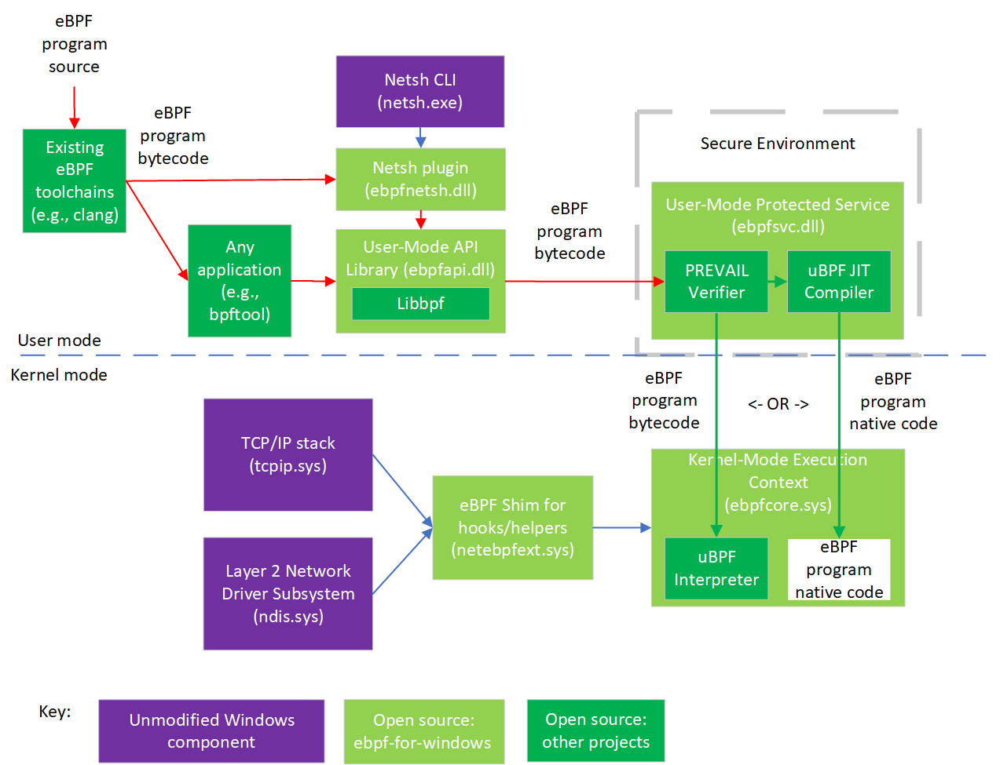

# eBPF for Windows

eBPF is a well-known technology for providing programmability and agility, especially for extending an
OS kernel, for use cases such as DoS protection and observability. This project is a work-in-progress that
allows existing eBPF
toolchains and APIs familiar in the Linux ecosystem to be used on top of Windows.  That is, this project
takes existing eBPF projects as submodules and adds the layer in between to make them run on top of Windows.

## New to eBPF?

See our [basic eBPF tutorial](docs/tutorial.md) and our
[tutorial on debugging eBPF verification failures](docs/debugging.md).

## Architectural Overview

The following diagram shows the basic architecture of this project and related components:

As shown in the diagram, existing eBPF toolchains (clang, etc.) can be used to generate eBPF bytecode from
source code in various languages.  Bytecode can be consumed by any application, or via bpftool or the Netsh command line tool, which use a shared library
that exposes [Libbpf APIs](https://github.com/libbpf/libbpf),
though this is still in progress.

The eBPF bytecode is sent to a static verifier (the [PREVAIL verifier](https://github.com/vbpf/ebpf-verifier))
that is hosted in a secure user-mode environment such as a system service (which is the case at present),
enclave, or trusted VM.
If the eBPF program passes all the verifier checks, it can be loaded into the kernel-mode execution context.
Typically this is done by being JIT compiled (via the [uBPF](https://github.com/iovisor/ubpf) JIT compiler) into native code that is passed to the execution context.  In a debug build,
the byte code can instead be directly loaded into
an interpreter (from [uBPF](https://github.com/iovisor/ubpf) in the kernel-mode execution context) though
the interpreter is not present in a release build as it is considered less secure.  See also the HVCI FAQ answer
below.

eBPF programs installed into the kernel-mode execution context can attach to various
[hooks](https://microsoft.github.io/ebpf-for-windows/ebpf__structs_8h.html#a0f8242763b15ec665eaa47c6add861a0)
and call various helper APIs exposed by the eBPF shim,
which internally wraps public Windows kernel APIs, allowing the use of eBPF on existing versions of Windows.
Many [helpers](https://microsoft.github.io/ebpf-for-windows/bpf__helper__defs_8h.html)
already exist, and more hooks and helpers will be added over time.

## Getting Started

This project supports eBPF on Windows 10 or later, and on Windows Server 2019 or later.
To try out this project, see our [Getting Started Guide](docs/GettingStarted.md).

Want to help?  We welcome contributions!  See our [Contributing guidelines](CONTRIBUTING.md).
Feel free to take a look at our [Good First Issues](https://github.com/microsoft/ebpf-for-windows/labels/good%20first%20issue)
list if you're looking for somewhere to start.

Want to chat with us?  We have a:
* [Slack channel](https://cilium.slack.com/messages/ebpf-for-windows) (If you are new, sign up at http://slack.cilium.io/)
* Zoom meeting for github issue triage: see [meeting info](https://github.com/microsoft/ebpf-for-windows/discussions/427)

For tracking Q&A and general discussion, we use [Discussions](https://github.com/microsoft/ebpf-for-windows/discussions)
in github.  This can also function similar to a mailing list if you subscribe to discussion notifications by
clicking "Watch" (or "Unwatch") and selecting "Custom" -> "Discussions" (or by selecting "All Activity" if
you want to receive notifications about everything else too).

## Frequently Asked Questions

### 1. Is this a fork of eBPF?

No.

The eBPF for Windows project leverages existing projects, including
the [IOVisor uBPF project](https://github.com/iovisor/ubpf) and
the [PREVAIL verifier](https://github.com/vbpf/ebpf-verifier),
running them on top of Windows by adding the Windows-specific hosting environment for that code.

### 2. Does this provide app compatibility with eBPF programs written for Linux?

The intent is to provide source code compatibility for code that uses common
hooks and helpers that apply across OS ecosystems.

Linux provides many hooks and helpers, some of which are very Linux specific (e.g., using
Linux internal data structs) that would not be applicable to other platforms.
Other hooks and helpers are generically applicable and the intent is to support them for eBPF
programs.

Similarly, the eBPF for Windows project exposes [Libbpf APIs](https://github.com/libbpf/libbpf)
to provide source code compatibility for applications that interact with eBPF programs.

### 3. Will eBPF work with HyperVisor-enforced Code Integrity (HVCI)?

Yes. With HVCI enabled, eBPF programs cannot be JIT compiled, but can be run either natively or in interpreted mode
(but the interpreter is disabled in release builds and is only supported in debug builds). To understand
why JIT compiled mode does not work, we must first understand what HVCI does.

[HyperVisor-enforced Code Integrity (HVCI)](https://techcommunity.microsoft.com/t5/windows-insider-program/virtualization-based-security-vbs-and-hypervisor-enforced-code/m-p/240571)
is a mechanism
whereby a hypervisor, such as Hyper-V, uses hardware virtualization to protect kernel-mode processes against
the injection and execution of malicious or unverified code. Code integrity validation is performed in a secure
environment that is resistant to attack from malicious software, and page permissions for kernel mode are set and
maintained by the hypervisor.

Since a hypervisor doing such code integrity checks will refuse to accept code pages that aren't signed by
a key that the hypervisor trusts, this does impact eBPF programs running natively.  As such, when HVCI
is enabled, eBPF programs work fine in interpreted mode, but not when using JIT compilation because the JIT
compiler does not have a key that the hypervisor trusts.  And since interpreted
mode is absent in release builds, neither mode will work on an HVCI-enabled production system.

Instead, a third mode is also supported by eBPF for Windows, in addition to JIT compiled and interpreted modes.
This third mode entails compiling eBPF programs into regular Windows drivers that can be accepted by HVCI.
For more discussion, see the [Native Code Generation documentation](docs/NativeCodeGeneration.md).
