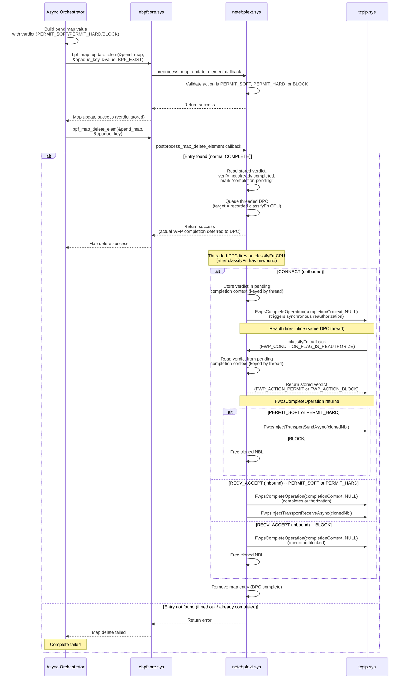
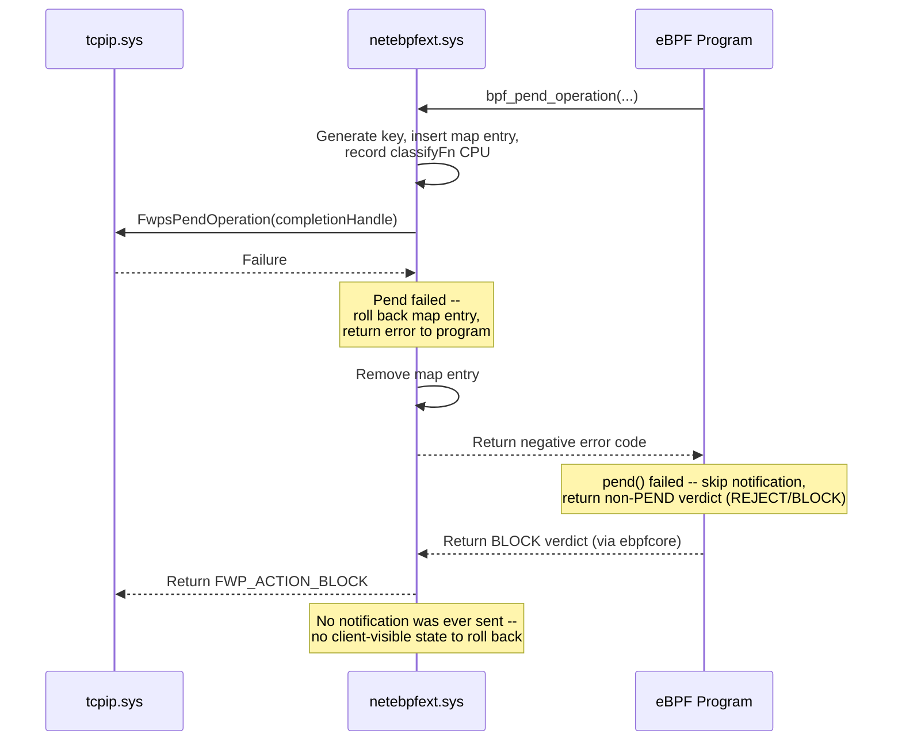

# Async Processing (Pend/Complete) for eBPF Network Extensions

## Contents
- [Motivation](#motivation)
- [Requirements](#requirements)
- [Design overview](#design-overview)
  - [Custom map for pend state](#custom-map-for-pend-state)
  - [Extension helper functions](#extension-helper-functions)
  - [Map key and value structures](#map-key-and-value-structures)
  - [Example eBPF program usage](#example-ebpf-program-usage)
- [PEND flow](#pend-flow)
- [COMPLETE flow](#complete-flow)
- [CONTINUE flow](#continue-flow)
- [Failure flows](#failure-flows)
- [Edge case and failure handling](#edge-case-and-failure-handling)
- [Internal pend state tracking](#internal-pend-state-tracking)
- [Multiple attached programs and PEND](#multiple-attached-programs-and-pend)
- [Identity-aware programs (token / subject context)](#identity-aware-programs-token--subject-context)
- [Per-layer async design](#per-layer-async-design)
  - [AUTH_CONNECT / AUTH_RECV_ACCEPT](#auth_connect--auth_recv_accept)
  - [AUTH_LISTEN](#auth_listen-layer)
  - [RESOURCE_ASSIGNMENT (Bind)](#resource_assignment-bind-layer)
  - [DATAGRAM_DATA](#datagram_data-layer)
  - [STREAM](#stream-layer)
- [Async orchestrator integration guide](#async-orchestrator-integration-guide)
- [ebpfcore platform requirements](#ebpfcore-platform-requirements)
- [netebpfext work breakdown](#netebpfext-work-breakdown)
- [Appendix: Internal state struct](#appendix-internal-state-struct)

## Motivation

Network callout drivers often need to defer a verdict on a connection or
packet while waiting for an asynchronous decision from another component
-- for example, a user-mode policy service or a kernel-mode classification
driver. The Windows Filtering Platform (WFP) provides several async
mechanisms at different layers (`FwpsPendOperation` /
`FwpsCompleteOperation` at ALE authorize layers, `FwpsPendClassify` /
`FwpsCompleteClassify` at resource assignment, ABSORB+reinject at
datagram, DEFER/OOB at stream), but eBPF programs running through
netebpfext currently have no way to express "pend this operation and
complete it later."

This proposal adds **pend/complete (async processing) support** to
netebpfext, enabling eBPF programs to:
1. **PEND** a network operation -- absorb a connection/packet while an
   external component makes a decision asynchronously.
2. **COMPLETE** the pended operation with a verdict (PERMIT, BLOCK, or
   CONTINUE -- re-invoke the program for continued evaluation; the
   program starts a fresh invocation, not a mid-execution resume).

The design is generic: any async orchestrator (kernel-mode driver, user-mode
service, or both) can integrate with pend/complete by interacting with
eBPF maps and optional BTF-resolved functions. No changes to the
async orchestrator's notification or decision-delivery mechanism are prescribed by
netebpfext itself.

## Requirements

### Functional requirements
1. An eBPF program attached to a supported WFP hook point (see
   [Supported WFP layers](#supported-wfp-layers)) must be able to
   pend the current network operation and return control to WFP.
2. An external async orchestrator must be able to complete the pended operation
   with a verdict (PERMIT, BLOCK, or CONTINUE) at a later time.
   Bounding "later" is the orchestrator's responsibility -- the
   extension provides backstops (per-entry stale-entry watchdog and a
   bounded `max_entries` map) but does not guarantee an upper bound on
   completion latency. See [Edge case 1: Stale pended operations](#1-stale-pended-operations-complete-never-arrives).
3. The CONTINUE verdict must re-invoke the eBPF program so it can
   resume evaluation from where it left off.
   Re-invocation is asynchronous on a worker thread at PASSIVE_LEVEL
   (not synchronous inside the COMPLETE call) and is not pinned to
   the original `classifyFn` CPU. See [CONTINUE flow](#continue-flow)
   for the full sequence.
4. The pend/complete mechanism must be fully encapsulated within
   netebpfext -- eBPF programs and async orchestrators interact only through
   maps and helper functions; no WFP-specific details leak to callers.

### Supported WFP layers

The design must support pend/complete at the following WFP layers:

| Layer | WFP layer IDs | `classifyFn` IRQL | Async mechanism |
|-------|---------------|-------------------|-----------------|
| Connect (outbound) | `FWPM_LAYER_ALE_AUTH_CONNECT_V4/V6` | DISPATCH | `FwpsPendOperation` / `FwpsCompleteOperation` |
| Accept (inbound) | `FWPM_LAYER_ALE_AUTH_RECV_ACCEPT_V4/V6` | DISPATCH | `FwpsPendOperation` / `FwpsCompleteOperation` |
| Listen | `FWPM_LAYER_ALE_AUTH_LISTEN_V4/V6` | PASSIVE | `FwpsPendOperation` / `FwpsCompleteOperation` |
| Bind | `FWPM_LAYER_ALE_RESOURCE_ASSIGNMENT_V4/V6` | PASSIVE | `FwpsPendClassify` / `FwpsCompleteClassify` |
| Datagram | `FWPM_LAYER_DATAGRAM_DATA_V4/V6` | DISPATCH | ABSORB + reinject (no pend API) |
| Stream | `FWPM_LAYER_STREAM_V4/V6` | DISPATCH | DEFER (inbound) / OOB clone+reinject (outbound) |

Each layer requires different WFP async APIs and completion semantics.
See [Per-layer async design](#per-layer-async-design) for details.

> **Note:** Not all layers listed above are currently supported in
> netebpfext. When support is added for new WFP layers, the
> implementation should account for the pend/async design described
> in this proposal.

### Non-requirements
- The notification mechanism between the eBPF program and the async orchestrator
  is **not** part of this proposal. Async orchestrators are responsible for
  choosing how to deliver pend notifications and receive verdicts (see
  [Async orchestrator integration guide](#async-orchestrator-integration-guide)).
- Only one program in a multi-program chain may PEND a given operation
  (see [Multiple attached programs and PEND](#multiple-attached-programs-and-pend)).

## Design overview

Using pend/complete requires an external component -- referred to in
this document as the **async orchestrator** -- that coordinates the
pend lifecycle: loading the eBPF program, owning the pend map,
receiving pend notifications, making asynchronous decisions, driving
the COMPLETE path via map operations, and cleaning up stale entries.
The async orchestrator may be a single kernel-mode driver, a single
user-mode process, or a combination of both -- the architecture is
up to the integrator. See
[Async orchestrator integration guide](#async-orchestrator-integration-guide)
for details.

### Custom map for pend state
The design leverages the
[custom map](https://github.com/microsoft/ebpf-for-windows/pull/4882)
feature. Custom maps allow an eBPF extension to register as an NMR
provider for a custom map type and intercept CRUD operations on map
entries.

Two distinct paths invoke the extension's callbacks:

1. **User-mode CRUD via `bpf_map_*` syscalls.** When the async
   orchestrator calls `bpf_map_update_elem` or `bpf_map_delete_elem`
   on a pend map entry, ebpfcore dispatches synchronously through
   the custom map provider's dispatch table to the extension's
   `preprocess_map_update_element` / `postprocess_map_delete_element`
   callbacks. (Lookups go through `postprocess_map_find_element`.)
   `bpf_map_update_elem` covers both insert and replace semantics.
   These callbacks run **synchronously** on the calling thread.
   Serialization across concurrent callers on the same key is
   provided by the hash table's **per-bucket spinlock**, not a per-map
   lock: `preprocess_map_update_element` fires while the bucket lock
   is held (so it can validate and reject invalid action transitions
   atomically), and `postprocess_map_delete_element` fires after the
   entry has been removed from the lookup table and after the bucket
   lock is released, but *before* the value memory is freed -- the
   just-removed value is passed to the callback by pointer.
   This path uses **existing** custom map provider machinery.
2. **Extension-initiated kernel-mode CRUD from the `pend()` helper
   and from the threaded DPC.** Insertion of a new pend entry, the
   verdict-store update on the synthesized-COMPLETE path, and any
   extension-driven delete are all driven by netebpfext directly
   (kernel mode, outside an eBPF helper call) -- not by the eBPF
   program calling `bpf_map_update_elem`. The program's only path
   into the map is via the `pend()` extension helper. This path
   requires **new ebpfcore APIs** (kernel-mode entry points exposed
   to providers) that do not exist today; see
   [ebpfcore platform requirements](#ebpfcore-platform-requirements).

> **Threaded DPC.** Throughout this document, "threaded DPC" refers
> to a DPC initialized with `KeInitializeThreadedDpc`. It is queued
> like a regular DPC (per-CPU queue, target CPU selectable via
> `KeSetTargetProcessorDpcEx`) but its callback executes at
> **`PASSIVE_LEVEL`** on a per-CPU, real-time-priority kernel thread
> ("DPC delivery thread") rather than in DPC dispatch context. This
> gives the callback both **CPU pinning** (the target CPU's DPC
> delivery thread is the only thread that runs it, and that thread
> cannot run while a `classifyFn` is on that CPU at DISPATCH) and
> **PASSIVE_LEVEL** semantics (so it can call PASSIVE-only APIs such
> as the WFP completion API, `ObReferenceObjectByHandle`,
> `PsLookupProcessByProcessId`, and `SeCaptureSubjectContextEx`).

The pend map is registered with `updates_original_value = true`,
which forbids BPF programs from CRUDing the map directly. The
practical consequences are that (a) all dispatch-table callbacks
are invoked at `PASSIVE_LEVEL` (no DISPATCH callers), and (b) the
program's only interaction with the map is through `pend()` plus
extension-internal kernel-mode CRUD. Per-entry state transitions
are owned by the extension and validated atomically inside
`preprocess_map_update_element` under the bucket lock. The
extension's per-pend tracking state (recorded `classifyFn` CPU,
WFP completion context, layer-specific reinject parameters) lives
in NonPagedPool memory the extension allocates at `pend()` time
and references via a pointer stored in the map value's extension
prefix; this lifetime is decoupled from the bpf value's lifetime
so the threaded DPC can complete the WFP operation and free the
tracking state after the bpf value has already been freed by
ebpfcore.

> **Note:** This design requires several ebpfcore changes: a new
> custom map type enum, **kernel-mode CRUD APIs** for custom map
> operations (user-mode and BPF-program-driven CRUD via the existing
> dispatch-table callbacks already works), and namespace isolation.
> See [ebpfcore platform requirements](#ebpfcore-platform-requirements)
> for details.

#### Concurrency and IRQL

The pend map operates under the following concurrency contract:

| Site | IRQL | Notes |
|---|---|---|
| `preprocess_map_update_element` callback | `PASSIVE_LEVEL` | User-mode caller (orchestrator) only, because `updates_original_value=true` blocks BPF programs from CRUD. Runs under per-bucket spinlock; safe place to atomically validate + write the action field. |
| `postprocess_map_delete_element` callback | `PASSIVE_LEVEL` | Same reason as above. Runs after the entry has been removed from the lookup table and the per-bucket lock has been released, but before the value memory is freed. The just-removed value is delivered by pointer; the callback must extract everything it needs (verdict, pointer to extension-owned tracking state) synchronously and queue the threaded DPC. |
| `bpf_pend_operation()` helper / extension-synthesized COMPLETE path | Up to `DISPATCH_LEVEL` (depends on the WFP layer's `classifyFn` IRQL -- `AUTH_LISTEN` and `RESOURCE_ASSIGNMENT` run at PASSIVE; `AUTH_CONNECT`, `AUTH_RECV_ACCEPT`, `DATAGRAM_DATA`, and `STREAM` run at DISPATCH -- see [Supported WFP layers](#supported-wfp-layers)) | Drives the new ebpfcore kernel-mode CRUD APIs to insert / update / delete entries. All primitives on this path (per-bucket spinlock, NonPagedPool allocation, `KeInsertQueueDpc`-equivalent for the threaded DPC) are DISPATCH-safe. |
| Threaded DPC (calls the WFP completion API, frees extension tracking state) | `PASSIVE_LEVEL` (threaded DPCs run on a real-time-priority worker thread, not in DPC dispatch context) | Matches the WFP completion API's required IRQL. |
| CONTINUE work-item handler (re-invokes program, validates entry state first) | `PASSIVE_LEVEL` | Work items always run at PASSIVE on a worker thread. |

Same-key serialization is provided by the per-bucket spinlock --
two concurrent operations on the same `pend_key` cannot both pass
through `preprocess_map_update_element` and `delete_elem`'s atomic
remove at the same time, so action-field state-machine transitions
are atomic. The extension does not maintain a separate per-map
lock; instead, it relies on (1) per-bucket lock-protected
validation of the action transition inside
`preprocess_map_update_element`, and (2) the per-bucket lock-
protected single-winner property of `delete_elem` (exactly one
caller wins the delete, exactly one `postprocess_map_delete_element`
fires per entry, exactly one threaded DPC is queued).

### Extension helper functions

The extension exposes one helper function:

- **`bpf_pend_operation()`** -- called by the eBPF program to
  pend the current classify. It generates an opaque key, populates
  the map entry, **records the current CPU number (`classifyfn_cpu`)
  for later DPC dispatch, and synchronously invokes the
  layer-appropriate WFP pend API** (e.g., `FwpsPendOperation`,
  `FwpsPendClassify`). On success it captures the WFP classify
  parameters needed for completion (e.g., `completionContext`,
  cloned NBL, reinject parameters) and returns the opaque key to
  the caller. On failure (WFP pend API fails) it rolls back the map
  entry and returns a negative error code; the program then returns
  a non-PEND verdict. Works on all supported layers.

The helper does not take an explicit `ctx` parameter. Instead, ebpfcore
exposes an **implicit program context** accessor
(`ebpf_get_current_program_context()`), avoiding consumption of a BPF
argument slot. All pointer arguments use `void*` + `uint32_t` size
pairs for verifier compatibility (`PTR_TO_MEM` + `CONST_SIZE`).

The program calls `pend()` to insert a map entry, pend the WFP
operation, and receive an opaque key. **Only after `pend()` returns
success** does the program notify the async orchestrator (e.g., via
a BTF-resolved function or a shared map), passing the opaque key so
the async orchestrator can issue a COMPLETE later.

This ordering -- WFP pend before notification -- structurally closes
the "COMPLETE-arrives-before-pend" race; see
[Race A](#race-a-complete-arrives-before-the-wfp-pend-api-is-called)
for the full argument.

If notification fails (or the program returns a non-PEND verdict for
any other reason after a successful `pend()`), netebpfext synthesizes
the COMPLETE path from the same threaded-DPC machinery used by the
orchestrator-driven COMPLETE; see
[Notification fails](#notification-fails) and
[PEND flow](#pend-flow) for the mechanism.

### Map key and value structures

#### Map key
The map key is **opaque to callers**. The extension generates and
manages the key internally. Programs and async orchestrators pass the key through
without interpreting its contents. Both the key and value structures
include an `ebpf_extension_header_t` as their first field, following
the standard eBPF for Windows versioning convention (see
`ebpf_windows.h`).

The header enables the extension and the consumer (the BPF program +
async orchestrator, which must themselves be in lockstep) to evolve
independently across versions. Each side reads only the prefix
fields up to `header.size` and treats the rest as defaults. A newer
extension receiving an older consumer's payload must be written to
tolerate the absence of any field added after the consumer's
`header.size` -- it cannot rely on those fields being meaningfully
populated. Because bpf map value sizes are fixed at map creation,
cross-version interop also requires both sides to allocate the
buffer to the larger of the two known prefix sizes (zero-padding the
unused tail); the header is what lets each side correctly interpret
a payload that may have been produced against a different version.

> **Example.** If the extension v2 adds a new prefix field and the
> consumer is built against v1, the map is sized for v1. Extension
> v2 detects this via `header.size`, operates in v1 mode for that
> map, and does not depend on the v2-only field being present. The
> consumer continues to receive v1-shaped keys and values --
> identical to what it would receive from a v1 extension.

```c
// Map key -- opaque to callers. "Opaque" here means that the eBPF
// program and the user-mode async orchestrator treat the key as a
// token they pass through without interpretation. The intent is not
// to provide security via key secrecy; the field is a monotonic
// counter.
// Versioned using the standard ebpf_extension_header_t pattern (see ebpf_windows.h).
//
// Layout note: the map key is hashed by raw bytes, so any compiler-inserted
// padding between fields would participate in the hash. To make layout
// deterministic across compilers/toolchains we (a) include an explicit
// `reserved` field where padding would otherwise sit and (b) require a
// compile-time size assertion so any future field addition that perturbs
// layout is a build break, not a silent hash-collision bug. Callers must
// also zero-initialize the struct (e.g. `= {}`) before populating fields,
// which the C standard guarantees zeroes the explicit reserved bytes too.
typedef struct _net_ebpf_ext_pend_key {
    ebpf_extension_header_t header;     // Version/size header for forward compatibility (4 bytes)
    uint32_t reserved;                  // Explicit padding -- must be zero (set by zero-init)
    uint64_t pend_id;                   // Monotonic counter generated by the extension
} net_ebpf_ext_pend_key_t;
C_ASSERT(sizeof(net_ebpf_ext_pend_key_t) ==
         sizeof(ebpf_extension_header_t) + sizeof(uint32_t) + sizeof(uint64_t));
```

#### Map value
The map value has a **minimum prefix** defined by the extension: a
single `action` field that the extension reads to distinguish a new
PEND insertion from a COMPLETE update (PERMIT_SOFT/PERMIT_HARD/BLOCK). Callers may
declare a larger value type with additional fields after this prefix --
the extension only accesses the prefix. The extension also appends its
own internal tracking fields (WFP layer ID, lifecycle state) after
the caller's value using the extension-controlled value size feature --
these are not visible to callers on lookups.

```c
typedef enum _net_ebpf_ext_pend_action {
    NET_EBPF_EXT_PEND_ACTION_PENDING       = 0,  // Operation is pended, awaiting orchestrator decision
    NET_EBPF_EXT_PEND_ACTION_PERMIT_SOFT   = 1,  // Orchestrator verdict: soft permit (other filters can still BLOCK)
    NET_EBPF_EXT_PEND_ACTION_PERMIT_HARD   = 2,  // Orchestrator verdict: hard permit (overrides remaining filters at this layer)
    NET_EBPF_EXT_PEND_ACTION_BLOCK         = 3,  // Orchestrator verdict: block (maps to hard block in WFP, matching BPF_SOCK_ADDR_VERDICT_REJECT)
    NET_EBPF_EXT_PEND_ACTION_CONTINUE      = 4,  // Orchestrator verdict: re-invoke program to continue evaluation
} net_ebpf_ext_pend_action_t;

// Minimum value prefix required by the extension.
// Programs may embed this in a larger value struct to store additional metadata.
// Versioned using the standard ebpf_extension_header_t pattern (see ebpf_windows.h).
typedef struct _net_ebpf_ext_pend_value {
    ebpf_extension_header_t header;     // Version/size header for forward compatibility
    net_ebpf_ext_pend_action_t action;  // Set to PENDING by pend; read by extension on COMPLETE/CONTINUE
    uint64_t pend_timestamp_ns;         // Set by the extension inside bpf_pend_operation() (boot-relative ns).
                                        // Authoritative pend time for stale-entry expiration. Programs and
                                        // orchestrators may read this value but must not write to it.
} net_ebpf_ext_pend_value_t;
```

> **Verdict mapping.** `PERMIT_SOFT` and `PERMIT_HARD` map to the
> same WFP outcomes as `BPF_SOCK_ADDR_VERDICT_PROCEED_SOFT` and
> `BPF_SOCK_ADDR_VERDICT_PROCEED_HARD` would when returned
> synchronously by a sock_addr program. `BLOCK` maps to a hard
> block (matching `BPF_SOCK_ADDR_VERDICT_REJECT`); the eBPF API
> does not expose a soft-block variant. Other layers that do not
> distinguish soft/hard permit (e.g., RESOURCE_ASSIGNMENT) treat
> both `PERMIT_SOFT` and `PERMIT_HARD` as a plain permit.

#### Map type
```c
// Custom map type for pend/complete operations (value TBD, must be added to ebpf_structs.h)
#define BPF_MAP_TYPE_NET_EBPF_EXT_PEND <TBD>  // To be defined in ebpf_map_type_t enum
```

#### Extension helper function prototypes
```c
// Pends the current classify. Generates a unique key, sets
// action=PENDING, appends internal tracking state, records the
// current CPU number for later threaded-DPC dispatch, inserts
// the entry, and synchronously invokes the layer-appropriate WFP
// pend API (FwpsPendOperation / FwpsPendClassify). On success the
// caller-visible map entry is populated and the opaque key is
// returned via the key out-parameter. On failure the map entry is
// rolled back and a negative error code is returned; the caller
// should return a non-PEND verdict.
// Returns: 0 on success, negative error code on failure.
int bpf_pend_operation(_In_ void* pend_map,
                               _In_reads_bytes_(value_size) void* value,
                               uint32_t value_size,
                               _Inout_updates_bytes_(key_size) void* key,
                               uint32_t key_size);
```

### Example eBPF program usage
```c
// Orchestrator-defined extended pend map value -- embeds the extension-required
// prefix and adds orchestrator-specific fields.
typedef struct _my_pend_map_value {
    net_ebpf_ext_pend_value_t base;     // Extension-required prefix (action, pend_timestamp_ns)
    uint64_t orchestrator_context;      // Orchestrator-defined context
} my_pend_map_value_t;

struct {
    __uint(type, BPF_MAP_TYPE_NET_EBPF_EXT_PEND);
    __type(key, net_ebpf_ext_pend_key_t);
    __type(value, my_pend_map_value_t);
    __uint(max_entries, 1024);  // Illustrative value only. Absolute cap is UINT32_MAX
                                // (max_entries is a uint32_t in the map definition).
                                // Hash-backed maps allocate entries on demand -- only
                                // the map header is allocated up front -- so a generous
                                // value imposes no upfront memory cost. The final value
                                // (and whether it should be tunable) is to be determined
                                // during implementation based on the worst-case concurrent
                                // pend count for the orchestrator's workload.
} pend_map SEC(".maps");

// ... in program logic:
net_ebpf_ext_pend_key_t opaque_key = {};
my_pend_map_value_t value = {};

value.orchestrator_context = /* orchestrator-defined identifier */;
// value.base.pend_timestamp_ns is set by the extension inside bpf_pend_operation();
// do not populate it here.

int err = bpf_pend_operation(&pend_map, &value, sizeof(value), &opaque_key, sizeof(opaque_key));
if (err != 0) {
    // pend() failed (e.g., FwpsPendOperation returned an error).
    // The map entry has been rolled back; return a non-PEND verdict.
    return DEFAULT_VERDICT;
}

// pend() succeeded -- the WFP operation is now pended and the
// opaque key is valid. Notify the async orchestrator about the
// pended operation. This is orchestrator-specific -- could be a
// BTF-resolved function call, a write to a shared map (perf event
// array, ring buffer), or any other mechanism. The orchestrator
// needs the opaque_key to issue the COMPLETE later.
int notify_result = notify_orchestrator(&opaque_key, /* ... */);
if (notify_result != 0) {
    // Notification failed -- return non-PEND verdict.
    // netebpfext detects this and synthesizes the COMPLETE path
    // (queues a threaded DPC on the recorded classifyfn_cpu to
    // call FwpsCompleteOperation after classifyFn unwinds).
    return BPF_SOCK_ADDR_VERDICT_REJECT;
}

return BPF_SOCK_ADDR_VERDICT_PEND;  // New verdict added by this proposal -- see ebpf_nethooks.h work item.
```

## PEND flow
1. The eBPF extension registers as a custom map provider (NMR provider
   for the Map Information NPI), defining the pend map type.
2. The eBPF program declares a map of this custom type to hold pended
   operations.
3. When the eBPF program determines that the current operation needs
   to be pended:
    1. The program populates the caller-visible value, then calls
       `bpf_pend_operation(&pend_map, &value, sizeof(value), &opaque_key, sizeof(opaque_key))`
       -- an extension helper function exposed by netebpfext. The
       extension generates a unique key (monotonic counter), sets
       `action = PENDING` in the value prefix, appends internal
       tracking state (WFP layer ID, recorded classifyFn CPU number),
       inserts the entry into the map, and **synchronously invokes
       the layer-specific WFP pend API** (e.g., `FwpsPendOperation()`
       for ALE authorize layers, `FwpsPendClassify()` for Bind --
       see [Per-layer async design](#per-layer-async-design)).
        - **If the WFP pend API succeeds:** the helper stores the
          pend context, performs any layer-specific work
          (clone NBL, acquire classify handle, save reinject params),
          and returns `0` plus the opaque key.
        - **If the WFP pend API fails:** the helper rolls back the
          map entry and returns a negative error code. The program
          must return a non-PEND verdict; no notification was sent,
          so there is no client-visible state to clean up.
    2. After `pend()` returns success, the program notifies the
       async orchestrator about the pended operation (using an
       orchestrator-specific mechanism -- see
       [Async orchestrator integration guide](#async-orchestrator-integration-guide)),
       passing the opaque key so the async orchestrator can issue a
       COMPLETE later.
        - This notification must be synchronous so the eBPF program
          can handle failure inline (by returning a non-PEND verdict).
        - **If notification fails:** The eBPF program returns a
          non-PEND verdict (e.g., BLOCK). netebpfext detects that the
          program returned a non-PEND verdict after a successful
          `pend()`, stores the verdict, and synthesizes the COMPLETE
          path -- it queues a threaded DPC on the recorded
          `classifyfn_cpu` to invoke the WFP completion API after
          `classifyFn` has unwound. No explicit cleanup by the
          program is needed.
    3. The eBPF program returns the `BPF_SOCK_ADDR_VERDICT_PEND`
       verdict. netebpfext sees this verdict and the entry remains
       in the pend map awaiting the orchestrator's COMPLETE. The
       extension returns the appropriate WFP action to absorb the
       operation (e.g., `FWP_ACTION_BLOCK | FWPS_CLASSIFY_OUT_FLAG_ABSORB`).

```mermaid
sequenceDiagram
    participant tcpip as tcpip.sys
    participant ebpfext as netebpfext.sys
    participant ebpfcore as ebpfcore.sys
    participant bpfprog as eBPF Program
    participant orchestrator as Async Orchestrator

    tcpip->>ebpfext: Network event (WFP callout)
    ebpfext->>ebpfcore: Invoke eBPF program
    ebpfcore->>bpfprog: Execute program
    bpfprog->>bpfprog: Process rules, determine pend needed

    bpfprog->>ebpfext: bpf_pend_operation(&pend_map,<br/>&value, sizeof(value),<br/>&opaque_key, sizeof(opaque_key))<br/>(extension helper)
    ebpfext->>ebpfext: Generate key, insert map entry,<br/>record classifyFn CPU
    ebpfext->>tcpip: FwpsPendOperation(completionHandle)<br/>(layer-specific pend API)
    tcpip-->>ebpfext: Success + completionContext
    ebpfext->>ebpfext: Store pend context, clone NBL,<br/>save reinject params
    ebpfext-->>bpfprog: Return 0 + opaque key

    bpfprog->>orchestrator: Notify async orchestrator<br/>(orchestrator-specific mechanism,<br/>passes opaque_key)
    orchestrator-->>bpfprog: Return success

    bpfprog-->>ebpfcore: Return PEND verdict
    ebpfcore-->>ebpfext: Return PEND verdict
    ebpfext-->>tcpip: Return FWP_ACTION_BLOCK + ABSORB<br/>(operation pended; entry awaits<br/>orchestrator COMPLETE)
```

## COMPLETE flow

> **Important:** The layer-specific completion API (e.g.,
> `FwpsCompleteOperation()`) is **only** invoked from a **threaded
> DPC** queued onto the recorded `classifyfn_cpu`. The DPC is
> queued from the `postprocess_map_delete_element` callback when the
> orchestrator calls `bpf_map_delete_elem`; netebpfext does not
> initiate completion on its own. From the orchestrator's
> perspective, `bpf_map_delete_elem` returns success once the DPC is
> queued -- the actual WFP completion is asynchronous to that
> return. All error and edge-case handling must be driven by the
> async orchestrator (see
> [Edge case and failure handling](#edge-case-and-failure-handling)).
> For CONTINUE, the orchestrator calls `bpf_map_update_elem` only --
> no delete -- see [CONTINUE flow](#continue-flow).
>
> For each pend entry, exactly one completion owner is active at a
> time: the orchestrator owns direct verdict handling; the extension
> owns terminal completion after CONTINUE re-invocation.

> **Why a threaded DPC on `classifyfn_cpu`?** See
> [Race B](#race-b-in-classifyfn-fwpscompleteoperation-drops-auth-context-refcount-2---1)
> for the full refcount analysis.

1. The async orchestrator makes its decision (asynchronously) and
   prepares to deliver the verdict.
2. For **PERMIT_SOFT, PERMIT_HARD, or BLOCK**, the async orchestrator uses the opaque
   pend key and performs two map operations:
   1. **Update verdict**: Call `bpf_map_update_elem` with `BPF_EXIST`
      to write the verdict (permit/block/continue) into the entry's
      `action` field. The extension's `preprocess_map_update_element`
      callback validates that the action is `PERMIT_SOFT`, `PERMIT_HARD`, `BLOCK`, or
      `CONTINUE` (not `PENDING`). For PERMIT_SOFT/PERMIT_HARD/BLOCK, this stores the
      verdict for the subsequent delete. For CONTINUE, the extension
      queues a work item to re-invoke the program (see
      [CONTINUE flow](#continue-flow)). If the entry does not exist
      (e.g., the stale-entry timeout removed it),
      `bpf_map_update_elem` returns an error.
   2. **Delete entry**: Call `bpf_map_delete_elem` with the same key.
      The extension's `postprocess_map_delete_element` callback reads the
      stored verdict from the `action` field, marks the entry
      "completion pending", and **queues a threaded DPC targeted at
      the recorded `classifyfn_cpu`**. The DPC fires after that CPU
      has unwound the original `classifyFn` and runs the
      layer-dependent completion (see
      [Per-layer async design](#per-layer-async-design)). The map
      entry is removed when the DPC completes.
3. The async orchestrator checks the return values. On success
   (DPC queued), the operation is logically complete from the
   orchestrator's perspective. On failure (entry not found on update,
   or delete fails), it logs the failure. Direct orchestrator verdict
   completion is orchestrator-owned; netebpfext returns map API
   errors and runs the deferred completion in the threaded DPC. For
   CONTINUE re-invocation that returns a final PERMIT/BLOCK,
   terminal completion is extension-owned and uses the same
   threaded-DPC dispatch.

The following diagram illustrates the COMPLETE flow for the
AUTH_CONNECT and AUTH_RECV_ACCEPT layers. Other layers use different
completion APIs -- see [Per-layer async design](#per-layer-async-design).



## CONTINUE flow

When the async orchestrator responds with CONTINUE (instead of PERMIT or BLOCK),
the pended operation is not yet decided. Instead, the eBPF program is
re-invoked to resume evaluation from where it left off. The program may
then return a final verdict (PERMIT/BLOCK) or PEND again for another
round of async processing.

CONTINUE differs from COMPLETE in two key ways:
1. **No map delete**: The async orchestrator calls
   `bpf_map_update_elem` with `action = CONTINUE` but does **not**
   call `bpf_map_delete_elem`. The pend map entry stays alive --
   the completion API is not called, and the WFP operation
   remains pended.
2. **Program re-invocation**: The extension queues a worker thread that
   re-invokes the eBPF program using a saved program context, allowing
   the program to continue its evaluation.

### Saved state for continuation

Two categories of state must be preserved to support CONTINUE:

**a) eBPF program context (saved by the extension):**
At pend time, the extension must save a copy of the **full
helper-visible context wrapper**, not just the public program-visible
struct. For sock_addr hooks this means the entire
`net_ebpf_sock_addr_t` (`bpf_sock_addr_t` plus `hook_id`,
`redirect_context`, `transport_endpoint_handle`, `process_id`,
`access_information`, `original_context`, the `pend_id` recorded by
`bpf_pend_operation()` for synthesized-COMPLETE tracking, etc.) -- the same fields
the helper / verdict path reads on a normal classify. Other layers
save the analogous wrapper struct.

The wrapper is constructed from the WFP classify parameters (fixed
values, metadata, layer data), which are stack-based and only valid
during the original `classifyFn` call -- once the pend API is called
and the callback returns, they are gone. Saving the full wrapper
(rather than only the public program-visible struct) ensures that
helpers invoked during CONTINUE re-invocation observe the same
values they would have observed in the original `classifyFn` --
re-invocation is a logical resume, not a fresh classify, so helper
semantics (redirect, access-information lookup, original-context
read, etc.) must remain unchanged.

**b) Program evaluation state (saved by the eBPF program):**
The eBPF program needs to store its evaluation resume point -- e.g.,
which rule was being evaluated, which filter node in the tree, any
intermediate results, and the opaque pend key (for re-PEND
notifications). This state is stored by the program in a **separate
regular hash map** (not the pend map) keyed by an identifier the
program can derive from the classify context (e.g., the connection
5-tuple from `bpf_sock_addr_t`).

The separate map is necessary because the pend map key is opaque -- the
program cannot derive it from context on re-invocation. A regular hash
map keyed by a context-derived identifier gives the program a stable
lookup key available in both the original and continuation invocations.
The program checks this map on **every invocation** -- if an entry
exists, it is a continuation; otherwise it is a fresh invocation.

```c
// Example: program-managed continuation state map
typedef struct _my_continuation_state {
    net_ebpf_ext_pend_key_t pend_key;   // Opaque key for re-PEND or COMPLETE
    // ... additional evaluation state as needed
} my_continuation_state_t;

struct {
    __uint(type, BPF_MAP_TYPE_LRU_HASH);
    __type(key, bpf_sock_addr_t);       // Connection tuple (or a hash/subset of it)
    __type(value, my_continuation_state_t);
    __uint(max_entries, 1024);          // Illustrative value only. Absolute cap is
                                        // UINT32_MAX (max_entries is a uint32_t).
                                        // Hash-backed map allocates entries on demand.
                                        // Final value to be determined during
                                        // implementation; should comfortably exceed the
                                        // worst-case concurrent pend count so LRU does
                                        // not evict in-flight entries under normal load.
                                        // See "Continuation map cleanup" below for the
                                        // LRU edge case.
} continuation_map SEC(".maps");
```

### CONTINUE flow steps

1. The async orchestrator responds with CONTINUE and calls
   `bpf_map_update_elem` with `action = CONTINUE` on the pend map
   entry. The extension's `preprocess_map_update_element` callback validates
   the action and records the CONTINUE request.
2. The extension detects the CONTINUE action and queues a work item
   (re-invocation cannot happen inline because the eBPF program may
   perform map operations on the pend map -- including the
   verdict-store `bpf_map_update_elem` + `bpf_map_delete_elem` pair
   that drives synthesized COMPLETE -- and those would deadlock
   trying to re-acquire the same per-bucket lock that
   `preprocess_map_update_element` is currently holding for this
   key). The pend map entry remains -- no delete, no completion.
   The action is reset to `PENDING`.
3. The work item fires on a worker thread (PASSIVE_LEVEL). Before
   re-invoking the program, the work item **re-validates** that the
   entry still exists and is in the expected state (action ==
   PENDING, completion not yet triggered). If a concurrent COMPLETE
   landed between the work-item queue and its fire, the entry is
   gone or in a completing state and the work item drops without
   invoking the program. Otherwise, the extension re-invokes the
   eBPF program through ebpfcore using the saved program context.
   The program re-invoked is the `originating_program` recorded in
   the pend entry's internal state -- the same program in the chain
   that returned PEND. This matters because the pend map may be
   shared across multiple programs at the same attach point (e.g.,
   compartment), and only the originating program holds the
   continuation_map state needed to resume. The remaining programs
   in the chain (N+1..M) are not invoked on CONTINUE for the same
   reason they were not invoked on the original classify -- PEND is
   an early exit (see [Multi-program semantics](#multiple-attached-programs-and-pend)).
   netebpfext's classify wrapper runs in this context -- the same
   wrapper that handles the normal classify path. Because there is
   no live WFP `classifyFn` context on this thread, the program must
   not call `pend()` again (the operation is already pended, and
   `FwpsPendOperation` cannot be called during reauthorization). The
   re-invocation context is what tells netebpfext to skip the WFP
   pend API on a re-PEND.
4. The eBPF program checks the continuation map (keyed by a
   context-derived identifier). An entry exists, so the program
   resumes evaluation from the saved position.
5. The program evaluates and returns one of:
   - **PERMIT or BLOCK**: The program cleans up its continuation
     map entry and returns the verdict. netebpfext's classify wrapper
     reads the return value and performs `bpf_map_update_elem` (store
     verdict) then `bpf_map_delete_elem` -- the same completion path
     as the normal COMPLETE flow (queues a threaded DPC on the
     recorded `classifyfn_cpu`). The pend map entry is removed when
     the DPC completes.
   - **PEND**: The program hit another point requiring async
     processing. The program updates its continuation state in the
     continuation map (including the stored opaque key), sends a new
     notification to the async orchestrator using the stored key, and
     returns PEND. The entry remains in the pend map. netebpfext
     detects the re-invocation context and does **not** call the WFP
     pend API again.

#### Continuation map cleanup

> **Keying note.** CONTINUE is a consumer-defined pattern -- the
> async orchestrator and eBPF program choose the continuation map's
> key shape. A connection-tuple key works for layers where the WFP
> contract guarantees one outstanding pend per tuple at a time (every
> ALE authorize layer). For per-packet layers where multiple pends
> per tuple can be outstanding simultaneously, a per-pend key shape
> (and any supporting mechanism the extension needs to expose so
> programs can obtain that key at re-invocation start) is part of
> that per-layer design and should be specified when the layer is
> implemented.

The continuation map is program-managed (not extension-managed), so
its lifetime is owned by the eBPF program and the async orchestrator.
Cleanup happens via three paths:

1. **Self-cleanup on terminal verdict (CONTINUE → PERMIT/BLOCK).**
   When CONTINUE re-invocation reaches a terminal verdict, the
   program deletes its own continuation entry before returning the
   verdict. See the alt branch in the CONTINUE sequence diagram
   above.
2. **Orchestrator-driven cleanup on COMPLETE.** The notification the
   program sends to the async orchestrator should carry both the
   opaque pend key and the orchestrator-defined continuation key
   (e.g., the connection tuple). The orchestrator stores both, and
   on COMPLETE issues `bpf_map_delete_elem(&continuation_map, &key)`
   alongside the pend map COMPLETE call.
3. **LRU backstop.** The continuation map is declared as
   `BPF_MAP_TYPE_LRU_HASH`, so any entry not deleted by paths (1) or
   (2) -- e.g., the orchestrator crashes mid-COMPLETE, or a stale
   entry is force-expired without notification -- is eventually
   evicted as new pends fill the map. `max_entries` should be sized
   to comfortably exceed the worst-case concurrent pended-connection
   count so LRU does not evict in-flight entries during normal
   operation; this is an edge case to account for, not a normal
   path.

**Edge case: CONTINUE re-invocation finds no continuation entry.**
This can occur only after LRU eviction of an in-flight entry under
extreme load. The program treats the missing entry as a fresh
classify and re-evaluates from scratch.
`bpf_pend_operation()` invoked during a re-invocation context is a
**no-op that returns the existing opaque key** -- the helper detects
the re-invocation context (no live `classifyFn`) and does not call
the WFP pend API again, since the WFP operation is already pended.
The program should also bump an observability counter so
LRU-eviction-during-flight events are visible.

```mermaid
sequenceDiagram
    participant orchestrator as Async Orchestrator
    participant ebpfcore as ebpfcore.sys
    participant ebpfext as netebpfext.sys
    participant bpfprog as eBPF Program
    participant tcpip as tcpip.sys

    Note over orchestrator: Orchestrator decides: CONTINUE<br/>(resume program evaluation)

    orchestrator->>ebpfcore: bpf_map_update_elem(&pend_map,<br/>&opaque_key, &value{action=CONTINUE}, BPF_EXIST)
    ebpfcore->>ebpfext: preprocess_map_update_element callback
    ebpfext->>ebpfext: Validate CONTINUE action,<br/>reset action to PENDING,<br/>queue work item
    ebpfext-->>ebpfcore: Return success
    ebpfcore-->>orchestrator: Map update success

    Note over ebpfext: Work item fires on worker thread

    ebpfext->>ebpfcore: Invoke eBPF program<br/>(using saved program context)
    ebpfcore->>bpfprog: Execute program

    bpfprog->>bpfprog: Check continuation map<br/>(keyed by connection tuple)<br/>Entry found -- resume evaluation

    bpfprog->>bpfprog: Continue evaluation<br/>from saved position

    alt Program reaches final verdict (PERMIT/BLOCK)
        bpfprog->>bpfprog: Clean up continuation map entry
        bpfprog-->>ebpfcore: Return PERMIT or BLOCK verdict
        ebpfcore-->>ebpfext: Return verdict
        ebpfext->>ebpfext: Classify wrapper reads verdict,<br/>performs map update + delete<br/>(same completion path as COMPLETE flow)
        Note over ebpfext: Same completion path as<br/>normal COMPLETE flow
        ebpfext->>ebpfext: postprocess_map_delete_element:<br/>queue threaded DPC on recorded<br/>classifyFn CPU
        Note over ebpfext: DPC fires, runs layer-specific completion<br/>+ reinject/free; entry removed

    else Program needs to pend again (re-PEND)
        bpfprog->>bpfprog: Update continuation map<br/>(new resume point + stored pend key)
        bpfprog->>orchestrator: Notify async orchestrator<br/>(using stored pend key)
        orchestrator-->>bpfprog: Return success
        bpfprog-->>ebpfcore: Return PEND verdict
        ebpfcore-->>ebpfext: Return PEND verdict
        ebpfext->>ebpfext: Re-invocation context<br/>-- skip WFP pend API<br/>(cannot re-pend during reauth)
        Note over ebpfext: Entry remains in pend map,<br/>awaiting next orchestrator response
    end
```

## Failure flows

### Notification fails

`pend()` (and therefore the WFP pend API) has already succeeded when
the program calls the notification function. If notification returns
failure, the program returns a non-PEND verdict from inside
`classifyFn`. netebpfext synthesizes the standard COMPLETE path:
stores the verdict, marks the entry "completion pending", and queues
a threaded DPC on the recorded `classifyfn_cpu` to invoke the WFP
completion API after `classifyFn` unwinds.

> netebpfext locates the entry without needing additional WFP
> context: when `bpf_pend_operation()` was invoked from inside the
> classifyFn, the classify wrapper recorded the opaque key (and the
> classifyFn-local state needed to complete -- recorded CPU,
> completion context, layer parameters) in its on-stack
> per-classify state. After the program returns, the wrapper
> inspects that recorded state -- if a `pend()` was issued and the
> verdict is non-PEND, it already has the key in hand to drive the
> synthesized COMPLETE.

```mermaid
sequenceDiagram
    participant tcpip as tcpip.sys
    participant ebpfext as netebpfext.sys
    participant ebpfcore as ebpfcore.sys
    participant bpfprog as eBPF Program
    participant orchestrator as Async Orchestrator

    Note over bpfprog: pend() succeeded; WFP pend API succeeded<br/>(opaque key in hand)

    bpfprog->>orchestrator: Notify async orchestrator<br/>(orchestrator-specific mechanism)
    orchestrator-->>bpfprog: Return error

    Note over bpfprog: Notification failed -- abort the pend<br/>by returning a non-PEND verdict
    bpfprog-->>ebpfcore: Return REJECT verdict
    ebpfcore-->>ebpfext: Return verdict

    Note over ebpfext: Synthesized COMPLETE path<br/>(non-PEND verdict after successful pend())
    ebpfext->>ebpfext: bpf_map_update_elem (store verdict),<br/>bpf_map_delete_elem (mark "completion pending"),<br/>queue threaded DPC on recorded classifyFn CPU
    ebpfext-->>tcpip: Return FWP_ACTION_BLOCK + ABSORB

    Note over ebpfext: Threaded DPC fires on classifyFn CPU,<br/>post-classifyFn-unwind
    ebpfext->>tcpip: FwpsCompleteOperation(completionContext, NULL)<br/>(operationComplete fires inline<br/>on DPC thread)
    ebpfext->>ebpfext: Remove map entry
    Note over ebpfext: Pend cleanly terminated;<br/>orchestrator never saw the opaque key
```

> **Why route extension-internal completion through
> `bpf_map_delete_elem` / `postprocess_map_delete_element` instead
> of calling the WFP completion API directly from netebpfext?**
> Every completion trigger (orchestrator-driven
> `bpf_map_delete_elem`, this synthesized COMPLETE path,
> CONTINUE→final verdict, expiration/drain) lands in the same
> `postprocess_map_delete_element` callback. Unifying on a single
> completion implementation avoids forking parallel code paths,
> keeps every entry leaving the map through one observable
> chokepoint, and inherits the per-bucket-lock guarantee that for
> any single pend_key exactly one delete wins (so exactly one
> postprocess fires, exactly one threaded DPC is queued, and the
> WFP completion API runs exactly once). The cost is a same-thread
> function-pointer dispatch through ebpfcore -- no thread switch.

### Pend API fails inside pend() helper

This failure happens synchronously inside
`bpf_pend_operation()`, *before* any notification is
dispatched. The helper rolls back the map entry and returns an error
to the program; the program then returns a non-PEND verdict. The
orchestrator never learned an opaque key, so there is no
client-visible state to roll back -- the failure is invisible
outside the kernel.



## Edge case and failure handling

### 1. Stale pended operations (COMPLETE never arrives)

A pended operation may never be completed for various reasons: the
async orchestrator crashes, is unavailable, or
simply takes too long to respond. In all cases, the pend map entry
remains and the WFP operation stays pended indefinitely.

There are five layers of protection against stale entries:

**a) Age-based timer (primary cleanup):**
The async orchestrator runs a periodic timer that enumerates pend map entries and expires
entries that have exceeded an age threshold (using the
`base.pend_timestamp_ns` field in the extension prefix, set
authoritatively by the extension inside `bpf_pend_operation()`). For
each expired entry, the process calls `bpf_map_delete_elem` -- the
extension's `postprocess_map_delete_element` callback defaults to BLOCK when
no verdict is stored (`action = PENDING`), and performs layer-dependent
completion (see [Per-layer async design](#per-layer-async-design)).
This is the primary cleanup mechanism for stale entries.

**b) Proactive cleanup (orchestrator disconnection):**
When a sub-component crashes or disconnects, the async orchestrator detects
this (via its own IPC mechanism) and enumerates the pend map entries,
identifies entries belonging to that sub-component (using an orchestrator-defined
field in the caller-visible value), and issues `bpf_map_delete_elem`
for each. Since the entry's `action` field is still `PENDING` (no
verdict was set), the extension's `postprocess_map_delete_element` callback
defaults to BLOCK and performs layer-dependent completion accordingly.

**c) Async orchestrator crash (kernel-side backstop):**
If the async orchestrator itself crashes, there is no user-mode
process available to issue map operations or run the orchestrator's
timer. In this window, fresh stale entries continue to accumulate
until the orchestrator restarts. The correctness guarantee that
every pended operation eventually completes is provided by the
**extension-side stale-entry watchdog** described in layer (e) below,
which runs independently of the orchestrator. On orchestrator
restart, the orchestrator is expected to perform a full pend-map
enumeration sweep (rebuilding any internal queue from
`base.pend_timestamp_ns`) so any entries the kernel watchdog has not
yet aged out are picked up by the faster orchestrator-side timer.

**d) Program unload (orchestrator-driven drain):**
If the eBPF program needs to be unloaded (e.g., policy update or
shutdown), the async orchestrator must drain all pending operations
in a way that does not race against new pends landing in the map
mid-drain. The procedure is:

1. **Detach the program first** so no further `classifyFn`
   invocations can call `pend()` and add new entries to the map.
   (Existing in-flight `classifyFn` calls already past the attach
   check are allowed to complete; once they return, no new
   inserts are possible.)
2. Enumerate the pend map, set the `action` field to the desired
   verdict via `bpf_map_update_elem`, and issue
   `bpf_map_delete_elem` for each entry -- triggering the normal
   COMPLETE flow via `postprocess_map_delete_element`.
3. Only after all pending entries have been drained may the
   process proceed with program unload.

Detaching before enumerating closes the TOCTOU window where an
enumerate-then-delete loop could miss entries inserted between
the enumerate and the delete; once detach has taken effect, the
set of entries that can still appear in the map is closed, so the
drain converges.

**e) Extension-side stale-entry watchdog (correctness backstop):**
netebpfext runs its own age-based stale-entry purge against the pend
map, independent of any async orchestrator. The purge walks the pend
map (or a netebpfext-internal LRU index built from
`base.pend_timestamp_ns`), and for any entry older than a configurable
threshold sets `action = BLOCK` and issues the standard delete path
(via `postprocess_map_delete_element`), which performs the
layer-specific completion.

This layer guarantees that **every pended operation eventually has
its layer-appropriate completion API called even if the async
orchestrator is permanently down** -- closing the correctness hole
that layer (c) alone would otherwise leave open. The watchdog
threshold should be larger than the orchestrator-side timer's
threshold so the kernel only fires when the orchestrator watchdog is
dead; under normal operation the orchestrator-side timer (a) handles
expiration first and the kernel watchdog never fires.

> **Precedent.** netebpfext already implements an analogous age-based
> stale-context purge for the connect-redirect layer in
> `_net_ebpf_ext_purge_connect_contexts` (see
> `netebpfext/net_ebpf_ext_sock_addr.c`). That purge uses an LRU list
> keyed on `KeQueryInterruptTime()` plus a fixed `EXPIRY_TIME`, and is
> invoked opportunistically from the insert hot path. The pend
> watchdog can follow the same pattern (opportunistic purge invoked
> from `bpf_pend_operation()` + a low-frequency periodic timer for the
> idle-map case where no new pends are arriving to drive opportunistic
> purges).

> **Important: WFP pend state leak prevention.** Every pended entry
> **must** eventually have the layer-appropriate completion API called
> -- otherwise WFP state leaks and operations hang indefinitely.
> netebpfext guarantees that the correct completion API is called for
> every `postprocess_map_delete_element` invocation where the entry has
> `lifecycle_state == PENDED`. Cleanup is driven primarily by the
> async orchestrator via the mechanisms above (age-based timer,
> disconnect cleanup, program-unload drain). netebpfext additionally
> runs its own kernel-side watchdog (layer (e)) as a correctness
> backstop covering the orchestrator-crash window and any other case
> where orchestrator-side cleanup fails to fire. The orchestrator must
> still ensure no pend map entries are left behind on any exit path;
> the extension watchdog is the safety net, not the primary cleanup
> path.

### 2. Pend entry lifecycle edge cases

A pended entry can be affected by operations happening out of the
expected order. Two key scenarios:

**a) Entry removed via unexpected delete:**
Since `bpf_map_delete_elem` now triggers completion in
the `postprocess_map_delete_element` callback, most unintended deletions are
safe -- the extension defaults to BLOCK when no verdict is stored
(`action = PENDING`). However, some edge cases remain:
- The stale-entry timer (item #1 above) races with a legitimate
  COMPLETE and deletes the entry first. The subsequent delete from the
  async orchestrator fails gracefully (entry not found).
- If the eBPF program is unloaded or replaced, the async orchestrator
  must drain all pending entries first (see item #1d above). The process
  should not allow program unload while pend map entries remain.

**b) Duplicate COMPLETE attempts:**
Nothing prevents the async orchestrator from calling
`bpf_map_delete_elem` twice for the same key (e.g., retry logic,
duplicate messages, or a race with the stale-entry timer). The
second call fails because the entry no longer exists (the first delete
removed it), so the process receives an error -- no risk of calling
the completion API twice.

### 3. Program returns non-PEND verdict after calling pend()
If the eBPF program calls `bpf_pend_operation()` (which
inserts the map entry and synchronously calls the WFP pend API)
successfully, but then returns a non-PEND verdict (e.g., because
notification failed), the map entry exists and the WFP operation is
already pended. netebpfext's classify wrapper detects the non-PEND
verdict, stores the verdict in the entry, marks it
"completion pending", and queues a threaded DPC on the recorded
`classifyfn_cpu` to invoke the layer-specific completion API after
`classifyFn` unwinds. No explicit cleanup by the eBPF program is
needed -- returning a non-PEND verdict is sufficient.

**How netebpfext identifies which entry to clean up.** The `pend_id`
returned by `bpf_pend_operation()` is recorded in the **private
portion of the netebpfext-internal classifyFn context** -- the
extension-private wrapper around the program-visible context (e.g.,
`bpf_sock_addr_t`), stack-allocated per classify invocation and not
visible to the eBPF program. `bpf_pend_operation()` writes the
returned id into that private field before returning to the program.
On program-return, the classify wrapper inspects the field: if a
`pend_id` was recorded and the program's verdict is not the PEND
verdict, the wrapper uses the recorded id to drive the synthesized-
COMPLETE path against that specific entry. Lifetime matches the
classifyFn call frame -- no per-CPU or per-thread tracking is needed,
and the program is not required to return or stash the id anywhere.

### 4. Orchestrator-controlled pend pause (e.g., modern standby)

There are conditions under which the async orchestrator needs to
temporarily disallow new pends and force-drain already-pended
operations. The canonical example is Windows modern standby:
when the system enters a low-power state in which the orchestrator
is fully suspended, the orchestrator cannot issue COMPLETE for
already-pended operations, and NDIS / WFP can wait indefinitely for
the pended operations to be drained -- the canonical symptom is
bugcheck `0x9F` (`DRIVER_POWER_STATE_FAILURE`). Other conditions
that may need the same mechanism include in-place servicing and
planned maintenance windows.

For pend/complete-capable extensions, two mitigation patterns are
available:

**a) Pend control map.**
A second extension-owned custom map type
(`BPF_MAP_TYPE_NET_EBPF_EXT_PEND_CONTROL`, size 1, value =
`{state, reserved}`) is written by the orchestrator to indicate
"pends disabled" / "pends enabled". The state field is
zero-initialized at map creation to `PEND_STATE_DISABLED` so the
default is fail-closed: pends stay refused until the orchestrator
explicitly writes `PEND_STATE_ENABLED` to affirm readiness (after
filter registration, program attach, and any other init steps are
complete). The extension hooks `preprocess_map_update_element` for
that map type and:
- On the `ENABLED -> DISABLED` transition, sets an internal flag
  that causes `bpf_pend_operation()` to return failure to the
  program (no new pends), and queues a threaded DPC that walks the
  pend map and forces every entry to BLOCK via the existing
  synthesized-COMPLETE drain primitive.
- On the `DISABLED -> ENABLED` transition, clears the internal
  flag.

This pattern reuses the same custom-map provider infrastructure
already used for the pend map (provider, update callback, drain
DPC). It gives both halves of what is needed: refusing new pends
*and* actively draining existing entries -- the latter is
load-bearing for 9F immunity, since the orchestrator itself may not
be in a position to issue COMPLETE once suspended.

**Binding: singleton per extension instance.** The pend control map
is implicitly bound to the netebpfext extension instance, not to
any specific pend map. At most one
`BPF_MAP_TYPE_NET_EBPF_EXT_PEND_CONTROL` map exists per loaded
extension. The custom map provider rejects any attempt to create a
second instance: subsequent `bpf_map_create` calls for this map type
fail with `EBUSY` (or the netebpfext-equivalent error). The PEND
helper consults "the" extension-scoped flag without parameterization
on which pend map is in scope; on the `ENABLED -> DISABLED`
transition, the drain DPC walks the (single) pend map that the
extension instance manages. If a future scenario requires multiple
pend-capable orchestrators with independent pend-pause lifecycles to
coexist within a single extension, the design will grow to an
explicit control-map-to-pend-map binding; for v1 the singleton
model is sufficient and assumed throughout.

**Helper failure when pends are disabled.** When the control map is
present and its state is `PEND_STATE_DISABLED`,
`bpf_pend_operation()` reports a failure return to the program with
a distinct error code (e.g., `NET_EBPF_EXT_PEND_ERROR_DISABLED`) so
the program can distinguish a pend-disabled refusal from other
helper failures, emit appropriate telemetry, and apply its
fail-safe verdict (typically BLOCK). The helper does not silently
coerce the verdict or substitute a value for the program; it
surfaces the condition explicitly so the program is in control of
the resulting classify outcome.

**Optional: opting out by not creating the control map.** Creating
the pend control map is opt-in. An orchestrator that does not need
pend-pause protection (test harnesses, kernel-mode-only clients,
deployments where the relevant conditions are out of scope) simply
omits the control map entirely. With no control map present,
`bpf_pend_operation()` skips the flag check and proceeds normally
-- it never fails a PEND on pend-disabled grounds when the control
map is absent -- and the drain DPC is never armed. Stale entries
fall back to the mechanisms in
[Edge case 1](#1-stale-pended-operations-complete-never-arrives).
The presence of the control map (detected by the custom map
provider's instance count) is the single switch that enables the
flag check + drain DPC behavior; absence is the default-off state.

**b) Best-effort shared-array-map polling (fallback).**
If the additional custom map type is judged too expensive in the
short term, the orchestrator can write a flag to a plain
`BPF_MAP_TYPE_ARRAY` (size 1) and the eBPF program can read it at
the start of every classify, returning a non-PEND verdict
(typically BLOCK) when the flag is set. Drain of already-pended
entries is then orchestrator-driven from user mode: enumerate the
pend map, write BLOCK to each entry's action field, then
`bpf_map_delete_elem` to trigger the existing
`postprocess_map_delete_element` synthesized-COMPLETE path.

The tradeoffs of (b) versus (a) are:

- **Non-zero race window for new pends.** The eBPF program reads
  the array map; the orchestrator writes it. There is no
  cross-context fence, so between the orchestrator writing the flag
  and the program observing it, an arbitrary number of new
  classifies can complete pends.
- **No kernel-side fail-safe drain.** Drain is orchestrator-driven.
  If the orchestrator is suspended without its suspend callback
  firing to completion (forced suspend, hang, OOM kill), the
  pend map is not drained and the 9F remains reachable.
- **No atomic flag application.** The flag write and read are
  ordered only by general memory consistency.

Pattern (a) actually closes the 9F surface: the helper refuses new
pends synchronously and the kernel-side drain DPC runs regardless
of orchestrator state. Pattern (b) is significantly lower-cost (no
new custom map type, no extension-side flag/drain plumbing) but
leaves the underlying problem unresolved -- the race window is
non-zero and drain depends on the orchestrator's suspend callback
running to completion. In practice (b) may shrink the exposure
enough that the issue is hard to hit, but cannot guarantee its
absence. It is up to each orchestrator to weigh engineering cost
against residual risk. Pattern (a) can be added incrementally on
top of (b) later if measurement shows the residual rate is
unacceptable; the two are not mutually exclusive design directions.

## Internal pend state tracking

The edge cases above require netebpfext to track per-entry WFP
lifecycle state. The extension uses the **extension-controlled value
size** feature to store internal tracking fields alongside the
caller-visible map value. When the extension inserts an entry (via the
`pend()` helper), it writes a larger value than what callers declared --
the caller-visible value (the caller's declared struct) followed by
extension-private tracking fields. On lookups, the extension only
returns the caller-visible portion.

The extension tracks the following internal state per entry:

- **Layer ID** -- discriminator for the per-layer union (determines
  async API, completion behavior, and reinject path)
- **Lifecycle state** -- tracks pend/completion progress
- **`classifyfn_cpu`** -- the CPU number on which the original
  `classifyFn` ran (recorded at pend time via
  `KeGetCurrentProcessorNumberEx`). Used as the target processor for
  the threaded DPC that invokes the WFP completion API.
- **Aggregate verdict** -- from programs that ran before the PEND
  program in the multi-program chain
- **Common classify parameters** -- `addressFamily`, `compartmentId`
  (captured at pend time since they are only valid during classifyFn)
- **Per-layer parameters** (union, selected by `layer_id`):
  - **AUTH_CONNECT**: `completionContext`, cloned NBL, `endpointHandle`,
    `remoteAddress`, `remoteScopeId`, `controlData`/`controlDataLength`
  - **AUTH_RECV_ACCEPT**: `completionContext`, cloned NBL,
    `interfaceIndex`, `subInterfaceIndex`, `ipHeaderSize`,
    `transportHeaderSize`, `nblOffset`, `ipSecProtected`, `protocol`,
    `localAddress`, `remoteAddress`
  - **AUTH_LISTEN**: `completionContext` only (no packet data)
  - **RESOURCE_ASSIGNMENT (Bind)**: `classifyHandle` (from
    `FwpsAcquireClassifyHandle`)
  - **DATAGRAM_DATA**: cloned NBL, `direction`, plus
    direction-specific reinject fields
  - **STREAM**: `flowId`, `calloutId`, `streamFlags`, `direction`
    (placeholder; depends on STREAM layer design)
- **Saved eBPF program context** -- e.g., `bpf_sock_addr_t`,
  constructed from WFP classify parameters at pend time, needed for
  CONTINUE re-invocation

The internal tracking fields are appended after the caller-visible
value. The actual stored value is
`[caller-visible value] + [net_ebpf_ext_pend_internal_state_t]`.
See [Appendix: Internal state struct](#appendix-internal-state-struct)
for the full struct definition.

The lifecycle of the internal state:
- **Created** when `bpf_pend_operation()` inserts the map
  entry and the WFP pend API succeeds. `lifecycle_state` is set to
  `PENDED`. All per-layer fields (e.g., `completion_context`,
  cloned NBL) and `classifyfn_cpu` are populated before the helper
  returns.
- **Updated** when `postprocess_map_delete_element` reads the verdict
  and queues the threaded DPC. `lifecycle_state` becomes
  `COMPLETION_PENDING`.
- **Removed** by the threaded DPC after the layer-dependent
  completion finishes (see
  [Per-layer async design](#per-layer-async-design)).
- **Rolled back** if `FwpsPendOperation()` fails inside the
  `pend()` helper (entry never visible to other threads), or if
  the program returns a non-PEND verdict after a successful
  `pend()` (synthesized COMPLETE path).

This state enables the following protections:

**Invariant:** Each pend entry can be terminally completed exactly once.
Duplicate update/delete attempts may fail with not-found errors but must
not result in a second WFP completion.

**For stale operations:** See
[Edge case 1](#1-stale-pended-operations-complete-never-arrives) --
the orchestrator's cleanup paths issue `bpf_map_delete_elem`, which
triggers `postprocess_map_delete_element` with a default BLOCK verdict.

**For lifecycle edge cases:** The `postprocess_map_delete_element` and
`preprocess_map_update_element` callbacks enforce the invariant -- see
[COMPLETE flow](#complete-flow) and [CONTINUE flow](#continue-flow)
for the callback logic.

### Race A: COMPLETE arrives before the WFP pend API is called

In the original two-step design (insert map entry first, call WFP
pend API after the program returned PEND), a notification could
escape to the orchestrator before `FwpsPendOperation()` ran, opening
a window where COMPLETE arrived against an entry whose pend context
was not yet populated.

**This race is structurally closed in the current design.** The
`pend()` helper invokes `FwpsPendOperation()` synchronously *before*
returning the opaque key. The program cannot dispatch the
notification until `pend()` returns success, and therefore the
orchestrator cannot learn the key until the WFP operation is already
pended and the per-layer fields (e.g., `completion_context`) are
populated. No `VERDICT_RECEIVED` lifecycle state is needed.

### Race B: in-classifyFn FwpsCompleteOperation drops auth-context refcount 2 -> 1

> **Why a threaded DPC is the recommended baseline:** The
> threaded-DPC-on-`classifyfn_cpu` mechanism provably closes the
> documented DDK race for **DISPATCH-level `classifyFn` paths on
> inject-style layers** (the non-TCP reinject scenario the
> `inspect_threadedDPC` DDK sample targets) -- at DISPATCH the DPC
> literally cannot fire on its target CPU until that CPU has
> dropped below DISPATCH, which only happens after `classifyFn`
> has unwound. This is the strongest cross-layer guarantee
> available with a single mechanism, and it is therefore used as
> the default completion path for all layers.
>
> **Scope of the proof at PASSIVE-level `classifyFn` layers:** The
> race documented in the DDK sample is reproducible at DISPATCH
> on inject-style layers; it has not been demonstrated at
> PASSIVE-level `classifyFn` layers (in this design, the only
> such layer is `ALE_AUTH_LISTEN` -- `RESOURCE_ASSIGNMENT` is
> also PASSIVE but uses `FwpsPendClassify` rather than
> `FwpsPendOperation` and is out of scope for this discussion).
> The IRQL-ordering proof for the threaded-DPC mitigation also
> does not transfer to PASSIVE -- a threaded-DPC routine runs in
> a priority-31 worker thread that can preempt the lower-priority
> `classifyFn` thread, so the ordering guarantee that the proof
> relies on no longer holds. In short, at PASSIVE layers neither
> the problem nor the mitigation have been proven, because the
> WFP semantics that drive the DDK race (refcounting on the auth
> context, reauth scheduling, thread-keyed verdict storage)
> differ per layer. When adopting a new PASSIVE-level layer, the
> design assumption is to start from the same threaded-DPC
> default and analyze the layer for whether (a) a race of this
> shape is actually reachable, and (b) the threaded DPC is
> sufficient -- and to swap in a different completion mechanism
> (system work item, additional WFP reference held across
> pend->complete, etc.) only if a layer-specific analysis or
> test surface a real issue.

#### Best-effort fence at PASSIVE-level `classifyFn`

This sub-design applies specifically to **`ALE_AUTH_LISTEN`** --
the only WFP layer in this design where `classifyFn` runs at
`PASSIVE_LEVEL` *and* uses `FwpsPendOperation` /
`FwpsCompleteOperation`. (`RESOURCE_ASSIGNMENT` is also PASSIVE
but uses `FwpsPendClassify` / `FwpsCompleteClassify`, which have
different semantics, and is out of scope here. `AUTH_CONNECT`,
`AUTH_RECV_ACCEPT`, `DATAGRAM_DATA`, and `STREAM` all run at
DISPATCH and are closed by the threaded-DPC mechanism above.)
The same fence pattern would apply to any future PASSIVE-level
`FwpsPendOperation` layer.

When `classifyFn` runs at `PASSIVE_LEVEL`, the IRQL barrier that
makes the DISPATCH-level threaded-DPC mechanism correct is not
available. Concretely:

- The threaded-DPC routine is a priority-31 kernel thread that can
  preempt the `classifyFn` thread on the same CPU. Once the DPC is
  queued (which happens synchronously inside the classify wrapper
  before `classifyFn` returns), there is no kernel primitive that
  prevents it from running before `classifyFn` has unwound.
- Other deferral mechanisms (non-threaded DPC, system work item,
  KQUEUE worker) all run at PASSIVE on a separate kernel thread and
  have the same property -- the scheduler can schedule them on top
  of (or in parallel with) the still-active `classifyFn`.
- WFP exposes no API to fence on "classify pipeline fully unwound"
  -- the only state we can observe is *our* classify wrapper's
  position, not WFP's internal post-classify cleanup.

The mitigation adopted at PASSIVE layers is a **best-effort
signal-at-end fence**:

1. The classify wrapper allocates (or reuses, from the entry's
   internal state) a `KEVENT`, initialized non-signaled, before
   calling the WFP pend API.
2. Immediately after the WFP pend API returns success, the wrapper
   continues to do whatever post-pend bookkeeping is required, then
   -- as the **last statement** before returning to WFP -- signals
   the event with `KeSetEvent()`.
3. The deferred completion path (threaded DPC, work item, whichever
   is configured for this layer) does `KeWaitForSingleObject` on
   the event before invoking the WFP completion API. The wait
   blocks the deferred path until the wrapper's last instruction
   has executed.

**Why this is "best-effort" rather than airtight:**

- The signal is emitted from inside the wrapper. The wrapper
  necessarily returns to WFP after that, and WFP performs its own
  post-classify-pipeline cleanup before the dispatch fully unwinds.
  Any work the deferred path does between waking on the event and
  calling the WFP completion API is racing against WFP's internal
  post-classify state, which we cannot observe.
- The pended operation's state is stable as soon as the WFP pend
  API returns success (that is the API's contract -- the operation
  is in WFP's "pended" data structures and a valid pended-op handle
  exists). The completion API operates on the pended-op handle, not
  on the classify pipeline state, so cross-thread completion on a
  properly-pended op is *expected* to be safe even while WFP is
  still doing post-classify cleanup.
- That expectation depends on WFP-internal invariants we cannot
  independently verify. The signal-at-end fence narrows the race
  window from "completion may race with the wrapper" to "completion
  may race only with WFP-internal post-classify cleanup," but it
  cannot close the window entirely.

**Open dependency on the WFP team:** This residual race is a
known, documented limitation of the design at PASSIVE-level
`classifyFn` layers. It cannot be closed from the callout side
without a new WFP API (e.g., a "post-classify-unwind" callback or
an explicit reference held across pend->complete that WFP itself
fences on). Confirmation from the WFP team that cross-thread
completion on a successfully-pended op is safe during WFP's
post-classify cleanup is required to consider this mitigation
production-ready. If the WFP team determines the race is not
benign, the fallback is either (a) restrict pend/complete to layers
WFP guarantees deliver `classifyFn` at DISPATCH, or (b) adopt a
per-entry WFP reference held across pend->complete that
WFP-internal code fences on.

WFP holds an internal classify-side reference on the auth context
for the duration of the original `classifyFn`. If
`FwpsCompleteOperation()` is invoked while that reference is still
held, the refcount drops `2 -> 1` instead of `2 -> 0`, and the
completion action does not fire until `classifyFn` returns.

This race is closed for DISPATCH-level `classifyFn` paths --
which in this design covers **`AUTH_CONNECT`**, **`AUTH_RECV_ACCEPT`**,
**`DATAGRAM_DATA`**, and **`STREAM`** (see
[Supported WFP layers](#supported-wfp-layers) for the per-layer IRQL
summary) -- by **always running `FwpsCompleteOperation()` from a
threaded DPC targeted at the recorded `classifyfn_cpu`**. When
`classifyFn` runs at `DISPATCH_LEVEL`, a threaded DPC queued on the
same CPU cannot be picked off the per-CPU DPC queue until IRQL on
that CPU drops below DISPATCH -- which only happens after
`classifyFn` has returned to WFP and WFP's classify-side cleanup has
released its reference. By the time the DPC runs, the refcount is
exactly 1; `FwpsCompleteOperation()` drops it to 0 and the
completion action fires inline on the DPC thread.

The residual concern applies only to **`AUTH_LISTEN`** (the sole
PASSIVE-level `FwpsPendOperation` layer in this design). See the
"Scope of the proof at PASSIVE-level `classifyFn` layers" callout
above and the [best-effort fence](#best-effort-fence-at-passive-level-classifyfn)
sub-design for the mitigation that applies to that layer.

> **Implementation validation.** The IRQL-ordering property the
> mitigation depends on -- a threaded DPC queued at a CPU cannot
> execute until that CPU has unwound to a point where the
> threaded-DPC worker can be dispatched, which for `classifyFn`
> is after `classifyFn` returned to WFP and WFP's classify-side
> cleanup ran -- is the same property the DDK
> `inspect_threadedDPC` sample relies on. Stress-testing the
> netebpfext implementation is engineering validation of our
> reimplementation of that pattern, not uncertainty about the
> underlying mechanism.

## Multiple attached programs and PEND

> **Note:** Pend/complete with a single program is already a complex
> scenario involving custom maps, WFP lifecycle management, worker
> threads, and cross-component coordination. Supporting multiple
> programs each independently PENDing the same operation would add
> significantly more complexity (saving/restoring state for each
> remaining program, coordinating multiple pending entries per
> operation, resolving conflicts between concurrent async decisions).
> To avoid this complexity, **only one program in the chain may PEND a
> given operation**.

netebpfext currently supports **up to 16 programs** on multi-attach
hook points (e.g., ALE CONNECT) and **1 program** on single-attach
hook points (e.g., ALE RECV_ACCEPT). Programs are invoked in attach
order, and verdicts are combined using a **"most restrictive wins"**
policy -- REJECT (highest priority) > PROCEED_HARD > PROCEED_SOFT
(lowest). If any program returns REJECT, the chain exits early and
subsequent programs are skipped.

**PEND behaves as an early exit**, similar to REJECT:

1. Programs 1..N-1 run and their verdicts are aggregated normally.
2. Program N returns `BPF_SOCK_ADDR_VERDICT_PEND`. The chain stops --
   programs N+1..M are **not** invoked.
3. The aggregate verdict from programs 1..N-1 is saved in the pend map
   entry's internal tracking state (as `aggregate_verdict`).
4. On COMPLETE, the PEND program's final verdict (PERMIT or BLOCK) is
   combined with the saved aggregate using the same max-priority
   logic. The combined result is used as the verdict for
   layer-dependent completion (see
   [Per-layer async design](#per-layer-async-design)).

Since prior programs can only have returned permissive verdicts
(REJECT would have stopped the chain before reaching the PEND
program), the PEND program's verdict will always dominate or tie the
aggregate. This preserves the existing verdict combining semantics
with no changes to the combining logic itself -- only the aggregate
must be persisted and retrieved.

Programs after the PEND program never run for that operation. This is
consistent with the existing early-exit model -- the PEND program
effectively claims the final decision for the operation.

### Detection of competing PEND-capable programs

Because netebpfext appends new clients to the tail of the program chain
(`net_ebpf_ext_add_client_context`) and invokes them in attach order,
**a program at the head of the chain cannot be preempted at runtime by
a later attach**. The only exposure window is at attach time, if
something is already attached at the same hook.

**Implementation note.** To make this detectable, the netebpfext
attach-params struct for sock_addr (and equivalents on other layers)
gains a `flags` field with a `..._ATTACH_FLAG_MAY_PEND` bit that
loaders set when their program may emit a PEND verdict. Today the
sock_addr attach-params payload is `uint32_t compartment_id` only; this
becomes a versioned struct that tolerates the legacy 4-byte payload
(flags = 0) and the new payload with `flags` appended. ebpfcore plumbing
is unchanged -- it already round-trips the attach data through
`bpf_link_info.attach_data` via `bpf_obj_get_info_by_fd`.

Any privileged ebpf client can then enumerate links at a hook
(`bpf_link_get_next_id` + `bpf_link_get_fd_by_id` +
`bpf_obj_get_info_by_fd`) and inspect each link's `attach_data.flags`
for the `MAY_PEND` bit. Consumers that depend on PEND for correctness
(e.g., AV-class hook clients) are expected to perform this enumeration
at attach time and surface a hard alert if any other `MAY_PEND` program
is found ahead of them in the chain.

> **Diagnostic trace.** When netebpfext skips one or more subsequent
> programs in the chain due to a prior PEND verdict, it emits a trace
> event identifying the skipped program(s) and the PEND-er. This is
> the runtime backstop for diagnosing cases where attach-time detection
> was not in place.

## Identity-aware programs (token / subject context)

Some hook consumers (e.g. AV-class network policy) need richer
identity information than WFP exposes directly in the `classifyFn`
metadata -- specifically a `PACCESS_TOKEN` (the dereferenced
access-token object) and/or a fully captured `SECURITY_SUBJECT_CONTEXT`
suitable for `SeAccessCheck`. Both of these are obtainable from
WFP-supplied fields, but only at `PASSIVE_LEVEL`.

> **Tracking issue:** #5235 -- `bpf_get_identity` helper
> (`PACCESS_TOKEN` + `PSECURITY_SUBJECT_CONTEXT`, `DEFER_TO_PASSIVE`
> verdict, two-phase resolution).
>
> Implementation tracks against the requirements documented there.

### Why DISPATCH classifyFn cannot resolve identity

WFP exposes the originator's identity at all four ALE layers via
three fields:

| Metadata field | Type | What it is | DISPATCH-safe? |
|----------------|------|------------|----------------|
| `FWPS_METADATA_FIELD_TOKEN` | `UINT64` (HANDLE) | Kernel handle (`OBJ_KERNEL_HANDLE`) to the originator's access-token object, opened by ALE itself with `TOKEN_ALL_ACCESS`. The handle is cached in ALE's per-token cache and lives as long as the cached entry. | Capturing the value is safe. Resolving it via `ObReferenceObjectByHandle` to obtain a `PACCESS_TOKEN` is **not** -- `ObReferenceObjectByHandle` is `PASSIVE_LEVEL` only. |
| `FWPS_METADATA_FIELD_PROCESS_ID` | `UINT64` | Originator's process ID. | Capturing the value is safe. `PsLookupProcessByProcessId` (needed to obtain a `PEPROCESS` for `SeCaptureSubjectContextEx`) is `PASSIVE_LEVEL` only. |
| `FWPS_INCOMING_VALUE_ALE_USER_ID` | serialized `TOKEN_ACCESS_INFORMATION` blob | A point-in-time snapshot of token attributes (SIDs, groups, privileges, integrity, AppContainer, capabilities, AuthenticationId). | **Yes** -- the blob is non-paged and can be consumed at any IRQL. `SeAccessCheckFromState` accepts it directly. |

For programs that only need attribute-level checks (SIDs, groups,
integrity, AppContainer state), `FWPS_INCOMING_VALUE_ALE_USER_ID` is
sufficient and no PASSIVE deferral is required. Programs that need
the full `PACCESS_TOKEN` (e.g., for token-info classes not exposed in
`TOKEN_ACCESS_INFORMATION`) or a captured `SECURITY_SUBJECT_CONTEXT`
must run at `PASSIVE`.

The two `DISPATCH`-level ALE layers (`AUTH_CONNECT_V4/V6`,
`AUTH_RECV_ACCEPT_V4/V6`) are the only places where this matters. The
two `PASSIVE`-level ALE layers (`AUTH_LISTEN_V4/V6`,
`RESOURCE_ASSIGNMENT_V4/V6`) can resolve identity inline.
`DATAGRAM_DATA` and `STREAM` already run their actual policy logic on
a worker thread at `PASSIVE` (via ABSORB + reinject) and can resolve
identity inline on that worker; identity is associated to the flow at
the matching `AUTH_CONNECT` / `AUTH_RECV_ACCEPT` and propagated via
flow context (`FwpsFlowAssociateContext`).

### Design overview

The end-to-end shape is:

1. **Extension exposes identity helpers** (extension-specific, not
   generic eBPF helpers). These return the requested identity object
   (`PACCESS_TOKEN`, `PSECURITY_SUBJECT_CONTEXT`) or `NULL` if the
   current invocation is at `DISPATCH` and the value has not been
   pre-resolved.
2. **Program calls a helper.** If the helper returns `NULL`, the
   program returns a new verdict
   `BPF_SOCK_ADDR_VERDICT_DEFER_TO_PASSIVE` (or per-hook equivalent).
3. **Extension PENDs the WFP operation** using the existing
   pend infrastructure (see [PEND flow](#pend-flow)), captures the
   minimum state needed to resolve identity at `PASSIVE`
   (token HANDLE, processId, copy of relevant `inFixedValues` /
   `inMetaValues`).
4. **Extension queues a threaded DPC pinned to the classifyFn CPU.**
   The DPC fires after `classifyFn` has unwound, then escalates to
   `PASSIVE` via the threaded-DPC worker. Same mechanism as the
   COMPLETE flow ([COMPLETE flow](#complete-flow)).
5. **Worker re-invokes the program** using the saved program context,
   identical to the [CONTINUE flow](#continue-flow). The program does
   not see a special "this is a re-invocation" bit -- it just runs.
6. **Helpers now succeed.** On the re-invocation, the per-invocation
   state has the resolved `PACCESS_TOKEN` / `PSECURITY_SUBJECT_CONTEXT`
   pre-populated, and the helpers return the cached pointers.
7. **Program runs to completion** at `PASSIVE`, returns a normal
   verdict (PERMIT, BLOCK, or PEND for orchestrator interaction).
8. **Extension drives the standard COMPLETE path** with the program's
   final verdict.

The PEND step in (3) is structurally identical to a program-initiated
PEND -- the same map machinery, classify-fence, threaded-DPC pattern,
and `FwpsCompleteOperation` race protection apply (see
[PEND flow](#pend-flow)). The only difference is that the
extension issues the PEND on the program's behalf, rather than the
program calling `bpf_pend_operation()` explicitly.

```mermaid
sequenceDiagram
    participant tcpip as tcpip.sys
    participant ebpfext as netebpfext.sys
    participant bpfprog as eBPF Program

    Note over ebpfext: classifyFn entered at DISPATCH_LEVEL
    tcpip->>ebpfext: classifyFn (DISPATCH)
    ebpfext->>bpfprog: Invoke program (DISPATCH)
    bpfprog->>ebpfext: bpf_get_identity(&info)
    ebpfext->>bpfprog: rc = -EAGAIN<br/>(not yet resolved)
    bpfprog->>ebpfext: DEFER_TO_PASSIVE

    ebpfext->>ebpfext: Capture saved_token,<br/>saved_pid; allocate pend<br/>entry (DEFER_TO_PASSIVE)
    ebpfext->>tcpip: FwpsPendOperation /<br/>FwpsPendClassify
    ebpfext->>ebpfext: Queue threaded DPC<br/>pinned to current CPU
    ebpfext->>tcpip: Return ABSORB

    Note over ebpfext: classifyFn unwinds; threaded<br/>DPC fires at PASSIVE on same CPU
    ebpfext->>ebpfext: ObReferenceObjectByHandle<br/>(saved_token)<br/>PsLookupProcessByProcessId<br/>(saved_pid)<br/>Token-pointer compare<br/>(detect PID reuse)<br/>SeCaptureSubjectContextEx<br/>(set resolution_errno = 0)

    ebpfext->>bpfprog: Re-invoke program<br/>(PASSIVE, via CONTINUE)
    bpfprog->>ebpfext: bpf_get_identity(&info)
    ebpfext->>bpfprog: rc = 0<br/>info.access_token,<br/>info.subject_context valid
    bpfprog->>ebpfext: PERMIT / BLOCK
    ebpfext->>tcpip: FwpsCompleteOperation
```

The diagram shows only the happy-path identity-resolution flow.
Failure paths (`-ENOENT` from the helper after the re-invocation,
anti-loop guard on a second `DEFER_TO_PASSIVE`) follow
the same shape but skip the relevant resolution steps -- see
[Edge cases](#edge-cases) for details.

### Extension-specific helper for identity

Defined in the netebpfext ALE (sock_addr et al.) helper namespace,
not a generic eBPF helper. Same context pattern as
`bpf_pend_operation()` (resolve via `ebpf_get_current_program_context`).
Single-call shape (one helper, one struct) modeled on
`bpf_perf_event_read_value`: int return for ABI errors, caller-provided
struct for the data, `size` parameter for forward-compat.

```c
typedef struct _bpf_identity_info {
    uint64_t access_token;       // PACCESS_TOKEN cast to u64; valid only on rc == 0
    uint64_t subject_context;    // PSECURITY_SUBJECT_CONTEXT cast to u64; valid only on rc == 0
} bpf_identity_info_t;

// Returns:
//   0           on success (fields valid for this invocation only)
//   -EAGAIN     metadata is present but resolution requires PASSIVE;
//               program should return DEFER_TO_PASSIVE. Returned only
//               at DISPATCH; never returned at PASSIVE.
//   -ENOENT     identity unavailable -- no token / PID attached to the
//               flow (returned immediately, no defer needed), or, after
//               PASSIVE resolution, originator process gone / PID
//               reused by a different process.
//   -EINVAL     bad pointer / size mismatch
//
// Both referenced kernel objects are owned by the extension and
// remain valid for this program invocation only -- released on
// COMPLETE.
int bpf_get_identity(_Out_ bpf_identity_info_t *info, uint32_t size);
```

Status comes via the int return (canonical BPF channel -- mirrors
`bpf_perf_event_read_value`); the struct holds only data, with a
`size` parameter for forward-compat. Pointers are returned as
`uint64_t` rather than typed pointers, matching
`bpf_get_current_task()`'s u64 convention -- the verifier has no
`PTR_TO_ACCESS_TOKEN` type. The subject context is captured with
`Thread = NULL` (no impersonation thread is available from WFP
fields -- matches WFP's own ALE access-check semantics).

Whether a program uses this helper is statically detectable from the
bytecode. Because returning `DEFER_TO_PASSIVE` has the same
chain-aggregation semantics as `bpf_pend_operation()` (the deferring
program acts as a PEND from the chain's perspective; only one
PEND-capable program is permitted in the chain), use of
`bpf_get_identity` causes the loader to stamp the existing
`MAY_PEND` bit on the attach-params struct -- no separate
identity-specific bit is needed. See
[Detection of competing PEND-capable programs](#detection-of-competing-pend-capable-programs).

### New verdict: defer to PASSIVE

```c
// In sock_addr verdict enum:
#define BPF_SOCK_ADDR_VERDICT_DEFER_TO_PASSIVE  4   // existing values 0..3
```

Meaningful only from a `DISPATCH`-level classifyFn invocation. Returned
from a `PASSIVE`-level layer (`AUTH_LISTEN`, `RESOURCE_ASSIGNMENT`) or
from a re-invocation, the extension fails closed with `BLOCK`
(programming error / anti-loop guard). A re-invocation flag on the
saved program context drives the latter; the program itself never
sees it.

### Extension-side caching and re-invocation

Per-pend extension state (lives in the extension-private portion of
the pend map entry):

| Field | Set at | Read by |
|-------|--------|---------|
| `saved_token` (HANDLE, UINT64) | classifyFn (copy of `metadata->token`) | DPC: `ObReferenceObjectByHandle` |
| `saved_pid` (UINT64) | classifyFn (copy of `metadata->processId`) | DPC: `PsLookupProcessByProcessId` + token-pointer compare |
| `resolved_access_token` (`PACCESS_TOKEN`) | DPC, after step 7 succeeds and PID-match passes | `bpf_get_identity()` -- surfaced as `info->access_token` |
| `captured_subject_context` (`SECURITY_SUBJECT_CONTEXT`, by value) | DPC, after `SeCaptureSubjectContextEx` | `bpf_get_identity()` -- surfaced as `info->subject_context` |
| `resolution_errno` (int: `0` / `-ENOENT`) | DPC (or classifyFn step 1 on early-out) | `bpf_get_identity()` -- returned to caller |

Everything else the program reads (addresses, ports, protocol,
`hook_id`, `redirect_context`, `transport_endpoint_handle`,
`process_id`, `access_information`, `original_context`, `pend_id`)
comes from the standard CONTINUE wrapper save -- no additions
required.

Inside the classify wrapper, on `DEFER_TO_PASSIVE`:

1. **Capture identity prerequisites.** Verify
   `FWPS_IS_METADATA_FIELD_PRESENT(TOKEN)` and `..._PROCESS_ID` as a
   defense-in-depth check -- a well-formed program would not have
   returned `DEFER_TO_PASSIVE` if the helper had returned `-ENOENT`
   for absent metadata. If either is absent here, treat as a
   programming error: skip the PEND, return `BLOCK`. Otherwise copy
   `metadata->token` into `saved_token` and `metadata->processId`
   into `saved_pid` in the pend-map entry's extension state. The
   HANDLE is captured by **value**; the cached `ALE_TOKEN_INFORMATION`
   keeps the underlying token alive while our PEND keeps the flow
   active. HANDLE-slot reuse before the DPC runs is caught at PASSIVE
   by step 8.
2. **Save program context** (CONTINUE wrapper -- see
   [Saved state for continuation](#saved-state-for-continuation)).
3. **Allocate the pend map entry** (extension-driven, marked
   `pend_reason = DEFER_TO_PASSIVE` for diagnostics).
4. **`FwpsPendOperation` / `FwpsAcquireClassifyHandle`+`FwpsPendClassify`** per the per-layer rules.
5. **Queue a threaded DPC** pinned to `KeGetCurrentProcessorNumberEx`.
6. Return `FWP_ACTION_BLOCK | FWP_CONDITION_FLAG_ABSORB`.

The threaded DPC runs at `PASSIVE` after the classifyFn CPU has
unwound:

7. **Resolve the access token:**
   ```c
   status = ObReferenceObjectByHandle(
       (HANDLE)saved_token, TOKEN_QUERY, *SeTokenObjectType,
       KernelMode, (PVOID*)&resolved_access_token, NULL);
   if (!NT_SUCCESS(nts)) {
       resolution_errno = -ENOENT;
       goto reinvoke;
   }
   ```
   Failure means the cached `ALE_TOKEN_INFORMATION` has been released
   (originator gone) or the HANDLE slot has been re-used for a
   different object type. `TOKEN_QUERY` is sufficient for
   `SeAccessCheck` reads; impersonation/duplication is **not**
   supported here.
8. **Resolve originator process; detect PID reuse:**
   ```c
   nts = PsLookupProcessByProcessId((HANDLE)(ULONG_PTR)saved_pid, &process);
   if (!NT_SUCCESS(nts)) {
       ObDereferenceObject(resolved_access_token); resolved_access_token = NULL;
       resolution_errno = -ENOENT;
       goto reinvoke;
   }
   currentPrimary = PsReferencePrimaryToken(process);
   match = (currentPrimary == resolved_access_token);
   PsDereferencePrimaryToken(currentPrimary);
   if (!match) {
       ObDereferenceObject(process);
       ObDereferenceObject(resolved_access_token); resolved_access_token = NULL;
       resolution_errno = -ENOENT;
       goto reinvoke;
   }
   ```
   Token-pointer equality is the source of truth: `PACCESS_TOKEN` is
   a unique kernel-object pointer and primary tokens are not shared
   across processes in normal operation. A mismatch means PID reuse
   (or, rarely, a primary-token swap -- still a different security
   context).
9. **Capture subject context, drop the `PEPROCESS` ref:**
   ```c
   nts = SeCaptureSubjectContextEx(NULL, process, &captured_subject_context);
   ObDereferenceObject(process);  // PEPROCESS no longer needed past this point
   if (!NT_SUCCESS(nts)) {
       ObDereferenceObject(resolved_access_token); resolved_access_token = NULL;
       resolution_errno = -ENOENT;
       goto reinvoke;
   }
   subject_context_captured = TRUE;  // gate for SeReleaseSubjectContext at teardown
   resolution_errno = 0;
   ```
   `SeCaptureSubjectContextEx` adds its **own internal references** on
   the captured token(s); it does **not** consume the ref held by
   `resolved_access_token`. The two refs are independent and released
   independently (see lifecycle table below). The `PEPROCESS` ref is
   not retained past this point -- the captured context does not need
   it.
10. **Re-invoke the program** (`reinvoke:`) via the CONTINUE
    re-invocation path (see [CONTINUE flow](#continue-flow)). The
    per-pend extension state pointer is plumbed alongside the wrapper
    so `bpf_get_identity()` can locate `resolved_access_token` /
    `captured_subject_context` / `resolution_errno`.
11. **Act on the verdict:** PERMIT/BLOCK -> drive COMPLETE; `PEND` ->
    hand off to orchestrator (do **not** COMPLETE here);
    `DEFER_TO_PASSIVE` again -> anti-loop guard fires, COMPLETE with
    `BLOCK`. Resource releases follow the lifecycle table below.

> **Why threaded DPC and not a generic work item.** The threaded DPC
> pinned to the classifyFn CPU ensures the COMPLETE call in step 11
> cannot race the still-unwinding `classifyFn` on the same CPU --
> same primitive used to close the analogous race in the standard
> COMPLETE flow. A generic work item (`IoQueueWorkItem`) lacks CPU
> pinning and could COMPLETE while `classifyFn` is still on the stack
> on a different CPU.

<a id="lifecycle-and-cleanup"></a>
### Lifecycle and cleanup

The extension takes **explicit kernel-object references** on the
`PACCESS_TOKEN` and on the tokens captured into the
`SECURITY_SUBJECT_CONTEXT`. These references -- not the WFP-supplied
HANDLE / PID -- are what guarantee the identity remains valid for the
entire lifetime of the PEND, regardless of originator process exit,
ALE cache release, or HANDLE-slot recycling.

| Resource | Reference acquired | Lifetime guarantee | Released |
|----------|--------------------|--------------------|----------|
| `saved_token` (HANDLE value) | None -- value copy | None; HANDLE may become stale | Implicit (value type) |
| `saved_pid` (UINT64 value) | None -- value copy | None; PID may be reused | Implicit (value type) |
| `PEPROCESS` | `PsLookupProcessByProcessId` (DPC step 8) | Process object alive through step 9 | DPC step 9, via `ObDereferenceObject(process)` |
| `resolved_access_token` (`PACCESS_TOKEN`) | `ObReferenceObjectByHandle(..., *SeTokenObjectType, ...)` (DPC step 7) | TOKEN object alive for the full PEND lifetime, **independent of ALE cache, originator process exit, or HANDLE-slot reuse** | COMPLETE / teardown, via `ObDereferenceObject` |
| `captured_subject_context` | `SeCaptureSubjectContextEx` adds its own internal refs on the captured token(s) (DPC step 9) | Captured tokens alive for the full PEND lifetime; **independent of `resolved_access_token`'s reference** -- they are separate refcounts on the same underlying object(s) | COMPLETE / teardown, via `SeReleaseSubjectContext` |
| Pend map entry (carries the extension state above) | classifyFn extension-driven insert | Alive until COMPLETE / teardown | COMPLETE / teardown, extension-driven delete |
| Saved program context | classifyFn (CONTINUE wrapper save) | Alive until COMPLETE / teardown | COMPLETE / teardown |

Key invariants:

- **Independence of identity refs.** `resolved_access_token` and the
  refs internal to `captured_subject_context` are independently
  acquired and independently released. Either may be released first;
  there is no ordering requirement and no risk of one releasing the
  other prematurely.
- **No reliance on ALE / WFP for keep-alive.** Once
  `ObReferenceObjectByHandle` succeeds, the TOKEN object's lifetime is
  ours. ALE may release the cached `ALE_TOKEN_INFORMATION` and the
  HANDLE may be recycled without affecting `resolved_access_token`.
- **Release routine runs at PASSIVE.** `ObDereferenceObject` and
  `SeReleaseSubjectContext` may complete object cleanup, which
  requires `PASSIVE_LEVEL`. All teardown paths (COMPLETE, watchdog,
  extension shutdown, filter removal) must dispatch the release
  routine at PASSIVE.
- **Null-safe release.** On DPC failure paths, `resolved_access_token`
  and/or the subject context may be NULL / uninitialized. The release
  routine null-checks each field before calling the corresponding
  release API. A dedicated `subject_context_captured` flag (set only
  after `SeCaptureSubjectContextEx` returns success) gates the call to
  `SeReleaseSubjectContext` -- the structure is opaque and must not be
  released unless successfully captured.

If the re-invoked program returns `PEND` (orchestrator-driven async,
e.g., user prompt), the resolved identity stays referenced until the
final orchestrator-driven COMPLETE. Subsequent CONTINUE re-invocations
reuse the same references -- no second resolution. On any non-COMPLETE
teardown (extension shutdown, filter removal, watchdog), the same
release routine runs over the extension state.

<a id="no-leak-invariants"></a>
### No-leak invariants (pend-entry path)

Every reference acquired on the identity-resolution path has exactly
one matching release on every code path. The acquisition / release
pairing is structured so that no failure path can leak.

| Reference | Acquisition site | Guaranteed release sites |
|-----------|------------------|--------------------------|
| `PEPROCESS` (transient) | DPC step 8: `PsLookupProcessByProcessId` success | Released in step 8 mismatch path; released in step 9 success path; released in step 9 `SeCaptureSubjectContextEx` failure path. The `PEPROCESS` is **never** retained past the DPC. |
| `resolved_access_token` | DPC step 7: `ObReferenceObjectByHandle` success | Released inline in step 8 (`PsLookupProcessByProcessId` failure or pointer-compare mismatch); released inline in step 9 (`SeCaptureSubjectContextEx` failure); otherwise released by the pend-entry release routine on COMPLETE / teardown / watchdog. |
| `captured_subject_context` (internal token refs) | DPC step 9: `SeCaptureSubjectContextEx` success (gated by `subject_context_captured = TRUE`) | Released exclusively by the pend-entry release routine on COMPLETE / teardown / watchdog, iff `subject_context_captured` is set. |

Per-acquisition argument:

- **`PEPROCESS` cannot leak.** Acquired in step 8 only on lookup
  success. The very next code that runs is one of: step 8 mismatch
  branch (releases + `goto reinvoke`), or step 9 (releases at the
  start of the `if (!NT_SUCCESS(nts))` branch on `SeCaptureSubject...`
  failure, or as the second statement on success). There is no
  intermediate code that can fail or take an early exit.
- **`resolved_access_token` cannot leak.** Acquired in step 7 only on
  success. Every subsequent failure branch (steps 8a, 8b, 9) releases
  inline before `goto reinvoke`. On the success branch the field is
  stored in the pend-entry extension state, and the pend-entry
  release routine -- which runs on every termination path (COMPLETE,
  watchdog, shutdown, filter removal, client crash) -- releases it
  unconditionally if non-NULL.
- **`captured_subject_context` cannot leak.** Acquired only when
  `subject_context_captured` becomes `TRUE`. The release routine
  guards on the same flag. If `SeCaptureSubjectContextEx` fails,
  `subject_context_captured` is never set and `SeReleaseSubjectContext`
  is never called -- which is correct, because failed-capture state
  is not safe to release.
- **`captured_subject_context` cannot be double-released.** The pend
  entry has exactly one release routine, called exactly once per
  entry by the pend-map teardown machinery. The `subject_context_captured`
  flag prevents re-entry within a single release call.
- **No leak from interrupted DPC.** If the pend entry is torn down
  while the DPC is queued, threaded-DPC rundown drains the DPC before
  freeing the entry (see [Race windows](#race-windows-and-mitigations) R7).
  The drained DPC either completed (so all refs were either released
  inline or stored in the entry for the release routine to find), or
  was cancelled before step 7 (so no refs were acquired).
- **No leak from re-PEND / orchestrator-driven async.** The pend
  entry persists across multiple re-invocations and the deferred
  COMPLETE; the release routine still runs exactly once at the final
  COMPLETE / teardown.
- **No double-acquire on re-invocation.** `bpf_get_identity()` on a
  re-invocation observes `resolution_errno == 0` and returns the
  already-stored pointers. It does **not** call `ObReferenceObjectByHandle`
  or `SeCaptureSubjectContextEx` again. There is no path that can
  acquire a second reference on the same field.

<a id="race-windows-and-mitigations"></a>
### Race windows and mitigations

The two-phase (DISPATCH classify -> PASSIVE DPC -> PASSIVE re-invoke)
flow opens a window between when the WFP-supplied HANDLE / PID are
captured and when we resolve them into refcounted kernel objects.
The following enumerates each race window in that gap and how it is
handled.

| # | Window | Concrete failure | Mitigation |
|---|--------|------------------|------------|
| R1 | HANDLE closed by ALE before DPC runs | `ObReferenceObjectByHandle` returns failure (e.g., `STATUS_INVALID_HANDLE`) | Step 7 surfaces `-ENOENT`. No resource leak (ref never acquired). |
| R2 | HANDLE slot reused for object of different type | `ObReferenceObjectByHandle` returns `STATUS_OBJECT_TYPE_MISMATCH` (because we pass `*SeTokenObjectType`) | Step 7 surfaces `-ENOENT`. |
| R3 | HANDLE slot reused for a *different* token | Step 7 succeeds and returns a different `PACCESS_TOKEN` than the originator's | Step 8's PID lookup + token-pointer compare detects the mismatch -> `-ENOENT`; step 8 also dereferences the wrong token. |
| R4 | Originator process exits, PID not reused | `PsLookupProcessByProcessId` fails | Step 8 dereferences `resolved_access_token` and surfaces `-ENOENT` (atomic-snapshot policy: token alone is not surfaced). |
| R5 | Originator process exits, PID reused by a different process | `PsLookupProcessByProcessId` succeeds; pointer compare against `PsReferencePrimaryToken(newProcess)` mismatches | Step 8 dereferences both `resolved_access_token` and the new `PEPROCESS` and surfaces `-ENOENT`. |
| R6 | Originator process swaps its primary token between classifyFn and DPC | Pointer compare mismatches | Same path as R5 -- treated as identity-changed -> `-ENOENT`. |
| R7 | Pend entry teardown (extension shutdown, filter removal, watchdog) while threaded DPC is queued or in-flight | DPC could write into freed entry; teardown could free objects DPC still references | **Threaded-DPC rundown:** teardown drains in-flight DPCs before freeing the entry (same global invariant required by the threaded-DPC work). DPC observes the teardown signal and exits without touching the entry. |
| R8 | COMPLETE dispatched externally (service-driven cleanup, client crash) before re-invocation runs | Re-invocation finds the entry gone | Same teardown path as R7; release routine runs over whatever extension state was populated, null-checking each field. |
| R9 | Multiple flows from the same originator (same HANDLE / PID) | Each PEND independently calls `ObReferenceObjectByHandle` / `SeCaptureSubjectContextEx` | Each PEND holds its **own** refs and releases them independently; no cross-flow coupling. |
| R10 | Same flow re-PENDs (orchestrator-driven async) | Identity must persist across multiple re-invocations and a deferred final COMPLETE | Refs are held by the pend entry, not by the invocation; re-invocations call `bpf_get_identity()` and observe `resolution_errno = 0` with the existing pointers. No re-resolution, no extra refs. |

R1-R6 are all detected at PASSIVE in the DPC and surfaced through
`bpf_get_identity()` returning `-ENOENT`; the program decides its own
fail-closed / fall-back policy. R7-R8 are handled by the existing
pend-map / threaded-DPC teardown machinery -- the identity state adds
new fields to release but no new ordering or rundown requirement
beyond what already exists. R9-R10 fall out of the per-PEND ownership
model.

The token-pointer compare in step 8 is the linchpin for R3, R5, and
R6: a `PACCESS_TOKEN` is a unique kernel-object pointer and primary
tokens are not shared across processes in normal operation, so
equality is a sufficient identity check.

<a id="per-layer-applicability"></a>
### Per-layer applicability

| Layer | classifyFn IRQL | Identity helpers behavior |
|-------|------------------|---------------------------|
| `AUTH_CONNECT_V4/V6` | DISPATCH | First call returns `-EAGAIN` -> `DEFER_TO_PASSIVE` -> PEND, resolve, re-invoke. |
| `AUTH_RECV_ACCEPT_V4/V6` | DISPATCH | Same as `AUTH_CONNECT`. |
| `AUTH_LISTEN_V4/V6` | PASSIVE | Helpers resolve inline. No PEND for identity. |
| `RESOURCE_ASSIGNMENT_V4/V6` | PASSIVE | Same as `AUTH_LISTEN`. |
| `DATAGRAM_DATA_V4/V6` | DISPATCH (classify), PASSIVE (worker) | Worker re-invocation already runs at PASSIVE; identity is propagated from the matching `AUTH_*` via flow context. See [DATAGRAM_DATA / STREAM identity propagation](#datagram_data--stream-identity-propagation) for the full design (per-flow blob, AUTH_* DPC publish, `flowDeleteFn` release, race analysis). |
| `STREAM_V4/V6` | DISPATCH (TBD) | Same model as `DATAGRAM_DATA`. Detailed design pending. |

`DEFER_TO_PASSIVE` is meaningless on `DATAGRAM_DATA` / `STREAM` --
the program already runs at PASSIVE on the worker.

<a id="datagram_data--stream-identity-propagation"></a>
#### DATAGRAM_DATA / STREAM identity propagation

The per-layer table above relies on identity being **propagated from
the matching `AUTH_*` layer** to the `DATAGRAM_DATA` / `STREAM`
worker via WFP flow context, rather than re-resolved per packet /
per stream chunk. Re-resolution is impossible anyway -- the WFP
metadata fields (`TOKEN` HANDLE, `PROCESS_ID`) are populated only at
the ALE `AUTH_*` layers, not at the data-path layers.

The propagation design extends the AUTH_* DPC and adds a flow-delete
callback. The AUTH_*-layer design above remains self-contained --
nothing in it depends on this propagation; this section adds the
plumbing required when an identity-aware program is also attached
to `DATAGRAM_DATA` or `STREAM` for the same flow.

**Model.** Independent refcounts. The AUTH_* PEND entry holds its
own refs (released on the AUTH_* COMPLETE / teardown -- see
[No-leak invariants](#no-leak-invariants)). The per-flow blob holds
a **second, independent** set of refs (released by the flow-delete
callback). Acquiring two refs separately -- rather than "transferring
ownership" -- means the two lifecycles are decoupled and either can
fail / tear down without affecting the other.

**Per-flow blob shape:**

```c
typedef struct _flow_identity {
    PACCESS_TOKEN              flow_access_token;          // ObReferenceObject'd
    SECURITY_SUBJECT_CONTEXT   flow_subject_context;       // SeCaptureSubjectContextEx'd
    BOOLEAN                    flow_subject_context_captured;  // gates SeReleaseSubjectContext
} FLOW_IDENTITY;
```

The blob is the per-flow attachment point for any extension context
that needs to outlive a single classifyFn / worker invocation and
follow the flow through its lifetime. Identity is the first
consumer; if a future feature needs additional per-flow state, it is
added to this same blob (renamed accordingly, e.g., `FLOW_CONTEXT`)
rather than spinning up a parallel `FwpsFlowAssociateContext0` slot.
The single blob amortizes the allocation, the publish/release
plumbing, the `flowDeleteFn` registration, and the race analysis
below across all per-flow context.

##### AUTH_* DPC additions (extend step 9)

Where the existing step 9 captures `captured_subject_context` for
the pend entry, the extended flow does the following while the
`PEPROCESS` is still referenced:

1. Capture subject context for the pend entry (existing step 9).
2. **`ObReferenceObject(resolved_access_token)`** -- adds a second
   independent refcount to the same TOKEN object, intended for the
   flow blob.
3. **`SeCaptureSubjectContextEx(NULL, process, &flow_subject_context)`**
   -- a second independent capture of the subject context (its
   own internal token refs).
4. Release the `PEPROCESS` (existing step 9).
5. Allocate the `FLOW_IDENTITY` blob, populate it, and stash the
   pointer in the pend-entry extension state for now (we cannot call
   `FwpsFlowAssociateContext0` from a DPC -- it must be called from
   a classifyFn).

`SeCaptureSubjectContextEx` failure on either capture is handled
the same way: release any refs already acquired (including the
extra `ObReferenceObject` if step 2 succeeded but step 3 failed),
set `resolution_errno = -ENOENT`, fall through to re-invoke. The
flow blob is not allocated and propagation is skipped for this
flow -- DATAGRAM_DATA workers will see `-ENOENT` and decide their
own fallback.

##### AUTH_* re-invocation: publish to flow context

After the AUTH_* program returns its final verdict (PERMIT) and
**before** driving COMPLETE, the classify wrapper calls:

```c
FWPS_FLOW_CONTEXT0 ctx = { .context = (UINT64)(ULONG_PTR)flow_identity };
nts = FwpsFlowAssociateContext0(metadata->flowHandle,
                                layerId, calloutId, (UINT64)ctx);
if (!NT_SUCCESS(nts)) {
    // Flow already torn down, duplicate context, etc. Release the
    // flow-blob refs (see flow_identity_release below) and proceed
    // without propagation. The pend-entry refs remain valid.
    flow_identity_release(flow_identity);
    flow_identity = NULL;
}
```

Successful association transfers ownership of the blob (and the refs
it owns) from the pend entry to WFP's flow-context table.The pend-entry release
routine then sees `flow_identity == NULL` and skips the
flow-blob-specific release path. The pend entry's own refs
(`resolved_access_token`, `captured_subject_context`) are released
on COMPLETE as before -- they are independent.

Propagation is skipped on BLOCK verdicts (no flow will be
established) and on `-ENOENT` paths (no identity to propagate).

##### DATAGRAM_DATA / STREAM worker: read flow context

At the worker (PASSIVE), `bpf_get_identity()` resolves identity by
looking up the per-flow blob:

```c
nts = FwpsGetFlowContext0(metadata->flowHandle, calloutId, &raw);
if (!NT_SUCCESS(nts) || raw == 0) {
    return -ENOENT;
}
FLOW_IDENTITY *fi = (FLOW_IDENTITY *)(ULONG_PTR)raw;
info->access_token    = (uint64_t)(ULONG_PTR)fi->flow_access_token;
info->subject_context = (uint64_t)(ULONG_PTR)&fi->flow_subject_context;
return 0;
```

`-EAGAIN` / DEFER_TO_PASSIVE is meaningless on the data-path worker
(it already runs at PASSIVE) -- the helper either returns `0` with
the flow-stashed identity or `-ENOENT`. No PEND for identity.

Reads are non-mutating: no refcount bump per read, no need for
locking, multiple worker invocations on the same flow share the
blob safely.

##### Flow-delete callback: release flow-blob refs

The extension registers a `flowDeleteFn` for any callout that may
attach a `FLOW_IDENTITY` blob. WFP fires this at PASSIVE after all
in-flight classifies / workers for the flow have unwound:

```c
void flow_delete_fn(UINT16 layerId, UINT32 calloutId,
                    UINT64 flowContext)
{
    FLOW_IDENTITY *fi = (FLOW_IDENTITY *)(ULONG_PTR)flowContext;
    flow_identity_release(fi);
}

void flow_identity_release(FLOW_IDENTITY *fi)
{
    if (fi == NULL) return;
    if (fi->flow_subject_context_captured) {
        SeReleaseSubjectContext(&fi->flow_subject_context);
    }
    if (fi->flow_access_token != NULL) {
        ObDereferenceObject(fi->flow_access_token);
    }
    ExFreePoolWithTag(fi, FLOW_IDENTITY_TAG);
}
```

Same null-safe / `subject_context_captured`-gated pattern as the
pend-entry release routine.

##### No-leak invariants (flow-context path)

Mirrors the pend-entry no-leak argument:

- The flow-blob refs are acquired only in the AUTH_* DPC, only when
  the corresponding pend-entry capture also succeeds (so the same
  `PEPROCESS` is in scope).
- Failure between the two captures (e.g., the second
  `SeCaptureSubjectContextEx` fails) releases anything already
  acquired inline before falling through to re-invoke.
- After successful DPC capture, the blob is owned by the pend
  entry until either (a) `FwpsFlowAssociateContext0` succeeds
  (ownership transfers to WFP's flow context table; flow-delete
  callback releases) or (b) the AUTH_* PEND is torn down before
  publication (pend-entry release routine releases the blob via
  `flow_identity_release`).
- `FwpsFlowAssociateContext0` failure releases the blob inline; no
  leak.
- After successful publication, exactly one of `flowDeleteFn` or
  the WFP-driven flow context cleanup releases the blob. WFP
  guarantees `flowDeleteFn` is called for every successfully
  associated context, including on adapter / driver unload.

##### Race windows (flow-context path)

| # | Window | Mitigation |
|---|--------|------------|
| F1 | Flow tears down between AUTH_* DPC and AUTH_* re-invocation publish | `FwpsFlowAssociateContext0` returns failure; blob released inline. DATAGRAM_DATA worker won't fire for a torn-down flow. |
| F2 | DATAGRAM_DATA worker queued before publish, runs after | Worker reads `FwpsGetFlowContext0` -- returns NULL until publish -> `-ENOENT`. After publish, subsequent workers see the blob. (Per-flow first-packet ordering is the consumer's policy concern, not a leak.) |
| F3 | `flowDeleteFn` racing with worker | WFP guarantees `flowDeleteFn` is called only after all in-flight callouts on that flow have unwound. No concurrency. |
| F4 | AUTH_* pend entry torn down (extension shutdown / watchdog) before publish | Pend-entry release routine sees `flow_identity != NULL`, calls `flow_identity_release`. No leak, no publish. |
| F5 | Driver unload while flows have associated contexts | WFP fires `flowDeleteFn` for every associated context during callout deregistration. Standard WFP teardown. |
| F6 | Same flow re-classified at AUTH_* (rare; same 5-tuple after flow tear-down + new flow) | New flow handle, new association. Old flow's blob already released by its own `flowDeleteFn`. |

##### Open implementation questions

These are bounded design decisions, not open architectural questions:

- **Always-publish vs. opt-in.** Current design always populates
  the flow blob when the AUTH_* program is identity-aware, even if
  no DATAGRAM_DATA / STREAM identity-aware program is attached.
  Memory cost is bounded per flow. An opt-in attach flag could
  avoid this cost when only AUTH_* layers care -- worth measuring
  before adding the complexity.
- **Verdict-conditional publish.** Current design publishes only on
  PERMIT (no flow on BLOCK). This matches WFP's flow-establishment
  semantics; revisit if any layer permits flow context on BLOCK.
- **Blob pool tag and accounting.** Per-flow allocation; standard
  pool-tag conventions apply. No special accounting beyond what
  the pend-map already does.

<a id="edge-cases"></a>
### Edge cases

- **`PETHREAD` is not available from WFP fields.** `SeCaptureSubjectContextEx` is called with `Thread = NULL`. The captured context has the process's primary token but no thread-impersonation overlay. Matches WFP's own ALE access-check semantics. Programs needing thread-impersonation context cannot use this design -- they must use a different mechanism (e.g., a user-mode policy daemon calling `OpenThreadToken` in the originator's thread context).
- **Originator process exited before the worker runs.** `PsLookupProcessByProcessId` fails; `bpf_get_identity()` returns `-ENOENT`. Program either fail-closes or proceeds with `FWPS_INCOMING_VALUE_ALE_USER_ID`.
- **PID reuse.** Detected by step 8's token-pointer compare; surfaced as `bpf_get_identity()` returning `-ENOENT` with the same fail-closed semantics. No extra capture state needed beyond the HANDLE and PID we already record. (`-ENOENT` collapses "gone" and "reused" into a single "identity unavailable" signal -- if a future consumer needs forensic distinction between the two, it can come from extension-side telemetry rather than the helper return value.)
- **Token HANDLE / PID is absent from metadata.** Some classifies have no token (system-initiated traffic, kernel-only flows). The helper detects this at DISPATCH via `FWPS_IS_METADATA_FIELD_PRESENT` and returns `-ENOENT` immediately -- no DEFER, no PEND, no PASSIVE round-trip. Program decides its own fallback (typically: fail-closed BLOCK, or proceed with `FWPS_INCOMING_VALUE_ALE_USER_ID` only).
- **`DEFER_TO_PASSIVE` from a PASSIVE layer or twice on the same flow.** Programming-error / anti-loop guards. Extension fails closed with `BLOCK`. The single re-invocation flag on the saved program context covers both cases.
- **Re-invocation racing with consumer disconnect.** Existing CONTINUE-time consumer-gone handling applies; see [Failure flows](#failure-flows).
- **Multiple programs in the chain, one needs identity.** `DEFER_TO_PASSIVE` aggregates as a PEND for chain purposes (see [Multiple attached programs and PEND](#multiple-attached-programs-and-pend)). Only one program in the chain may use `DEFER_TO_PASSIVE`, same restriction as `PEND`.

## Per-layer async design

The core map infrastructure, CONTINUE flow, and edge-case handling are
shared; this section covers the layer-specific differences.

### AUTH_CONNECT / AUTH_RECV_ACCEPT

These layers use `FwpsPendOperation` / `FwpsCompleteOperation` as
described in the [PEND](#pend-flow) and [COMPLETE](#complete-flow)
sections. They are the reference model for the design. The following
are WFP-specific correctness requirements for the callout driver
implementation.

> **Reference implementation:** The WFP DDK transport inspection
> sample (`inspect`) demonstrates the pend/complete pattern with
> clone-reinject at the ALE authorize layers. Use it as a starting
> point. The DDK API reference pages for
> [`FwpsPendOperation`](https://learn.microsoft.com/en-us/windows-hardware/drivers/ddi/fwpsk/nf-fwpsk-fwpspendoperation0)
> and
> [`FwpsCompleteOperation`](https://learn.microsoft.com/en-us/windows-hardware/drivers/ddi/fwpsk/nf-fwpsk-fwpscompleteoperation0)
> should be consulted alongside the sample during implementation.

> **DISPATCH-level `classifyFn`.** WFP delivers `ALE_AUTH_CONNECT`
> and `ALE_AUTH_RECV_ACCEPT` at `DISPATCH_LEVEL` -- the WFP shim
> raises IRQL to `DISPATCH_LEVEL` before invoking `classifyFn` and
> lowers it on the way out. The cross-thread completion race
> documented in
> [Race B](#race-b-in-classifyfn-fwpscompleteoperation-drops-auth-context-refcount-2---1)
> is therefore closed for these layers by the DISPATCH fence: the
> threaded-DPC worker thread cannot preempt the `classifyFn`
> thread until that CPU lowers IRQL by returning to WFP, so
> `FwpsCompleteOperation()` queued from the threaded DPC on the
> recorded `classifyfn_cpu` is guaranteed to run after WFP's
> classify-side cleanup. **No best-effort signal-at-end fence is
> required for `AUTH_CONNECT` or `AUTH_RECV_ACCEPT`.** The
> PASSIVE-fence sub-design applies only to `ALE_AUTH_LISTEN` (see
> the [Best-effort fence](#best-effort-fence-at-passive-level-classifyfn)
> section).

> **Per-protocol packet availability at ALE layers** (per the
> [WFP layer requirements and restrictions](https://learn.microsoft.com/en-us/windows-hardware/drivers/network/wfp-layer-requirements-and-restrictions)):
>
> | ALE layer        | TCP                  | UDP                                 |
> |------------------|----------------------|-------------------------------------|
> | Bind (RESOURCE)  | n/a                  | n/a                                 |
> | AUTH_CONNECT     | **no packet**        | first outbound UDP datagram         |
> | AUTH_RECV_ACCEPT | SYN (incoming)       | first inbound UDP datagram          |
> | Flow Established | final ACK (in & out) | first UDP datagram (in & out)       |
>
> Implications for clone/reinject in this design:
> - **TCP AUTH_CONNECT**: `layerData` is NULL. Skip NBL clone; the
>   `cloned_nbl` field in the AUTH_CONNECT internal state is unused
>   for TCP. PERMIT completion is just `FwpsCompleteOperation()` +
>   the reauth-driven verdict; no `FwpsInjectTransportSendAsync` is
>   needed.
> - **UDP AUTH_CONNECT**: `layerData` carries the first outgoing
>   datagram. Clone is required; PERMIT completion reinjects via
>   `FwpsInjectTransportSendAsync`.
> - **TCP AUTH_RECV_ACCEPT**: `layerData` is the SYN. Clone +
>   `FwpsInjectTransportReceiveAsync` on PERMIT.
> - **UDP AUTH_RECV_ACCEPT**: `layerData` is the first inbound
>   datagram. Same clone + `FwpsInjectTransportReceiveAsync` on
>   PERMIT.
>
> Requirements #1 and #4 below are conditional on `layerData != NULL`.

1. **NBL clone at pend time** (when `layerData != NULL`): After
   `FwpsPendOperation()` succeeds, clone the original NBL via
   `FwpsAllocateCloneNetBufferList()` before returning. The clone can
   be done directly (no `FwpsReferenceNetBufferList` needed --
   `layerData` is valid for the duration of classifyFn). The cloned
   NBL is stored in internal tracking state for later reinject
   (CONNECT via `FwpsInjectTransportSendAsync`, RECV_ACCEPT via
   `FwpsInjectTransportReceiveAsync`). If the clone fails, call
   `FwpsCompleteOperation(ctx, NULL)` to release pend state, then
   return BLOCK. **TCP AUTH_CONNECT skips this step entirely**
   because `layerData` is NULL at that layer.

2. **Policy-triggered reauth handling** (CONNECT only): The reauth
   classifyFn must distinguish completion-triggered reauth from
   policy-triggered reauth. Check `FWP_CONDITION_FLAG_IS_REAUTHORIZE`
   in `incomingValue` and look for
   `FWP_CONDITION_REAUTHORIZE_REASON_CLASSIFY_COMPLETION`. If reauth
   was triggered by policy change (not completion), do not read from
   the pending completion context -- fall through to normal classify
   logic.

3. **BLOCK NBL free order**: When the verdict is BLOCK and a cloned
   NBL exists, call `FwpsCompleteOperation()` first to release WFP
   state, then free the cloned NBL. For RECV_ACCEPT, call
   `FwpsCompleteOperation(ctx, NULL)` -- WFP does not take ownership
   when NULL is passed. For CONNECT, reauth fires first (returning
   `FWP_ACTION_BLOCK`), then free the cloned NBL after
   `FwpsCompleteOperation()` returns. **TCP AUTH_CONNECT** has no
   cloned NBL to free.

4. **Self-injection check** (when `layerData != NULL`): The
   classifyFn must call
   `FwpsQueryPacketInjectionState(injectionHandle, layerData, NULL)`
   and permit the packet immediately if the state is
   `FWPS_PACKET_INJECTED_BY_SELF` or
   `FWPS_PACKET_PREVIOUSLY_INJECTED_BY_SELF`. Without this check,
   reinjected packets would be re-inspected by the same callout,
   potentially causing infinite loops or spurious re-pend attempts.
   Not applicable to TCP AUTH_CONNECT (`layerData` is NULL there).

5. **Cannot pend during reauthorization**: `FwpsPendOperation` returns
   `STATUS_FWP_CANNOT_PEND` if called during a reauthorization
   classify. This means re-PEND after CONTINUE requires the
   worker-thread approach (see [CONTINUE flow](#continue-flow)).

**Non-TCP reinject race (known WFP issue)**: After
`FwpsCompleteOperation` returns, the flow's internal pending flag
may not yet be cleared, causing immediate reinject to be dropped.
The DDK sample works around this with a per-CPU threaded DPC that
defers `FwpsCompleteOperation` until after the original `classifyFn`
unwinds. **This design adopts the same mitigation**: the COMPLETE
path always runs `FwpsCompleteOperation` from a threaded DPC
targeted at the recorded `classifyfn_cpu` (see
[Race B](#race-b-in-classifyfn-fwpscompleteoperation-drops-auth-context-refcount-2---1)).
By the time the DPC runs, the original `classifyFn` has unwound and
the flow's pending flag has been cleared, so reinject succeeds.

**Completion behavior comparison:**

| Aspect | CONNECT (outbound) | RECV_ACCEPT (inbound) |
|--------|-------------------|----------------------|
| `FwpsCompleteOperation` triggers reauth | Yes (synchronous, inline on DPC thread) | No |
| Verdict delivery mechanism | Reauth classifyFn returns stored verdict via thread-keyed entry | No reauth; authorization completes directly |
| PERMIT reinject API | `FwpsInjectTransportSendAsync` (inline on DPC thread) | `FwpsInjectTransportReceiveAsync` (inline on DPC thread) |
| BLOCK behavior | Reauth returns `FWP_ACTION_BLOCK`; free cloned NBL (if any) | `FwpsCompleteOperation(ctx, NULL)`; free cloned NBL (if any) |
| Why reinject is needed | Original packet absorbed at pend time (UDP only); UDP has no retransmit | Pended packet data flushed by WFP |

### AUTH_LISTEN layer

The AUTH_LISTEN layer (`FWPM_LAYER_ALE_AUTH_LISTEN_V4/V6`) authorizes
incoming TCP listen requests. It reuses the AUTH_CONNECT
`FwpsPendOperation` / `FwpsCompleteOperation` flow with the following
differences:

- **No packet data.** No SYN or datagram at listen time. The pend
  context has no cloned NBL, and the PERMIT completion path skips
  reinject (`FwpsInjectTransportSendAsync` /
  `FwpsInjectTransportReceiveAsync` are not called).
- **Reauth detection.** Same
  `FWPS_METADATA_FIELD_COMPLETION_HANDLE` check as AUTH_CONNECT.
- **Available classify fields.** Source/destination IP, source port,
  application ID, user ID. No remote address or port.
- **CONTINUE.** Identical to AUTH_CONNECT -- no special handling.

### RESOURCE_ASSIGNMENT (Bind) layer

The RESOURCE_ASSIGNMENT layer
(`FWPM_LAYER_ALE_RESOURCE_ASSIGNMENT_V4/V6`) authorizes socket bind
operations. It uses `FwpsPendClassify` / `FwpsCompleteClassify` with
a classify handle, rather than `FwpsPendOperation` /
`FwpsCompleteOperation`.

1. **PEND.** Inside the `pend()` helper, netebpfext calls
   `FwpsAcquireClassifyHandle(classifyContext, 0, &classifyHandle)`,
   then `FwpsPendClassify(classifyHandle, 0, &waitEvent)`. A pend
   map entry is created storing the `classifyHandle`. No NBL is
   cloned (no packet data at this layer). On failure (acquire or
   pend), the helper rolls back the map entry and returns an error
   to the program.

2. **PERMIT.** From the threaded DPC queued by
   `postprocess_map_delete_element`, netebpfext calls
   `FwpsCompleteClassify(classifyHandle, 0, &classifyOut)` with
   `classifyOut.actionType = FWP_ACTION_PERMIT`, then
   `FwpsReleaseClassifyHandle(classifyHandle)`. The verdict is
   delivered **directly** -- no reclassify occurs, no continuation
   map lookup.

3. **BLOCK.** Same path with
   `classifyOut.actionType = FWP_ACTION_BLOCK`, then
   `FwpsReleaseClassifyHandle`.

#### Key differences from AUTH_CONNECT

- **Classify handle acquisition failure.**
  `FwpsAcquireClassifyHandle` returns `NTSTATUS` and can fail. If
  it fails inside `pend()`, the helper returns an error code and
  the program returns a non-PEND verdict (e.g., BLOCK) directly --
  no async processing for this operation.
- **Classify handle lifecycle.** `FwpsAcquireClassifyHandle` at
  pend time, `FwpsReleaseClassifyHandle` after
  `FwpsCompleteClassify`. The handle must not leak -- timeout and
  teardown cleanup must call `FwpsCompleteClassify` (with
  `FWP_ACTION_BLOCK` as safe default) followed by
  `FwpsReleaseClassifyHandle`.
- **No reclassify / no continuation map.** `FwpsCompleteClassify`
  delivers the verdict inline; the eBPF program is not re-invoked
  on completion.
- **Explicit bind vs. implicit bind.** `FwpsPendClassify` works for
  both; `FwpsPendOperation` only works for explicit bind.

#### CONTINUE at RESOURCE_ASSIGNMENT

CONTINUE re-invokes the eBPF program on a worker thread. The
`classifyHandle` must remain valid across the entire CONTINUE
chain -- `FwpsCompleteClassify` + `FwpsReleaseClassifyHandle` are
called only on the final verdict. Unlike AUTH_CONNECT (where
`FwpsPendOperation` consumes no ongoing resource), the classify
handle is an active WFP resource; long CONTINUE chains hold it
longer.

### DATAGRAM_DATA layer

The DATAGRAM_DATA layer (`FWPM_LAYER_DATAGRAM_DATA_V4/V6`) classifies
individual UDP datagrams using an **ABSORB + reinject** pattern
per-packet. Multiple packets on the same flow may be pending
simultaneously. Because UDP datagrams are self-contained messages, a
single packet usually carries enough data for the eBPF program to
reach a verdict.

#### PEND (both directions)

Inside `bpf_pend_operation()` the helper creates a pend
map entry and clones the NBL via `FwpsAllocateCloneNetBufferList`.
For DATAGRAM_DATA, this is an internal deferred-processing record
only; it does **not** use the WFP pend/complete API pair
(`FwpsPendOperation()` / `FwpsCompleteOperation()`), and it does
**not** call `FwpsPendClassify()`. Unlike authorization layers,
multiple packets per flow can be outstanding simultaneously (keyed
by distinct pend IDs). The cloned NBL is stored in the pend
context. For **outbound**, the pend context additionally captures
`endpointHandle`, `compartmentId`, and `remoteScopeId` (needed for
`FwpsInjectTransportSendAsync`).

After `pend()` returns success and the program returns PEND, the
classify wrapper returns `FWP_ACTION_BLOCK` with
`FWPS_CLASSIFY_OUT_FLAG_ABSORB` -- WFP silently consumes the
original packet. Any later PERMIT/COMPLETE path for DATAGRAM_DATA
is implemented by reinjecting the cloned NBL, not by completing a
WFP pended classify operation.

#### PERMIT completion

From the threaded DPC queued by `postprocess_map_delete_element` (on
the recorded `classifyfn_cpu`), netebpfext reinjects the cloned
packet using the direction-specific API:
`FwpsInjectTransportReceiveAsync` (inbound) or
`FwpsInjectTransportSendAsync` (outbound). The reinjected packet
traverses the full WFP classify stack. The cloned NBL is freed in
the reinject completion callback.

#### Self-injection detection

Reinjected packets re-enter the same callout. At the top of
classifyFn, netebpfext checks `FwpsQueryPacketInjectionState` and
returns `FWP_ACTION_PERMIT` immediately for
`FWPS_PACKET_INJECTED_BY_SELF` /
`FWPS_PACKET_PREVIOUSLY_INJECTED_BY_SELF`.

#### BLOCK completion

Free the cloned NBL. The packet was already silently dropped at
absorb time.

#### CONTINUE at DATAGRAM_DATA

No special handling. The cloned NBL stays in the pend context; no
WFP handle is consumed. New packets on the same flow continue to
arrive and are classified independently.

#### netebpfext notes

- **NBL ownership on inject failure**: If the reinject API returns
  an error synchronously, the completion callback does **not**
  fire -- free the cloned NBL inline. Guard against double-free.
- **Direction in pend context**: Record direction at absorb time so
  `postprocess_map_delete_element` calls the correct reinject API.

### STREAM layer

Stream segments are arbitrarily fragmented by the TCP stack, so
accumulation across multiple classifyFn invocations is expected to
be the common case. After the verdict, no further inspection is
needed for that flow.

> **Prerequisite: ebpf-for-windows STREAM layer.** ebpf-for-windows
> does not currently implement a STREAM layer. A separate design and
> implementation is required. That implementation must support:
>
> - **Data accumulation with WFP-level withholding.** The eBPF
>   program signals that it needs more data; the extension handles
>   the WFP mechanics (inbound DEFER, outbound OOB clone+absorb)
>   internally so that data is withheld from the application until
>   the program reaches a verdict.
> - **Per-flow lifecycle management.** The extension tracks flow
>   state (classifying, accumulating, verdict rendered) and stops
>   invoking the eBPF program after a final verdict.
> - **Per-flow state.** `FwpsFlowAssociateContext` /
>   `FwpsFlowRemoveContext` for inspection status, OOB queues, and
>   post-verdict passthrough. Callout registered with
>   `FWP_CALLOUT_FLAG_CONDITIONAL_ON_FLOW`; `flowDeleteFn` cleans
>   up per-flow state.
> - **Outbound clone-and-queue mechanism.** OOB requires cloning
>   and queuing stream data; the API surface, per-flow queue
>   management, and byte-cap enforcement need to be designed.
>
> Once that framework is in place, adding pend/complete support on
> top of it should be straightforward using the patterns established
> in this document.

## Async orchestrator integration guide

The pend/complete mechanism in netebpfext is
**orchestrator-agnostic** -- it provides the WFP lifecycle management, map
infrastructure, and extension helpers. The async orchestrator is responsible for:
1. Delivering pend notifications to the decision-maker
2. Receiving verdicts and driving the COMPLETE path via map operations
3. Driving the primary stale-entry cleanup path (the extension provides
   a kernel-side correctness backstop -- see
   [Edge case 1, layer (e)](#1-stale-pended-operations-complete-never-arrives) --
   but the orchestrator is expected to expire entries faster than the
   kernel watchdog under normal operation)

### Architecture

An async orchestrator integration has three components:

| Component | Role | Required |
|-----------|------|----------|
| **eBPF program** | Calls `pend()`, notifies orchestrator, returns PEND verdict | Yes |
| **Decision-maker** | Receives pend notification, makes async decision, returns verdict | Yes |
| **Map owner** | Loads/owns the eBPF program and pend map; drives COMPLETE and cleanup via map operations | Yes |

These components may be the same process or
separate processes. For example, a user-mode service could serve as both
a single component that handles everything (loading programs, owning maps, and making pend/complete decisions).

### Notification mechanisms

The eBPF program must notify the async orchestrator when an operation is pended.
The notification must be **synchronous** (the program needs the return
value to decide whether to proceed with PEND or fall back).

| Mechanism | How it works | Trade-offs |
|-----------|-------------|------------|
| **BTF-resolved function** | Orchestrator's kernel driver exposes a kfunc (see [BtfResolvedFunctions.md](BtfResolvedFunctions.md)). Program calls it directly with the opaque key. | Synchronous, low-latency. Requires a kernel driver loaded before the eBPF program. |
| **Shared map** | Program writes the opaque key + context to a ring buffer or hash map; orchestrator consumes from user mode. | No kernel driver needed. Higher latency; not truly synchronous (ring buffer full = write fails, program falls back to non-PEND). |

### COMPLETE and cleanup

The COMPLETE path is driven by the orchestrator via standard eBPF map
APIs -- see [COMPLETE flow](#complete-flow) and
[Edge case and failure handling](#edge-case-and-failure-handling).
Stale-entry cleanup responsibilities (orchestrator-driven primary
paths + netebpfext watchdog backstop) are detailed in
[Edge case 1](#1-stale-pended-operations-complete-never-arrives).

### Minimal integration checklist

1. **Map setup**
   - Define an orchestrator-extended pend map value type (embedding
     `net_ebpf_ext_pend_value_t` as the prefix).
2. **Notification**
   - Choose a notification mechanism (BTF-resolved function or shared
     map).
   - Implement the notification path in the eBPF program.
3. **Completion**
   - Implement the COMPLETE path in the async orchestrator (map update +
     delete).
4. **Cleanup**
   - Implement stale-entry cleanup (periodic timer in the async
     orchestrator).
   - Implement sub-component-crash cleanup (async orchestrator detects
     disconnection and drains entries).
5. **CONTINUE support** *(if applicable)*
   - Implement continuation state management in the eBPF program
     (separate hash map keyed by connection tuple).
6. **Testing**
   - `pend()` failure (program falls back to non-PEND verdict; no
     notification dispatched).
   - Notification failure after successful `pend()` (synthesized
     COMPLETE via threaded DPC).
   - Stale entry expiration (timer-based cleanup).
   - Duplicate COMPLETE (second delete fails gracefully).
   - Orchestrator restart (leftover entries cleaned up on startup).

## ebpfcore platform requirements

The following changes to ebpfcore are required to support this design:

1. **Custom map type registration**
   - Add the `BPF_MAP_TYPE_NET_EBPF_EXT_PEND` enum value to
     `ebpf_map_type_t` in `ebpf_structs.h`.
   - Add the `BPF_SOCK_ADDR_VERDICT_PEND` enum value to
     `ebpf_sock_addr_verdict_t` in `ebpf_nethooks.h`. This is a new
     program return verdict introduced by this proposal; netebpfext
     interprets it as "operation absorbed and held until the
     orchestrator issues a COMPLETE." The corresponding WFP outcome
     is layer-specific (see [Per-layer async design](#per-layer-async-design)).
   - *(Optional, pattern (a) only)* Add
     `BPF_MAP_TYPE_NET_EBPF_EXT_PEND_CONTROL` to `ebpf_map_type_t`
     for the pend control map mechanism described in
     [Edge case 4](#4-orchestrator-controlled-pend-pause-eg-modern-standby).
     If the orchestrator chooses pattern (b) (best-effort shared
     array map), this enum value is not required.
2. **Custom map operation callbacks** *(extends existing user-mode and BPF-program-driven CRUD with new kernel-mode CRUD entry points)*
   - **User-mode and BPF-program-driven callbacks (existing
     dispatch-table machinery, no new wiring):** The custom map
     framework already invokes
     `preprocess_map_update_element`,
     `postprocess_map_delete_element`, and
     `postprocess_map_find_element` on both the user-mode
     `bpf_map_*` syscall path and the BPF-program-helper path -- no
     new ebpfcore work needed for these paths. For this map type the
     orchestrator drives the COMPLETE path with `bpf_map_update_elem`
     (insert/replace) and `bpf_map_delete_elem` (triggers WFP
     completion via the postprocess delete callback).
   - **Extension-initiated kernel-mode operations (new APIs
     required):** ebpfcore must expose kernel-mode entry points that
     allow a custom map provider to perform CRUD on its own map from
     kernel mode -- outside the user-mode and BPF-helper paths.
     These APIs do not exist today and must be added.
     They must route through the same dispatch-table callbacks as
     the user-mode and BPF-helper paths (so all state transitions
     remain observable by the provider) and must integrate with the
     same per-bucket lock so concurrent operations on the same key
     are serialized identically regardless of caller. Required for:
     inserting entries with full pend context populated (in the
     `pend()` helper handler, after a successful WFP pend API call),
     reading entries (in COMPLETE and CONTINUE processing), and
     deleting entries (rollback on `FwpsPendOperation()` failure
     inside the helper, synthesized COMPLETE for a non-PEND verdict
     after `pend()`, post-completion cleanup from the threaded DPC,
     and the extension-driven periodic stale-entry purge in
     [Edge case 1](#1-stale-pended-operations-complete-never-arrives)).
     The provider must receive a stable kernel-mode map handle (or
     opaque provider-scoped reference) at registration / attach --
     retained for the provider's lifetime -- to use as the map
     identifier on these APIs.
3. **Namespace isolation**
   - Ensure custom maps support namespace isolation
     ([PR #4424](https://github.com/microsoft/ebpf-for-windows/pull/4424))
     so that only processes within the same namespace can access pend
     map entries.
4. **Implicit program context accessor**
   - Expose `ebpf_get_current_program_context()` so that extension
     helpers can retrieve the current program's context without
     requiring an explicit `ctx` parameter.
   - ebpfcore sets the implicit context in a per-CPU slot (or
     thread-local) before invoking the eBPF program and clears it on
     return. This allows extension helpers like `bpf_pend_operation()` to
     access the program context internally (to store the pend key and
     map pointer for post-return processing) while keeping `ctx` out
     of the helper's BPF-visible signature.

## netebpfext work breakdown

1. **Custom map provider for the pend map** -- register as an NMR
   provider for the Map Information NPI with extension-controlled
   value size and the dispatch-table callbacks
   `preprocess_map_update_element` and `postprocess_map_delete_element`
   (insert/replace and delete) plus `postprocess_map_find_element` for
   lookups.
2. **Extension helper functions** --
   `bpf_pend_operation()` (all layers). Inserts the map
   entry, records `classifyfn_cpu` via
   `KeGetCurrentProcessorNumberEx`, records the `pend_id` in the
   private portion of the netebpfext-internal classifyFn context
   (e.g., `net_ebpf_sock_addr_t` for sock_addr hooks; analogous
   private wrapper for other layers) so the wrapper can identify
   the entry on synthesized COMPLETE, synchronously invokes the
   layer-specific WFP pend API, and rolls back on failure.
3. **Threaded DPC infrastructure for completion** -- per-entry
   threaded DPC targeted at the recorded `classifyfn_cpu`; per-layer
   completion bodies (`FwpsCompleteOperation` / `FwpsCompleteClassify`
   + reinject/free).
4. **Classify callback pend/complete integration** -- self-injection
   check, injection handle lifecycle, and synthesized COMPLETE
   handling for non-PEND verdicts after a successful `pend()`. After
   the program returns, the classify wrapper inspects the
   private-context `pend_id` field; if set and the verdict is not
   PEND, the wrapper drives the synthesized COMPLETE path against
   that specific entry.
5. **PASSIVE-level `classifyFn` fence** -- for layers WFP delivers
   `classifyFn` at `PASSIVE_LEVEL` (in this design, `ALE_AUTH_LISTEN`),
   implement the per-entry
   `KEVENT` signal-at-end fence on the classify wrapper and the
   matching wait in the deferred completion path. See
   [Best-effort fence at PASSIVE-level classifyFn](#best-effort-fence-at-passive-level-classifyfn).
   Required wherever a layer can deliver classify at PASSIVE and
   there is any path that triggers the WFP completion API from a
   deferred context (extension-synthesized COMPLETE or
   orchestrator-driven COMPLETE).
6. **CONTINUE support** -- save program context at pend time,
   worker-thread re-invocation, and re-PEND skip on re-invocation
   context (no live `classifyFn`).
7. **Multi-program chain handling** -- PEND as early exit, aggregate
   verdict save/restore, and verdict combining on COMPLETE.
8. **PEND-capability attach flag.** Extend the sock_addr (and
   sock_ops, and other layers gaining pend/complete) attach-params
   struct with a versioned `flags` field including a `MAY_PEND` bit.
   Loosen `validate_client_data` to accept either the legacy payload
   (flags = 0) or the new payload. ebpfcore plumbing is unchanged.
   See
   [Detection of competing PEND-capable programs](#detection-of-competing-pend-capable-programs).
9. **STREAM layer design and implementation** (prerequisite for STREAM
   pend/complete). Must support data accumulation with WFP-level
   withholding and per-flow lifecycle. See
   [STREAM layer prerequisite note](#stream-layer).
10. **Identity-aware programs (`bpf_get_identity` + `DEFER_TO_PASSIVE`).**
    Tracked at #5235. See
    [Identity-aware programs](#identity-aware-programs-token--subject-context)
    for the full design. Sub-items:
    - Extension-specific helper `bpf_get_identity()` filling
      `bpf_identity_info_t` (sock_addr / ALE namespace).
    - Classify-wrapper handling for the `DEFER_TO_PASSIVE` verdict
      (capture `saved_token` / `saved_pid`, allocate the pend-map
      entry with `pend_reason = DEFER_TO_PASSIVE`, PEND, queue the
      threaded DPC pinned to the classifyFn CPU).
    - Threaded-DPC resolution
      (`ObReferenceObjectByHandle` + `PsLookupProcessByProcessId` +
      token-pointer compare + `SeCaptureSubjectContextEx`) and
      program re-invocation via the existing CONTINUE re-invocation
      path; post-re-invocation verdict handling (PERMIT/BLOCK ->
      COMPLETE; PEND -> hand off to orchestrator; DEFER_TO_PASSIVE
      again -> anti-loop BLOCK).
    - Anti-loop guards (re-invocation flag on the saved program
      context; reject `DEFER_TO_PASSIVE` from already-PASSIVE layers).
    - Lifecycle / cleanup of `resolved_access_token` and
      `captured_subject_context` on COMPLETE and on any non-COMPLETE
      pend-map teardown (null-safe; `subject_context_captured` flag
      gates `SeReleaseSubjectContext`).
    - `MAY_PEND` plumbing: ensure helper-use stamps the existing
      `MAY_PEND` bit (no new attach-flag value -- `DEFER_TO_PASSIVE`
      aggregates as PEND for chain purposes).
    - DATAGRAM_DATA / STREAM identity propagation: per-flow blob
      published via `FwpsFlowAssociateContext0` after AUTH_*
      re-invocation, read via `FwpsGetFlowContext0` from the
      data-path worker, released via `flowDeleteFn`. See
      [DATAGRAM_DATA / STREAM identity propagation](#datagram_data--stream-identity-propagation).

## Appendix: Internal state struct

The `net_ebpf_ext_pend_internal_state_t` struct holds all per-entry
tracking fields that netebpfext appends after the caller-visible map
value. It is not exposed to eBPF programs or orchestrator code --
the extension controls the actual stored value size, and lookups
return only the caller-visible portion.

> **Memory ownership note:** Any metadata captured here for use by
> a later program re-invocation (CONTINUE) or by the WFP completion
> path must be backed by extension-owned storage with a lifetime
> that outlives the original `classifyFn`. Pointers to buffers
> provided by WFP/TCPIP (e.g., `inMetaValues` fields, control data,
> NBL contents) are only valid while the original `classifyFn` is
> on the stack and **must be deep-copied** (or otherwise rehydrated
> from a stable source) before being stored in the entry. The same
> rule applies to any future fields added to this struct.

```c
// Lifecycle state for a pend map entry.
typedef enum _net_ebpf_ext_pend_lifecycle {
    NET_EBPF_EXT_PEND_LIFECYCLE_PENDED = 0,             // pend() helper (incl. WFP pend API) succeeded; awaiting verdict
    NET_EBPF_EXT_PEND_LIFECYCLE_COMPLETION_PENDING = 1, // Verdict received; threaded DPC queued for completion
} net_ebpf_ext_pend_lifecycle_t;

typedef struct _net_ebpf_ext_pend_internal_state {
    uint16_t layer_id;                      // Discriminator for the layer_params union
    net_ebpf_ext_pend_lifecycle_t lifecycle_state;
    uint32_t aggregate_verdict;
    const ebpf_program_t* originating_program; // Program in the chain that returned PEND;
                                               // re-invoked on CONTINUE so the same program
                                               // resumes evaluation (chain is short-circuited
                                               // at this program -- see Multi-program semantics).
                                               // Necessary because (a) the pend map may be shared
                                               // across multiple programs at the same attach point
                                               // and (b) only the originating program holds the
                                               // continuation_map state needed to resume.

    PROCESSOR_NUMBER classifyfn_cpu;        // CPU that ran the original classifyFn;
                                            // target processor for the threaded DPC
                                            // that invokes the WFP completion API.

    ADDRESS_FAMILY address_family;
    COMPARTMENT_ID compartment_id;

    union {
        struct {  // AUTH_CONNECT (outbound) -- FwpsPendOperation path
            HANDLE completion_context;
            PNET_BUFFER_LIST cloned_nbl;
            UINT64 endpoint_handle;
            UINT8 remote_address[16];
            SCOPE_ID remote_scope_id;
            WSACMSGHDR* control_data;       // Deep-copied into extension-owned storage at pend time;
                                            // do not store a pointer to classify-time memory (which
                                            // is not guaranteed valid after classifyFn returns).
            ULONG control_data_length;      // Size in bytes of the extension-owned buffer.
        } connect;

        struct {  // AUTH_RECV_ACCEPT (inbound) -- FwpsPendOperation path
            HANDLE completion_context;
            PNET_BUFFER_LIST cloned_nbl;
            IF_INDEX interface_index;
            IF_INDEX sub_interface_index;
            ULONG ip_header_size;
            ULONG transport_header_size;
            ULONG nbl_offset;
            BOOLEAN ip_sec_protected;
            UINT8 protocol;
            UINT8 local_address[16];
            UINT8 remote_address[16];
        } recv_accept;

        struct {  // AUTH_LISTEN -- FwpsPendOperation path, no packet data
            HANDLE completion_context;
        } listen;

        struct {  // RESOURCE_ASSIGNMENT (Bind) -- FwpsPendClassify path
            UINT64 classify_handle;     // From FwpsAcquireClassifyHandle
        } bind;

        struct {  // DATAGRAM_DATA -- ABSORB + reinject path
            PNET_BUFFER_LIST cloned_nbl;
            UINT32 direction;           // FWP_DIRECTION_INBOUND / OUTBOUND
            UINT64 endpoint_handle;     // Outbound only
            SCOPE_ID remote_scope_id;   // Outbound only
            IF_INDEX interface_index;   // Inbound only
            IF_INDEX sub_interface_index; // Inbound only
        } datagram;

        struct {  // STREAM -- placeholder; depends on STREAM layer design.
            UINT64 flow_id;
            UINT32 callout_id;
            UINT32 stream_flags;
            UINT32 direction;
        } stream;
    } layer_params;

    // Saved eBPF program context for CONTINUE re-invocation.
    // (Actual fields TBD -- depends on program type and context struct.)
} net_ebpf_ext_pend_internal_state_t;
```
