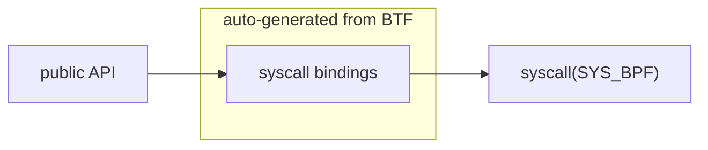

# `bpf()` syscall compatibility with Linux ABI

There is a desire to have first-class eBPF support for Windows for the Go ecosystem.
The Go community prefers for libraries that can be easily cross-compiled and distributed.
However, calling into libbpf via Go's foreign function interface (CGo) goes against this spirit, as it requires distributing C headers, a C toolchain, and other dependencies.

To address this, one of the most popular ways to interact with eBPF on Linux is through the [ebpf-go library], which intentionally avoids CGo.
Given these considerations, this proposal explores what is necessary to port the ebpf-go library to the eBPF for Windows runtime.
Such a port would provide a solution that aligns with Go's cross-platform philosophy while offering robust eBPF support for Windows.

## ebpf-go architecture

ebpf-go uses BTF from a Linux kernel image to generate syscall bindings.
This happens at development time, and the bindings are checked in.
These are used from the rest of the library to provide an "idiomatic" public API.



The library follows the same ELF conventions as libbpf so you are able to load the same ELF files.
The API however is [completely distinct][architecture] and doesn't follow libbpf semantics.

## ebpf-go on Windows

The goal of porting ebpf-go is to end up with a library that facilitates porting programs written for Linux to Windows.
In the best case the public API stays the same regardless of operating system.

A natural point to start a port is to replace the auto-generated syscall bindings with a Windows-specific wrapper.
[An attempt][stable ioctl] was made to directly issue `DeviceIoControl` from ebpf-go.
This approach was discarded because the exact format of the request and response buffers is currently an implementation detail, which is a good thing considering that the current approach [has performance implications][ioctl allocs].
It also forces us to reimplement the scheme used to load signed native images, which might also still change.

Instead of replacing the auto-generated syscall bindings we can replace the `bpf()` syscall on Windows with an existing [wrapper][bpf wrapper].
This has a number of benefits:

- The necessary changes are much smaller since we don't need to write new code to generate bindings for Windows.
- We don't need to add a new stable API to the Windows runtime and instead can reuse the existing `bpf()` emulation.

For this to work we need the `bpf()` emulation to be binary compatible with the Linux syscall.
Otherwise the auto generated bindings in ebpf-go won't work, negating one of the key benefits of this approach.
This is problematic since so far eBPF for Windows has only targeted source-level compatibility, not binary compatibility.

### Differing `bpf_cmd_id` values

The values of `bpf_cmd_id` do not match Linux, which leads to ebpf-go performing the wrong syscalls.

### Differing field size

On Windows the length of an object's name is restricted to 64 characters, while Linux only allows 16.
Unfortunately this constant is used to size an array embedded in key structures like `bpf_map_info` and `bpf_prog_info`:

```C
struct bpf_map_info
{
    // ...
    char name[BPF_OBJ_NAME_LEN]; ///< Null-terminated map name.
    // ...
```

The result is that fields after `name` have a different offset.

### Differing field order / presence

Sometimes the field order doesn't match. For example, `id` and `type` are swapped in `bpf_map_info`.

```C
struct bpf_map_info
{
    // Cross-platform fields.
    ebpf_id_t id;                ///< Map ID.
    ebpf_map_type_t type;        ///< Type of map.
    // ...
```

Some unsupported fields are missing completely:

```C
struct bpf_prog_info
{
    ebpf_id_t id;                ///< Program ID.
    enum bpf_prog_type type;     ///< Program type, if a cross-platform type.
    // 8 missing fields
    uint32_t nr_map_ids;         ///< Number of maps associated with this program.
```

### Additional fields

Some structures contain Windows-specific fields:

```C
struct bpf_map_info
{
    // Cross-platform fields.
    ebpf_id_t id;                ///< Map ID.
    // ...

    // Windows-specific fields.
    ebpf_id_t inner_map_id;     ///< ID of inner map template.
    uint32_t pinned_path_count; ///< Number of pinned paths.
};
```

This is problematic because Linux exposes many more fields in `bpf_map_info`, aliasing with the Windows-specific fields.
Adding a new cross-platform field before the Windows-specific fields will break compatibility in several ways.

## Resolve ABI incompatibilities in the `bpf()` syscall emulation

Changing the problematic types globally is possible but undesirable, since it will cause problems for existing users of the C API.
Instead we will restrict the necessary changes to the `bpf()` syscall emulation.
A separate header will contain type definitions compatible with the Linux ABI.
The syscall emulation layer is then responsible for translating between the Linux
and native types.
This localises breakage to users of `bpf()` and allows the C API to evolve on its own.

[ebpf-go library]: https://ebpf-go.dev
[architecture]: https://ebpf-go.dev/contributing/architecture/
[stable ioctl]: https://github.com/microsoft/ebpf-for-windows/issues/3700
[ioctl allocs]: https://github.com/microsoft/ebpf-for-windows/issues/3726
[bpf wrapper]: https://github.com/microsoft/ebpf-for-windows/blob/main/libs/api/bpf_syscall.cpp
[api tests]: https://github.com/microsoft/ebpf-for-windows/issues/3729#issuecomment-2259330472