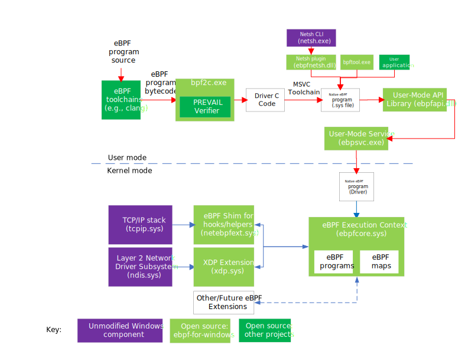

# Native Code Generation of eBPF and signed PE Images

# Overview
While JIT-compiled eBPF programs can work on systems where
[Hypervisor-protected Code Integrity (HVCI)](https://docs.microsoft.com/en-us/windows-hardware/design/device-experiences/oem-hvci-enablement)
is not enabled, JIT-compiled programs fail on systems where it is enabled. This document describes the mechanism for such
systems which works on existing unmodified Windows.

To permit the use of eBPF programs on systems where HVCI is enabled, the eBPF programs must be in a form that Windows'
Secure Kernel (SK) can verify their signature and load them. The only code format currently supported by SK is Portable
Executable (PE) files in the form of Windows Drivers (.sys files) that have been signed by a trusted key.

This document covers generating signed PE files from eBPF programs in an automated fashion.

# Background

eBPF programs start in a higher level language (like C) that is then compiled using the LLVM tool chain into an ELF
file containing the definition for zero or more maps and one or more code segments containing eBPF byte code. eBPF For
Windows uses the [PREVAIL verifier](https://github.com/vbpf/ebpf-verifier) to perform safety analysis of eBPF programs.
The verifier accepts an eBPF program compiled into an Executable and Linkable Format (ELF) file and then returns a yes/no
response depending on whether it can prove the program is safe. The verified ELF file can then be used to generate a PE
image that can be loaded and used as an eBPF program.

# Usage

From the root of the eBPF-For-Windows project (from a VS Developer Command Prompt), after building the project, run:
```
powershell scripts\Convert-BpfToNative.ps1 -FileName my_program
```
Where my_program is the name of your BPF program without the extension. This will produce a native image in x64\Release
with name of my_program.sys.

# Native Code Generation Pipeline

The following diagram shows the steps in the pipeline:


Generation of a Windows Driver in PE format from an eBPF program can be broken down into a series of steps. The first
step is executed by the developer either on their own build machine or part of a pre-existing build pipeline. The
remaining steps can be executed in a secure environment (for a production signed PE image) or a developer environment (for a test
signed PE image).

## External - Step 1 - Generation of ELF from high level eBPF program

The first step of the process is identical to the traditional build pipeline. The eBPF program is provided as a C or
other high level language file and the normal LLVM / Clang tool chain is invoked, to produce an ELF file containing one
or more programs and zero or more map definitions.

## Step 2 – Verification of the eBPF program

The second step is to use the verifier to determine if the resulting eBPF program conforms to the required safety
requirements. This is identical to the process used to by eBPF for Windows today. Only once the verifier can prove the
program is safe does the process proceed to the next step.

## Step 3 – Generation of the C code from the eBPF byte code

The third step is to automatically generate C code that maps one to one with the [eBPF instructions](isa-support.rst) in the ELF file. The eBPF
registers are mapped to local variables in the generated C function and each eBPF instruction is used to generate
equivalent C operations. In addition, the generated C file also contains bindings for any helper functions referenced
by the eBPF program and any maps the eBPF program uses.

## Step 4 – Compile generated C code into native COFF (Common Object File Format) file

The fourth step is to use a standard C compiler (GCC, MSVC, or Clang) to generate an x64/ARM64 COFF file with Windows
calling conventions. The C file will expose a single top-level global variable that allows the skeleton code to find
the helpers, maps, and programs contained in the file.

## Step 5 – Linking the COFF file into a PE image

The fifth step is to use the platform-specific linker to generate the final PE file. The linker consumes the object file
from step 4, a generic DriverEntry skeleton.

## Step 6 – Signing the PE file

The last step is to use the standard PE signing tools to produce a signed PE file from the output of step 5. For the
developer workflow the signature would be based on a test signing root, whereas for production use the PE file would
be signed using the Microsoft PRS signing keys.

# Stub files consumed by the linker

Step 5 consumes a set of object files to generate the final PE image. The following section gives a summary of the
driver skeleton.

## DriverEntry skeleton

All Windows Drivers need to export a static function labelled &quot;DriverEntry&quot; that is invoked by the OS
(Operating System) during loading of the driver. In addition to the standard driver related functionality, the driver
entry skeleton also registers as a [Network Module Registrar (NMR)](https://docs.microsoft.com/en-us/windows-hardware/drivers/network/introduction-to-the-network-module-registrar) client
to export the program to the eBPF runtime, to create any maps
required, and to import the helper functions.

## Global entry point for generated code

Every generated C file contains a single global entry point of type metadata_table_t:

```c
typedef struct _metadata_table
{
    void (*programs)(program_entry_t** programs, size_t* count);
    void (*maps)(map_entry_t** maps, size_t* count);
    void (*hash)(const uint8_t** hash, size_t* size);
    void (*version)(bpf2c_version_t* version);
    void (*map_initial_values)(map_initial_values_t** map_initial_values, size_t* count);
    void (*global_variable_sections)(global_variable_section_t** global_variable_sections, size_t* count);
} metadata_table_t;

metadata_table_t myprogram_metadata_table = { _get_programs, _get_maps };
```

The metadata table provides pointers to three functions that permit querying the list of programs and the list of maps.
The table name prefix is derived from the ELF file name, with _ replacing any character that
is not valid in a C variable name. This variable is the only globally visible variable in the generated C code.

## Exported Program Entry

Each program in the generated C file is exported via a program_entry_t:
```c
typedef struct _program_entry
{
    // DLLs put the strings into the same section, so add a marker
    // at the start of a program entry to make it easy to find
    // entries in the programs section.
    uint64_t zero;

    uint64_t (*function)(void*, const program_runtime_context_t*); ///< Address of the program.
    const char* pe_section_name;              ///< Name of the PE section containing the program.
    const char* section_name;                 ///< Name of the section containing the program.
    const char* program_name;                 ///< Name of the program.
    uint16_t* referenced_map_indices;         ///< List of map indices referenced by the program.
    uint16_t referenced_map_count;            ///< Number of maps referenced by the program.
    helper_function_entry_t* helpers;         ///< List of helper functions used by the program.
    uint16_t helper_count;                    ///< Number of helper functions used by the program.
    size_t bpf_instruction_count;             ///< Number of BPF instructions in the program.
    ebpf_program_type_t* program_type;        ///< Type of the program.
    ebpf_attach_type_t* expected_attach_type; ///< Expected attach type of the program.
    const uint8_t* program_info_hash;         ///< Hash of the program info.
    size_t program_info_hash_length;          ///< Length of the program info hash.
    const char* program_info_hash_type;       ///< Type of the program info hash
} program_entry_t;
```
The program_entry t contains the hash, hash length and the hash algorithm type [(CNG)](https://learn.microsoft.com/en-us/windows/win32/seccng/cng-algorithm-identifiers) used to generate the hash.

The skeleton framework then uses NMR to publish this information to the eBPF execution context.

The `program` above takes 2 arguments as input. First is a point to the program context. The second argument is a pointer to the program runtime context, which is defined as below:
```c
typedef struct _helper_function_data
{
    helper_function_t address;
    bool tail_call;
} helper_function_data_t;

typedef struct _map_data
{
    uintptr_t address;
} map_data_t;

typedef struct _global_variable_section_data
{
    unsigned char* address_of_map_value;
} global_variable_section_data_t;

typedef struct _program_runtime_context
{
    helper_function_data_t* helper_data;
    map_data_t* map_data;
    global_variable_section_data_t* global_variable_section_data;
} program_runtime_context_t;
```
The runtime context (`program_runtime_context_t`) is allocated by the eBPF runtime for each program that is loaded.
It contains the resolved helper addresses, map addresses and map value addresses (for global variable sections) referenced by that program. This runtime context is then passed to the loaded BPF program on each invocation.

## Imported helper functions

The generated C code exposes a table containing static information for each helper function. The C code generator emits
a different table with the helper function information for each of the programs.

```c
typedef struct _helper_function_entry
{
    uint32_t helper_id;
    const char* name;
} helper_function_entry_t;

static helper_function_entry_t _helpers[] = {
    { 1, "helper_id_1"},
    { 0, "helper_id_0"},
};
```

The skeleton then uses NMR to query the address of each helper function in the table, after which it writes to the
address field in the table and sets additional metadata (such as if this is a tail call). Calls to helper functions
in the generated code are called indirectly via the address field.

## Exported maps

Each map referenced by any of the eBPF programs is added as a map_entry_t, containing static map information:

```c
typedef struct _map_entry
{
    // DLLs put the strings into the same section, so add a marker
    // at the start of a map entry to make it easy to find
    // entries in the maps section.
    uint64_t zero_marker;

    ebpf_map_definition_in_file_t definition;
    const char* name;
} map_entry_t;

static map_entry_t _maps[] = {
    {0,
     {
         BPF_MAP_TYPE_ARRAY, // Type of map.
         4,                  // Size in bytes of a map key.
         4,                  // Size in bytes of a map value.
         1,                  // Maximum number of entries allowed in the map.
         0,                  // Inner map index.
         LIBBPF_PIN_NONE,    // Pinning type for the map.
         10,                 // Identifier for a map template.
         0,                  // The id of the inner map template.
     },
     "interface_index_map"},
    {0,
     {
         BPF_MAP_TYPE_ARRAY, // Type of map.
         4,                  // Size in bytes of a map key.
         8,                  // Size in bytes of a map value.
         1,                  // Maximum number of entries allowed in the map.
         0,                  // Inner map index.
         LIBBPF_PIN_NONE,    // Pinning type for the map.
         15,                 // Identifier for a map template.
         0,                  // The id of the inner map template.
     },
     "dropped_packet_map"},
};
```

The skeleton then uses NMR to either create an instance of the map or obtain the address of an existing map and then
write the address into the address field. References to the maps in the generated code are then indirect via the
address field.

### Map initial values

Hash of map, array of map, and program array maps can have initial values defined. For each map that has initial
values provided, an entry of type map_initial_values_t is added.

```c
typedef struct _map_initial_values
{
    const char* name;
    size_t count;
    const char** values;
} map_initial_values_t;
```

The name field is the name of the map for which initial values are being provided.
The count and values field are an array of map names to initialize the map with.

### Exported global variable sections

Each global section (.rodata, .data, or .bss) that is referenced by the program is added as an entry.

```c
    typedef struct _global_variable_section_info
    {
        const char* name;
        size_t size;
        const void* initial_data;
    } global_variable_section_info_t;
```

The execution context creates an array map for each section, loads any initial data into the map, and stores the
address of the start of the map data into the address_of_map_value field.

## Loading an eBPF program from a PE .sys file

The process of loading an eBPF program is a series of interactions between the eBPF execution context and the generated
.sys file, and is summarized in the following diagram:



### Lifecycle of a generated PE .sys file

1) During driver entry, the generated DriverEntry calls [NmrRegisterClient](https://docs.microsoft.com/en-us/windows-hardware/drivers/ddi/netioddk/nf-netioddk-nmrregisterclient) for the native eBPF NPI contract.

1) The skeleton attaches as the NPI client and sends metadata information about the programs including maps,
   helper functions used, and global variables.

1) In response to the native module's (NPI client) attach notification, the eBPF core (NPI provider) checks if the native program was
   verified successfully by the process outlined in [Proof of Verification](eBbpfProofOfVerification.md). If successful, an entry
   is created for the module in the native module table and the metadata information is stored.

1) Later when an application tries to load the program(s) in a native module by invoking libbpf APIs (such as `bpf_prog_load`),
   the eBPF core looks up the corresponding module and uses the metadata information to resolve helper function addresses, map
   addresses, etc. as outlined in [Exported Program Entry](NativeCodeGeneration.md#exported-program-entry) section.

1) At this point, the eBPF execution context is free to invoke the eBPF programs.

1) In response to an NPI client detach notification, the eBPF core clears up the state created for the native module.

1) When the OS calls unload on the driver, the driver unregisters as an NPI client and waits for the
notification that the eBPF execution context has detached before completing unloading.

### Note about native code generation samples shipped with ebpf-for-windows.
The ```ebpf-for-windows\test\bpf2c_tests\expected``` directory contains the native source files generated
from the ebpf sample programs shipped with this project.  These samples (especially the generated ```.c``` sources in
this directory) are used for test automation during CI/CD workflows.  If the ```.o``` -> ```.c``` code generation logic
changes for any reason, the source files in this directory may need to be regenerated as well. Not doing so could
result in failures in the CI/CD test passes.

Furthermore, the generated source files also contain references to local file paths in the embedded comments, which can
differ for each person regenerating them.

These paths therefore need to be canonicalized to make them portable and this is done by running the following command
from the ```ebpf-for-windows``` project root directory:
``` .\scripts\generate_expected_bpf2c_output.ps1 .\x64\Debug\```.

*Note: Tests may also fail if files generated by this script are formatted through clang-format.*
