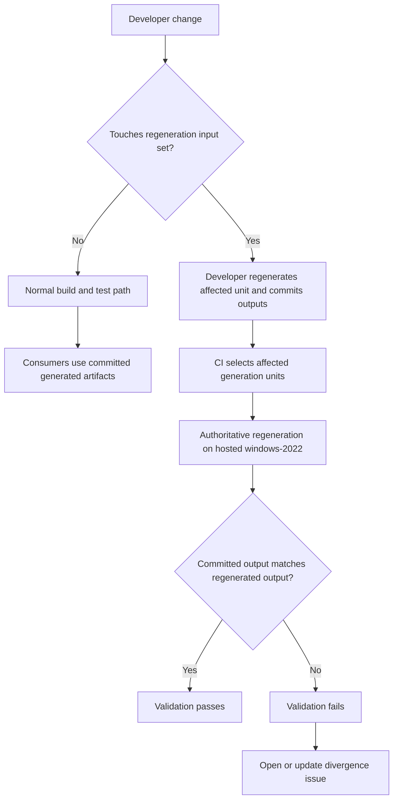

<!-- Copyright (c) eBPF for Windows contributors -->
<!-- SPDX-License-Identifier: MIT -->

# EverParse Build Mitigation — Design Specification

## 1. Overview

This document describes the proposed repository workflow for EverParse-generated artifacts in `ebpf-for-windows`.
The design keeps `.3d` files authoritative, commits generated `.c` and `.h` outputs, and validates divergence only
when the regeneration input set changes.

The design is intentionally repository-centric. It uses the existing MSBuild project boundaries for
`ioctl_spec` and `elf_spec`, the existing GitHub-hosted `windows-2022` build path, and the repository's existing
issue-automation pattern for open-or-update behavior.

## 2. Design Goals

1. Keep `.3d` files as the sole source of truth.
   Satisfies: `REQ-SRC-001`, `REQ-GUARD-001`
2. Make committed generated artifacts the normal consumer path.
   Satisfies: `REQ-ART-001`, `REQ-DEV-001`
3. Run authoritative regeneration only when relevant inputs change.
   Satisfies: `REQ-TRG-001`, `REQ-VAL-001`
4. Keep unstable 1ES runners out of the default regeneration decision path.
   Satisfies: `REQ-REL-001`
5. Make divergence failures actionable and durable.
   Satisfies: `REQ-VAL-002`, `REQ-ISSUE-001`, `REQ-ISSUE-002`, `REQ-OPS-001`

## 3. High-Level Architecture

## 4. Generation Units

The design treats each EverParse entry point as a separate **generation unit**.

### 4.1 Unit: `ioctl_spec`

- **Authoritative source**: `libs\ioctl_spec\EbpfProtocol.3d`
- **Current generated outputs**:
  - `libs\ioctl_spec\generated\EbpfProtocol.h`
  - `libs\ioctl_spec\generated\EbpfProtocolWrapper.h`
  - `libs\ioctl_spec\generated\EverParse.h`
  - `libs\ioctl_spec\generated\EverParseEndianness.h`
  - `libs\ioctl_spec\generated\EbpfProtocol.c`
  - `libs\ioctl_spec\generated\EbpfProtocolWrapper.c`
- **Primary consumers**:
  - `libs\execution_context\kernel\execution_context_kernel.vcxproj`
  - `libs\execution_context\user\execution_context_user.vcxproj`

### 4.2 Unit: `elf_spec`

- **Authoritative source**: `libs\elf_spec\Elf.3d`
- **Current generated outputs**:
  - `libs\elf_spec\generated\Elf.h`
  - `libs\elf_spec\generated\ElfWrapper.h`
  - `libs\elf_spec\generated\EverParse.h`
  - `libs\elf_spec\generated\EverParseEndianness.h`
  - `libs\elf_spec\generated\Elf.c`
  - `libs\elf_spec\generated\ElfWrapper.c`
- **Primary consumers**:
  - `libs\api\api.vcxproj`
  - `tools\bpf2c\bpf2c.vcxproj`
  - `tests\bpf2c_tests\bpf2c_tests.vcxproj`

### 4.3 Rationale

Using project-level generation units keeps trigger evaluation and divergence reporting precise.
It aligns directly with the current build structure instead of introducing a new abstraction boundary
that the repository does not already have.

## 5. Committed Artifact Model

### 5.1 Policy

- `.3d` files are authoritative.
- Generated `.c` and `.h` files are committed, derived artifacts.
- Direct manual edits to generated outputs are unsupported.
- Any authoritative-input change that affects a generation unit must be committed together with regenerated outputs.

### 5.2 Practical Consequences

- Unrelated changes do not require local EverParse regeneration.
- Reviewers can see authoritative input changes and derived output changes in the same pull request.
- A clean checkout can build without mandatory local regeneration of unchanged generation units.

## 6. Regeneration Input Set

Each generation unit defines a **regeneration input set**. A change to any member of that set requires regeneration.

### 6.1 Required Input Classes

- The authoritative `.3d` file for the unit.
- The unit's `packages.config` entry that pins EverParse.
- The unit's `.vcxproj` custom-build definition that invokes EverParse and defines output names.
- Any additional repository-tracked file later identified as affecting generated output.

### 6.2 Manifest

The design introduces a repository-tracked manifest that records, for each generation unit:

- Unit identifier
- Authoritative source file
- Committed output files
- Tool-version pin references
- Invocation-definition references

The manifest is the source used by CI to decide whether regeneration is required.

## 7. CI Flow

### 7.1 Trigger Evaluation

For each pull request or merge-group change set:

1. Compute the changed file set.
2. Compare changed files with the manifest.
3. Select zero or more affected generation units.
4. Skip regeneration comparison if no generation unit is selected.

This keeps the default path fast for unrelated changes.

### 7.2 Authoritative Regeneration Environment

Authoritative regeneration runs on GitHub-hosted `windows-2022`.

This is the pragmatic initial choice because:

- The repository already uses hosted `windows-2022` for regular builds.
- Several 1ES jobs are concentrated in driver and regression test flows.
- The requirements prioritize minimizing dependence on unstable 1ES behavior for unchanged generated artifacts.

### 7.3 Comparison Semantics

For each selected unit:

1. Restore dependencies.
2. Run the EverParse generation step in the authoritative environment.
3. Compare regenerated outputs with the committed generated outputs for that unit.
4. Produce one of three results:
   - `pass`
   - `diverged`
   - `infrastructure_error`

`diverged` means output content differs.
`infrastructure_error` means the job could not establish whether divergence exists.

## 8. Divergence Handling

### 8.1 Validation Result

If any selected generation unit diverges:

- The validation check fails.
- The failure output identifies the affected generation unit.
- The failure output lists the mismatched generated files.

### 8.2 Issue Handling

After divergence is confirmed:

1. On trusted repository events such as `schedule`, `push`, and `merge_group`, the workflow opens a new
   issue or updates an existing open issue for the same underlying condition.
2. The issue includes:
   - Generation unit identifier
   - Diverged files
   - Triggering revision
   - Workflow run reference
   - Toolchain fingerprint or pinned version context

Pull request and ad hoc manual runs still fail validation when divergence is detected, but they do not create
or update repository issues.

### 8.3 Deduplication

Issue creation uses open-or-update semantics rather than blind issue creation.
This follows the same pattern already used elsewhere in repository automation.

## 9. Repository Changes Required by the Design

### 9.1 `ioctl_spec`

- Stop treating `libs\ioctl_spec\generated\` as ignored output.
- Commit the generated files for this unit.

### 9.2 `elf_spec`

- Use `libs\elf_spec\generated\` as the committed output path instead of relying on `$(OutDir)`.
- Update the generation unit definition to compare against that committed path.

### 9.3 Documentation

- Document when developers must regenerate.
- Document that manual edits to generated outputs are unsupported.
- Document the expected pull request shape for authoritative-input changes.

## 10. Tradeoffs

### 10.1 Commit generated artifacts

- **Chosen because** it best matches the priority to reduce intermittent failures and developer friction.
- **Benefit**: routine builds and reviews do not depend on regeneration.
- **Cost**: larger diffs and more review noise.
- **Reversibility**: moderate.

### 10.2 Use hosted `windows-2022` for authoritative regeneration

- **Chosen because** it removes the default regeneration authority from unstable 1ES paths and fits existing CI.
- **Benefit**: lower coupling to 1ES for unchanged generated artifacts.
- **Cost**: less hermetic than a bespoke pinned image.
- **Reversibility**: easy to moderate.

### 10.3 Use a manifest for trigger selection

- **Chosen because** it keeps trigger logic reviewable and precise.
- **Benefit**: avoids both over-triggering and under-triggering.
- **Cost**: one more repository artifact to maintain.
- **Reversibility**: moderate.

## 11. Security and Trust Boundaries

- Pull request content is untrusted input.
- Issue-writing automation is privileged behavior.
- Divergence must be proven before issue creation or update occurs.
- Infrastructure failures must not be reported as divergence.

For fork-originated pull requests, the design should keep privileged issue-writing actions in trusted repository context.

## 12. Operational Considerations

### 12.1 Rollout Sequence

1. Land the requirements, design, and validation specifications.
2. Define the generation-unit manifest.
3. Commit `elf_spec` generated outputs under `libs\elf_spec\generated\`.
4. Stop ignoring committed `ioctl_spec` outputs.
5. Add trigger evaluation and authoritative comparison to CI.
6. Add divergence issue open-or-update behavior.

### 12.2 Failure Recovery

- `diverged`: regenerate, recommit, and re-run validation.
- `infrastructure_error`: rerun or repair CI environment; do not create divergence issues unless output mismatch is proven.

## 13. Open Questions

1. Are there additional repository-tracked inputs beyond `.3d`, `packages.config`, and `.vcxproj` that must be included in the regeneration input set?
2. Should a later phase add automated remediation pull requests, or should issue-only remediation remain the boundary?

## 14. Revision History

| Version | Date | Author | Changes |
| --- | --- | --- | --- |
| 0.1 | 2026-06-12 | Copilot | Initial design specification. |
