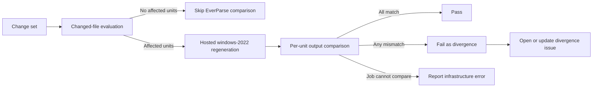

<!-- Copyright (c) eBPF for Windows contributors -->
<!-- SPDX-License-Identifier: MIT -->

# EverParse Build Mitigation — Validation Specification

## 1. Purpose

This specification defines how `ebpf-for-windows` validates EverParse-generated artifacts once the
committed-artifact workflow is adopted.

The validation design must prove repository consistency without making routine validation depend on
unrelated regeneration work or unstable 1ES execution paths.

## 2. Validation Objectives

The validation workflow must:

1. Detect divergence between committed generated artifacts and authoritative regeneration results.
2. Run only when the regeneration input set changes.
3. Distinguish divergence from infrastructure failure.
4. Produce actionable failure output.
5. Open or update tracking issues when divergence is proven.

## 3. Validation Scope

### 3.1 Covered Units

The initial validation scope includes:

- `ioctl_spec`
- `elf_spec`

### 3.2 Triggering Inputs

Validation is required when a change touches any repository-tracked member of a generation unit's regeneration input set:

- The unit's authoritative `.3d` file
- The unit's EverParse version pin in `packages.config`
- The unit's EverParse custom-build definition in `.vcxproj`
- Any future manifest-declared repository-tracked generation input

Validation is also required when a change touches a committed generated output for a covered generation unit.
This protects against unauthorized manual edits to derived artifacts by forcing authoritative regeneration and comparison.

### 3.3 Non-Triggering Inputs

Changes outside the regeneration input set do not require EverParse regeneration comparison in the default path.

## 4. Validation Workflow

## 5. Validation Environment

### 5.1 Authority

The authoritative validation environment is GitHub-hosted `windows-2022`.

### 5.2 Rationale

This keeps the regeneration authority in the existing hosted build path rather than on the 1ES paths that
are already a first-order stability concern for this effort.

### 5.3 Environment Responsibilities

The authoritative environment must:

- Restore pinned dependencies.
- Execute the unit's EverParse generation step.
- Collect the generated output set for each selected unit.
- Compare regenerated output with committed output.
- Emit a structured result for each selected unit.

## 6. Result Model

Each selected generation unit must end in exactly one of the following states:

| Result | Meaning | Required action |
| --- | --- | --- |
| `pass` | Regenerated output matches committed output. | Continue. |
| `diverged` | Regenerated output differs from committed output. | Fail validation. In trusted repository issue-writing contexts, create or update issue. |
| `infrastructure_error` | Validation could not determine whether output diverged. | Fail or surface separately according to CI policy, but do not create a divergence issue unless mismatch was proven. |

## 7. Per-Unit Validation Rules

For each selected generation unit:

1. Restore repository dependencies required for generation.
2. Execute the authoritative generation step.
3. Assert that all expected generated outputs exist.
4. Compare each expected output against the committed copy for that unit.
5. Record the unit result and file-level differences.

If any expected output is missing, the result is `infrastructure_error` unless the missing file itself is the
observed divergence being validated as part of the committed output set definition.

## 8. Reporting Requirements

### 8.1 Success Reporting

When validation passes, the job should report:

- Selected generation units
- Authoritative environment identifier
- Toolchain or pinned-version context

### 8.2 Divergence Reporting

When validation detects divergence, the job must report:

- Generation unit identifier
- Diverged generated files
- Triggering revision
- Workflow run reference
- A summary that makes it clear the failure is a committed-artifact mismatch

### 8.3 Infrastructure Error Reporting

When validation cannot determine divergence, the job must report:

- The step that failed
- Whether the failure occurred before or during generation
- Enough context to distinguish environment failure from content mismatch

## 9. Issue Automation

### 9.1 Preconditions

Issue automation runs only for confirmed divergence in trusted repository issue-writing contexts.

### 9.2 Required Behavior

For each confirmed divergence event observed on trusted repository events such as `schedule`, `push`, or
`merge_group`, the workflow must open a new issue or update an existing open issue for the same underlying
condition.

Pull request and ad hoc manual runs must still fail validation on divergence, but they must not write issues.

### 9.3 Required Issue Fields

Each divergence issue must include:

- Generation unit identifier
- Diverged file set
- Commit SHA or equivalent triggering revision
- Workflow run URL or equivalent run identifier
- Toolchain fingerprint or pinned version context

### 9.4 Deduplication Rule

Repeated divergence for the same underlying condition must update existing tracking rather than creating
unbounded duplicates.

## 10. Validation Matrix

| Scenario | Example change | Expected validation behavior | Expected result |
| --- | --- | --- | --- |
| Unrelated code change | Change outside all regeneration input sets | Skip EverParse comparison | No EverParse validation failure |
| Authoritative source change | Edit `EbpfProtocol.3d` or `Elf.3d` | Select affected unit, regenerate, compare | Pass if committed outputs were updated correctly |
| Tool-version change | Update EverParse package pin | Select affected unit or units, regenerate, compare | Pass if outputs match regenerated result |
| Invocation change | Update EverParse custom-build step in `.vcxproj` | Select affected unit, regenerate, compare | Pass if outputs match regenerated result |
| Manual generated-file edit | Edit committed generated file without authoritative-input change | Select affected unit because committed generated outputs are protected trigger paths, then regenerate and compare | Divergence |
| CI environment failure | Restore or generation step fails before compare completes | Report infrastructure error | No divergence issue unless mismatch was proven |

## 11. Acceptance Mapping

| Requirement | Validation enforcement |
| --- | --- |
| `REQ-TRG-001` | Changed-file evaluation selects affected generation units from the regeneration input set. |
| `REQ-VAL-001` | Selected units are authoritatively regenerated and compared. |
| `REQ-VAL-002` | Any confirmed mismatch fails validation. |
| `REQ-ISSUE-001` | Confirmed divergence opens or updates an issue. |
| `REQ-ISSUE-002` | Issue payload includes unit identity and triggering revision. |
| `REQ-DEV-001` | Unrelated changes skip EverParse comparison in the default path. |
| `REQ-REL-001` | The authoritative path is hosted `windows-2022`, not 1ES by default. |
| `REQ-DET-001` | Validation relies on pinned toolchain inputs and controlled trigger selection. |
| `REQ-OPS-001` | Output distinguishes divergence from infrastructure failure and includes actionable context. |

## 12. Open Questions

1. Should validation fail hard on `infrastructure_error`, or should that remain a separate non-divergence signal with its own retry policy?

## 13. Revision History

| Version | Date | Author | Changes |
| --- | --- | --- | --- |
| 0.1 | 2026-06-12 | Copilot | Initial validation specification. |
