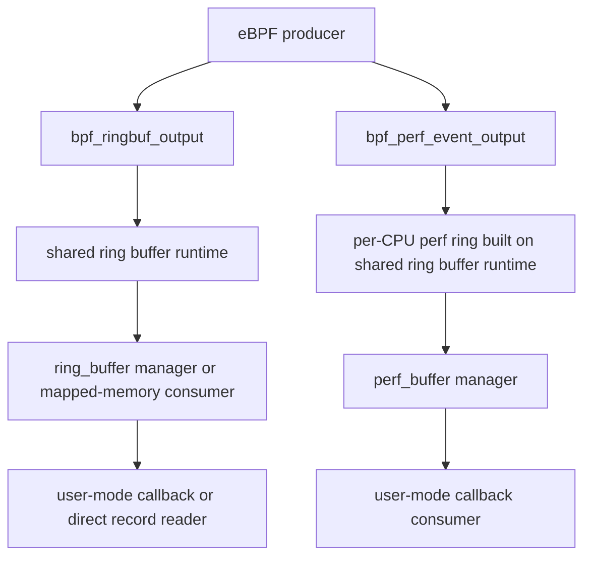

<!-- Copyright (c) eBPF for Windows contributors -->
<!-- SPDX-License-Identifier: MIT -->

# Ring Buffer and Perf Event Array — Design Specification

## 1. Overview

This document describes the design of the ring-buffer and perf-event-array facilities in `ebpf-for-windows`.

The design centers on one shared runtime primitive:

- a kernel-owned ring-buffer implementation with shared producer/consumer metadata and record framing

Perf event arrays are built on top of that primitive as one ring per CPU with additional lost-record accounting and
perf-buffer-specific helper and consumer behavior.

## 2. Design Goals

1. Reuse one record transport primitive for both map types.
2. Match Linux libbpf default consumption behavior where practical.
3. Keep Windows-specific extensions explicit and isolated.
4. Support both callback-based and explicit-memory consumption models where implemented.
5. Surface overflow and invalid usage deterministically.

## 3. High-Level Architecture

## 4. Core Ring Runtime

### 4.1 Memory Layout

Each runtime ring consists of:

1. a kernel page containing the wait-event reference and producer-reserve offset
2. a consumer page containing the consumer offset
3. a producer page containing the producer offset
4. a double-mapped data region containing records

The double mapping allows straightforward linear reads of records that wrap around the physical end of the ring.

### 4.2 Record Model

Each record contains:

- a record header with length and state bits
- payload bytes
- alignment padding to the runtime's record alignment

Two header bits are used for state:

- locked/busy
- discarded

The consumer reads records in producer order. Discarded records are skipped and returned to the ring without being
surfaced as samples.

### 4.3 Synchronization Model

The ring runtime is designed for:

- multiple producers in the generic ring-buffer path
- a single consumer position per ring

Generic reserve uses an interlocked producer-reserve-offset exchange to serialize multiple producers. Producer
publication uses release semantics so that consumers never observe a visible producer offset for an uninitialized
record. Consumers use acquire reads of producer offsets and record headers before treating a record as available.

### 4.4 Notification Model

The runtime optionally stores a wait-event reference in the kernel page. Submit and discard operations decide whether
to signal that event based on the wakeup flags:

- `NO_WAKEUP`
- `FORCE_WAKEUP`
- default adaptive behavior

Adaptive behavior signals when the ring appears non-empty for a waiting consumer.

## 5. Ring Buffer Map Design

### 5.1 Kernel Map Semantics

A `BPF_MAP_TYPE_RINGBUF` map owns exactly one runtime ring. The map does not expose ordinary keyed CRUD semantics.
Kernel-facing ring operations such as query, map, unmap, async query, wait-handle installation, and return-buffer
operate only on map index `0`.

### 5.2 Producer Paths

The ring-buffer map supports:

- helper-driven output through `bpf_ringbuf_output`
- direct user-mode map writes through the eBPF API

Both paths produce one runtime record containing the supplied payload bytes.

### 5.3 Consumer Modes

#### Synchronous callback mode

This is the Linux-compatible default. A user-mode ring-buffer manager:

- creates a shared event handle
- installs it into the map
- maps the ring's shared memory
- waits and drains records explicitly using `poll` or `consume`

#### Asynchronous callback mode

This is Windows-specific. A user-mode ring-buffer manager subscribes for automatic delivery and does not expose a
wait handle or synchronous drain semantics.

#### Mapped-memory mode

This is Windows-specific and bypasses callback managers. User mode:

1. requests one protected mapping handle at a time from the kernel for the consumer page, producer page, or data region
2. maps the writable consumer page, read-only producer page, and read-only data region
3. maps the data region twice contiguously in user space so wrapped records remain linearly readable
4. installs a wait handle
5. waits for notification
6. parses records directly
7. advances the consumer offset explicitly to return space

The public libbpf-facing and eBPF API-facing signatures remain unchanged. The per-region handle choreography is an
internal implementation detail beneath those existing APIs.

### 5.4 Protected Region Handle Model

The mapped-memory implementation uses three logical regions:

- a writable consumer section
- a read-only producer section
- a read-only data section

The kernel owns the backing objects for those regions, opens one user handle per requested region, and does not depend
on a later ring-specific unmap request from user mode. User-mode cleanup is performed by ordinary view unmap and handle
close, with process rundown reclaiming abandoned mappings.

The kernel-side runtime no longer retains a consuming-process reference to manage mapping lifetime.

### 5.5 Multi-Map Ring-Buffer Managers

A synchronous user-mode ring-buffer manager may aggregate multiple ring-buffer maps. This introduces a distinct
user-mode manager slot index:

- **map index** remains `0` for each underlying `BPF_MAP_TYPE_RINGBUF`
- **manager slot index** is `0..N-1` across maps attached to one userspace manager

This distinction is important because `ebpf_ring_buffer_get_buffer()` addresses attached maps by manager slot index,
not by kernel map index.

### 5.6 Cleanup and Reopen

Ring-buffer consumer teardown clears installed wait handles or subscriptions and releases user-mode views locally. The
kernel does not perform region-specific user unmapping or retain process references for that purpose. This permits
reopening the same ring-buffer map within the same process after free or unsubscribe and allows a later process
instance to reopen the same map after abnormal termination.

## 6. Perf Event Array Design

### 6.1 Kernel Map Structure

A `BPF_MAP_TYPE_PERF_EVENT_ARRAY` map is implemented as:

- one runtime ring per CPU
- one async-query context list per CPU ring
- one per-CPU lost-record counter stored in the extended producer page

The map's `max_entries` value is interpreted as the capacity of each per-CPU ring. The number of rings is derived
from the current CPU count.

### 6.2 Relationship to the Shared Ring Runtime

Perf event arrays reuse the ring runtime's:

- record layout
- producer and consumer offsets
- reserve/submit flow
- mapped-memory primitives used internally by perf-buffer managers

Perf event arrays differ from plain ring buffers in three important ways:

1. storage is per-CPU instead of globally shared
2. overflow is tracked by lost-record counters rather than represented by discarded records
3. helper behavior supports optional context-payload capture

### 6.3 Internal vs Public Surface

#### Internal map behavior

Execution-context operations such as query, async query, return-buffer, map, and unmap are CPU-indexed because the
map contains one ring per CPU.

#### Public userspace behavior

The public perf-buffer surface is callback-driven. It supports:

- synchronous all-CPU managers
- Windows-specific asynchronous all-CPU managers
- per-CPU draining via `perf_buffer__consume_buffer`
- wait-handle access in synchronous mode

The public API intentionally does not expose raw direct Linux perf-buffer APIs such as `perf_buffer__new_raw()` or
Linux epoll-fd interfaces. Per-CPU protected-region handle issuance is an internal implementation detail and does not
create a new public direct-memory perf-buffer API.

## 7. Perf Event Output Helper Design

### 7.1 CPU Targeting

`bpf_perf_event_output` targets exactly one per-CPU ring. The current implementation allows:

- `CURRENT_CPU`
- an explicit CPU index that matches the CPU running at dispatch

Writes to a different CPU are rejected.

Below dispatch, the helper raises execution to dispatch only when the request is compatible with current-CPU
targeting. This preserves the implementation invariant that writes occur on the current CPU's ring.

### 7.2 Context-Payload Capture

The helper optionally appends bytes from the program context's data pointer after the explicit caller-supplied
payload. This avoids needing a separate helper for each program type when a context data pointer is available.

Failure cases are explicit:

- no context data pointer: operation not supported
- requested capture longer than available data: invalid argument

### 7.3 Overflow Accounting

Perf-event-array writes use the runtime's exclusive-reserve fast path because the producer is constrained to the
current CPU-at-dispatch path. If reserve fails, the target CPU's lost-record counter is incremented and the write
fails without creating a visible record.

## 8. User-Mode Perf-Buffer Manager Design

### 8.1 Synchronous mode

The synchronous perf-buffer manager:

- creates one shared wait handle
- installs that handle into each per-CPU ring
- maps each per-CPU ring
- drains all rings with `perf_buffer__consume()` or one ring with `perf_buffer__consume_buffer()`
- reports newly observed lost-record deltas through the lost callback

### 8.2 Asynchronous mode

The asynchronous perf-buffer manager:

- subscribes across all CPUs
- delivers sample and lost callbacks automatically
- does not expose a wait handle
- rejects sync-only consumption methods

### 8.3 Cleanup and Reopen

Perf-buffer teardown releases local per-CPU mappings and clears installed wait handles or subscriptions. This permits
reopening the same perf-event-array map in both sync and async modes within the same process and after prior consumer
process termination.

## 9. Linux Alignment and Intentional Divergence

### 9.1 Linux-aligned behavior

- synchronous callback mode is the default for both ring and perf consumers
- `poll` and `consume` semantics match the Linux libbpf model
- perf-event output is restricted to current-CPU writes

### 9.2 Intentional Windows-specific behavior

- opt-in asynchronous callback mode for ring buffers
- opt-in asynchronous callback mode for perf buffers
- wait-handle-based blocking instead of Linux epoll-fd APIs
- mapped-memory ring-buffer consumption through kernel-issued protected region handles and Windows mapping APIs

### 9.3 Intentional omissions

The current Windows public API omits Linux raw perf-buffer APIs, including:

- `perf_buffer__new_raw()`
- direct per-buffer memory accessors for perf buffers
- perf epoll-fd accessors

These omissions reflect the current public surface and the implementation's distinct internal layout for perf-event
arrays.

## 10. Revision History

| Version | Date | Author | Changes |
| --- | --- | --- | --- |
| 0.1 | 2026-07-10 | Copilot | Initial design specification for ring buffer and perf event array behavior. |
| 0.2 | 2026-07-10 | Copilot | Revised mapped-memory design to use protected region handles, local rundown cleanup, and unchanged public APIs. |
